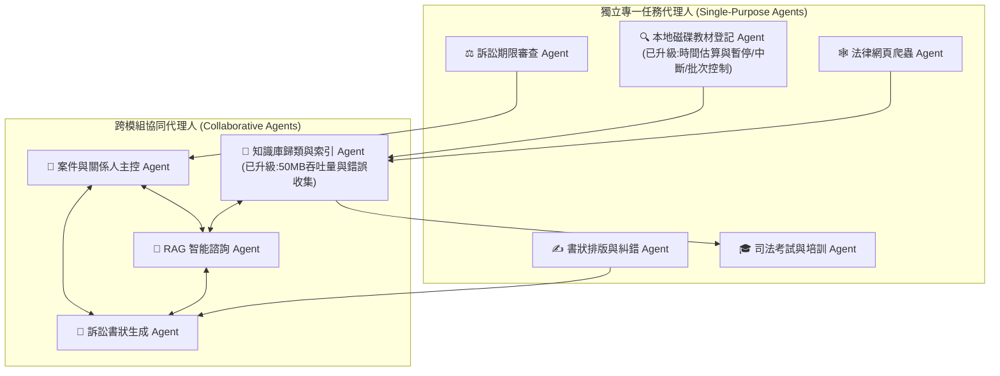
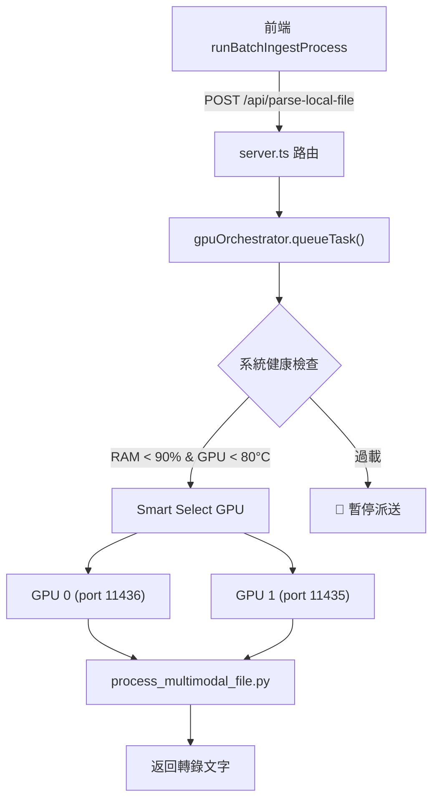

# LexMind-Omni AI 法律工作站：多代理人 (Multi-Agent) 架構與程式定義 (已更新進度與錯誤監視功能)

本文件為 **LexMind-Omni 法律實務 AI 工作站** 的核心架構設計說明書。內容包含：系統模組拆解、9 個 AI 代理人（Agents）的定義、以及實現「本地磁碟教材安全爬蟲與批次進度控制」的核心原始程式碼，便於在 Obsidian 中進行長期記憶、知識檢索與後續系統擴充。

---

## 📂 一、 系統代理人 (Agent) 多角色分工架構

工作站內部的核心功能與子任務，被區分為「獨立工具型 Agent」與「跨模組協同型 Agent」兩大類別，共計 **9 個 Agent**。



### 1. 獨立專一任務代理人 (Single-Purpose Agents)

| 代理人名稱 | 角色定位 | 核心職責與輸入輸出 |
| :--- | :--- | :--- |
| **✍️ 法律公文糾錯與排版 Agent** | 文字工匠 | **職責**：法律公文格式修正、法條引用正確性校對、錯字即時修正。<br>**輸入**：未經排版或可能含有錯別字的法律書狀草稿。<br>**輸出**：符合司法機關規範之標準文本。 |
| **🔍 本地磁碟教材登記 Agent** <br>*(能力升級)* | 磁碟掃描與進度主控器 | **職責**：遞迴掃描本機磁碟，提取未分析教材。**新增能力**：在執行前估算所需時間；支援一次執行或分批次執行（自訂每批大小與間隔）；支援中途暫停、繼續、中斷。<br>**輸入**：目標磁碟、批次間隔參數。<br>**輸出**：處理進度 (%)、運行時間日誌、去重後教材列表。 |
| **🕸️ 法律網頁爬蟲 Agent** | 外部採集器 | **職責**：抓取外部法條或裁判書網頁，過濾廣告雜訊，保留純淨內文。<br>**輸入**：目標裁判書或法規 URL。<br>**輸出**：乾淨的 Markdown 格式文本。 |
| **⚖️ 訴訟期限與排程審查 Agent** | 時效警示鐘 | **職責**：計算侵權賠償 2 年時效、勞資終止契約 30 日除斥期間等法定時效。<br>**輸入**：關鍵事實發生日、適用法律條款。<br>**輸出**：精確截止日期、剩餘天數及法律時效紅線警示。 |
| **🎓 司法考試與法律培訓 Agent** | 教學導師 | **職責**：抽取法律知識庫試題，模擬考試環境，針對使用者答覆給予評分與法理詳解。<br>**輸入**：作答文本與科目種類。<br>**輸出**：考題解析、學習建議。 |

---

### 2. 跨模組協同代理人 (Collaborative Agents)

| 代理人名稱 | 角色定位 | 協同機制與資料流 |
| :--- | :--- | :--- |
| **🧠 法律知識庫歸類與索引 Agent** <br>*(能力升級)* | 資料與日誌中樞 | 調用 OCR、STT 與多模態 AI 對教材分類並寫入 `database.json` 記憶庫。**新增能力**：優化 Express 解析極限至 **50MB**（防 PayloadTooLargeError），並增加錯誤同步日誌接口，接收執行異常寫入 `ingest_errors.log` 以供後台除錯。 |
| **📁 訴訟案件與關係人主控 Agent** | 業務大腦 | 維護所有案件的起訴階段、關係人網絡與時間線。當收到時效警示或新證物時，更新案件時間線，並為問答或書狀生成提供完整的上下文（Context）。 |
| **💬 RAG 智能法律諮詢與檢索 Agent** | 諮詢智囊 | 綜合「案件主控 Agent」的案情及「知識庫 Agent」的法律法規，組裝成 Context，調用 LLM 生成具備法源依據與邏輯深度的法律意見書。 |
| **📝 訴訟書狀與答辯狀生成 Agent** | 書狀編撰官 | 調用 RAG 意見書與案件爭點，起草答辯狀或起訴書；完成後**自動呼叫「排版糾錯 Agent」**校正拼寫與編排，最後輸出最終版本。 |

---

## 💻 二、 核心程式碼定義 (TypeScript)

以下為本次實作「時間估計、批次暫停中斷控制、以及後端錯誤日誌寫入」的核心程式碼片段。

### 1. 後端：Express 大檔案解析優化與錯誤日誌收集 API
位於：`server.ts`

```typescript
// 1. 大檔案解析上限優化，避免大檔案 PDF Ingest 報錯 PayloadTooLargeError
app.use(express.json({ limit: "50mb" }));
app.use(express.urlencoded({ limit: "50mb", extended: true }));

// 2. 錯誤日誌接口，將前端教材處理異常寫入本地磁碟
app.post("/api/log-error", (req, res) => {
  try {
    const { filename, error, timestamp, type } = req.body;
    const logMessage = `[${timestamp}] [TYPE: ${type}] [FILE: ${filename}] ERROR: ${error}\n`;
    const logFile = path.join(DATA_DIR, "ingest_errors.log");
    fs.appendFileSync(logFile, logMessage, "utf-8");
    res.json({ status: "success" });
  } catch (err: any) {
    res.status(500).json({ error: `寫入錯誤日誌失敗: ${err.message}` });
  }
});
```

### 2. 前端：時間預估與時序投影計算
位於：`src/App.tsx`

```typescript
const calculateEstimatedSeconds = (files: typeof scannedLocalFiles) => {
  return files.reduce((acc, file) => {
    const ext = file.name.split('.').pop()?.toLowerCase() || '';
    const sizeMB = (file.size || 0) / (1024 * 1024);
    if (ext === 'pdf') return acc + 3 + sizeMB * 1.5; // PDF 解析預估
    if (['mp3', 'wav', 'mp4'].includes(ext)) return acc + 5 + sizeMB * 2.0; // 影音轉文字預估
    if (['png', 'jpg', 'jpeg'].includes(ext)) return acc + 1.5; // OCR 圖片預估
    return acc + 0.5; // 純文字預估
  }, 0);
};
```

### 3. 前端：支援暫停、繼續、中斷與分批的 Runner 函數
位於：`src/App.tsx`

```typescript
const runBatchIngestProcess = async (
  filesToProcess: typeof scannedLocalFiles,
  targetMode: "import" | "direct",
  execMode: "all" | "batch",
  filesPerBatch: number,
  intervalSec: number
) => {
  isBatchPausedRef.current = false;
  isBatchAbortedRef.current = false;
  setBatchIngestStatus("running");
  setBatchProcessedCount(0);
  setBatchElapsedSeconds(0);
  
  const startTimeStr = new Date().toLocaleTimeString();
  setBatchLogs([
    { time: startTimeStr, type: "info", text: `🚀 開始處理 ${filesToProcess.length} 個本機教材檔案...` },
    { time: startTimeStr, type: "info", text: `ℹ️ 模式: ${targetMode === "import" ? "導入待處理隊列" : "直接分析歸類到記憶庫"}` }
  ]);
  
  let timerId = setInterval(() => {
    setBatchElapsedSeconds(prev => prev + 1);
  }, 1000);
  
  let successCount = 0;
  let failCount = 0;
  const processedFiles: typeof scannedLocalFiles = [];
  
  try {
    for (let index = 0; index < filesToProcess.length; index++) {
      // 1. 檢查是否中斷
      if (isBatchAbortedRef.current) {
        setBatchLogs(prev => [...prev, { time: new Date().toLocaleTimeString(), type: "error", text: "🛑 使用者已中斷處理程序。" }]);
        setBatchIngestStatus("aborted");
        break;
      }
      
      // 2. 檢查是否暫停 (利用 Promise 自旋等待)
      if (isBatchPausedRef.current) {
        setBatchIngestStatus("paused");
        setBatchLogs(prev => [...prev, { time: new Date().toLocaleTimeString(), type: "info", text: "⏸️ 處理程序暫停中..." }]);
        while (isBatchPausedRef.current) {
          if (isBatchAbortedRef.current) break;
          await new Promise(r => setTimeout(r, 200));
        }
        if (isBatchAbortedRef.current) break;
        setBatchIngestStatus("running");
        setBatchLogs(prev => [...prev, { time: new Date().toLocaleTimeString(), type: "info", text: "▶️ 處理程序已繼續。" }]);
      }
      
      const fileInfo = filesToProcess[index];
      setBatchCurrentFileName(fileInfo.name);
      
      try {
        // 模擬執行 API 請求獲取本地檔案與內容
        const url = `/api/get-local-file?path=${encodeURIComponent(fileInfo.path)}`;
        const resp = await fetch(url);
        if (!resp.ok) throw new Error("讀取本地檔案失敗");
        const blob = await resp.blob();
        const mimeType = fileInfo.ext === 'pdf' ? 'application/pdf' : 'text/plain';
        const fileObj = new File([blob], fileInfo.name, { type: mimeType });
        const content = await extractContentForFile(fileObj);
        
        if (targetMode === "import") {
          // 導入待處理
          setBatchTexts(prev => [...prev, { name: fileInfo.name, content, category: classifyFileCategory(fileInfo.name) }]);
        } else {
          // 直接 Ingest
          await fetch("/api/ingest", {
            method: "POST",
            headers: { "Content-Type": "application/json" },
            body: JSON.stringify({ files: [{ name: fileInfo.name, content, category: classifyFileCategory(fileInfo.name) }] })
          });
        }
        successCount++;
        processedFiles.push(fileInfo);
        setBatchLogs(prev => [...prev, { time: new Date().toLocaleTimeString(), type: "success", text: `✅ 檔案 ${fileInfo.name} 處理完成！` }]);
      } catch (fileErr: any) {
        failCount++;
        const errMsg = fileErr.message || String(fileErr);
        setBatchLogs(prev => [...prev, { time: new Date().toLocaleTimeString(), type: "error", text: `❌ 檔案 ${fileInfo.name} 失敗: ${errMsg}` }]);
        
        // 寫入後端 log-error
        await fetch("/api/log-error", {
          method: "POST",
          headers: { "Content-Type": "application/json" },
          body: JSON.stringify({ filename: fileInfo.name, error: errMsg, timestamp: new Date().toISOString(), type: targetMode })
        });
      }
      
      setBatchProcessedCount(index + 1);
      
      // 3. 處理分批間隔時間 (Interval)
      if (execMode === "batch" && (index + 1) % filesPerBatch === 0 && (index + 1) < filesToProcess.length) {
        setBatchLogs(prev => [...prev, { time: new Date().toLocaleTimeString(), type: "info", text: `⏳ 等待間隔時間 ${intervalSec} 秒...` }]);
        for (let s = 0; s < intervalSec; s++) {
          if (isBatchAbortedRef.current) break;
          await new Promise(r => setTimeout(r, 1000));
        }
      }
    }
    
    clearInterval(timerId);
    if (!isBatchAbortedRef.current) {
      setBatchIngestStatus("completed");
      setScannedLocalFiles(prev => prev.filter(f => !processedFiles.some(p => p.path === f.path)));
    }
  } catch (err: any) {
    clearInterval(timerId);
    setBatchIngestStatus("aborted");
  }
};
```

---

## 🎯 三、 長期記憶小結

當您需要為工作站加入新的生成式 AI 邏輯或擴充多模態檔案處理管線時，請以此份代理人架構定義為基石，保持對 Agent 2 (掃描登記) 與 Agent 4 (歸類索引) 的介面相容性。
# LexMind-Omni 系統架構索引 — Agent 與 MCP Server 程式碼分類地圖

> 最後更新：2026-06-29
> 本文件將系統中所有 Agent、Express API 端點、前後端邏輯函式、Python 腳本及 Agent Skills 做完整分類歸檔，方便迅速定位有問題的程式。

---

## 📂 專案目錄結構總覽

```
LexMind-Omni-法律實務-AI-工作站/
├── server.ts                          ← 🔴 主後端 Express 伺服器 (2460 行, 123KB)
├── src/
│   ├── App.tsx                        ← 🔵 主前端 React UI (309KB)
│   └── utils/
│       ├── gpuOrchestrator.ts         ← 🟢 GPU 雙卡排程器 (288 行)
│       └── legalProofer.ts            ← 🟡 法律術語 ASR 糾錯規則引擎 (126 行)
├── extracted_sources/
│   ├── app.py                         ← ⚪ 原始 Gradio 前端 (Legacy)
│   ├── legal_glossary.json            ← 📘 法律詞彙表
│   └── scripts/                       ← 🟣 Python Agent 腳本群
│       ├── process_multimodal_file.py
│       ├── agent_core_pro.py
│       ├── auto_ingest_bot.py
│       ├── backup_manager.py
│       ├── exam_trainer.py
│       ├── ingest_law_pro.py
│       ├── law_digester.py
│       ├── law_scraper_cli.py
│       ├── legal_calendar.py
│       └── multimodal_input.py
├── scripts/                           ← 🟣 頂層獨立 Python 腳本
│   ├── auto_ingest_bot.py
│   ├── law_scraper_cli.py
│   └── visual_analyzer.py
├── .agents/skills/                    ← 🧩 12 個 Agent Skill 定義
├── data/
│   ├── database.json                  ← 💾 主資料庫 (法律智庫)
│   ├── history.json                   ← 💾 對話歷史
│   ├── cases_data.json                ← 💾 案件資料
│   └── ingest_errors.log              ← 📝 錯誤日誌
└── .env                               ← ⚙️ 環境變數配置
```

---

## 🔴 一、Express MCP Server — API 端點總表

> 所有端點定義在 [server.ts](file:///c:/Users/temp/antigravity/LexMind-Omni-法律實務-AI-工作站/server.ts)

### 1.1 核心智庫 CRUD

| HTTP | 路由 | 行號 | 功能 | 所屬 Agent |
|------|------|------|------|-----------|
| POST | `/api/ingest` | [L673](file:///c:/Users/temp/antigravity/LexMind-Omni-法律實務-AI-工作站/server.ts#L673) | 法律教材消化寫入資料庫 | 分流合併 Agent + MapReduce 校正器 |
| POST | `/api/reset-db` | [L664](file:///c:/Users/temp/antigravity/LexMind-Omni-法律實務-AI-工作站/server.ts#L664) | 重設資料庫 | — |
| GET | `/api/intelligence-vault` | [L2384](file:///c:/Users/temp/antigravity/LexMind-Omni-法律實務-AI-工作站/server.ts#L2384) | 讀取法律智庫全部條目 | — |
| DELETE | `/api/intelligence-vault/:id` | [L2390](file:///c:/Users/temp/antigravity/LexMind-Omni-法律實務-AI-工作站/server.ts#L2390) | 刪除智庫條目 | — |
| PUT | `/api/intelligence-vault/:id` | [L2401](file:///c:/Users/temp/antigravity/LexMind-Omni-法律實務-AI-工作站/server.ts#L2401) | 修改智庫條目 | — |

### 1.2 法律 AI 對話與書狀

| HTTP | 路由 | 行號 | 功能 | 所屬 Agent |
|------|------|------|------|-----------|
| POST | `/api/lawyer-chat` | [L1546](file:///c:/Users/temp/antigravity/LexMind-Omni-法律實務-AI-工作站/server.ts#L1546) | 法律諮詢對話 (含 RWS 實務動態權重) | RAG 案例顧問 Agent |
| POST | `/api/draft-pleading` | [L1493](file:///c:/Users/temp/antigravity/LexMind-Omni-法律實務-AI-工作站/server.ts#L1493) | IRAC 書狀草擬 | RAG 案例顧問 Agent |
| POST | `/api/cases/chat` | [L1788](file:///c:/Users/temp/antigravity/LexMind-Omni-法律實務-AI-工作站/server.ts#L1788) | 個案分析對話 | RAG 案例顧問 Agent |
| POST | `/api/clean-history` | [L1744](file:///c:/Users/temp/antigravity/LexMind-Omni-法律實務-AI-工作站/server.ts#L1744) | 清除對話歷史 | — |

### 1.3 時效計算與法規

| HTTP | 路由 | 行號 | 功能 | 所屬 Agent |
|------|------|------|------|-----------|
| POST | `/api/calculate-deadline` | [L821](file:///c:/Users/temp/antigravity/LexMind-Omni-法律實務-AI-工作站/server.ts#L821) | 計算消滅時效 / 除斥期間 | 時效計算專家 Agent |
| POST | `/api/scrape-legal-url` | [L898](file:///c:/Users/temp/antigravity/LexMind-Omni-法律實務-AI-工作站/server.ts#L898) | 爬取法規網站 | 法規爬蟲驗證 Agent |
| POST | `/api/trigger-scraper` | [L1834](file:///c:/Users/temp/antigravity/LexMind-Omni-法律實務-AI-工作站/server.ts#L1834) | 觸發法規批次爬蟲 | 法規爬蟲驗證 Agent |

### 1.4 國家考試訓練

| HTTP | 路由 | 行號 | 功能 | 所屬 Agent |
|------|------|------|------|-----------|
| POST | `/api/exam-training` | [L1032](file:///c:/Users/temp/antigravity/LexMind-Omni-法律實務-AI-工作站/server.ts#L1032) | 考試題目解答 + 教授對抗 | 考試對抗訓練 Agent |
| GET | `/api/exam-questions` | [L1120](file:///c:/Users/temp/antigravity/LexMind-Omni-法律實務-AI-工作站/server.ts#L1120) | 讀取題庫 | — |
| POST | `/api/add-exam-question` | [L1129](file:///c:/Users/temp/antigravity/LexMind-Omni-法律實務-AI-工作站/server.ts#L1129) | 新增考題 | — |
| POST | `/api/scrape-exam-url` | [L1151](file:///c:/Users/temp/antigravity/LexMind-Omni-法律實務-AI-工作站/server.ts#L1151) | 爬取考題網頁 | 法規爬蟲驗證 Agent |

### 1.5 外部 AI 技術情報 Agent

| HTTP | 路由 | 行號 | 功能 | 所屬 Agent |
|------|------|------|------|-----------|
| POST | `/api/trigger-tech-agent` | [L1254](file:///c:/Users/temp/antigravity/LexMind-Omni-法律實務-AI-工作站/server.ts#L1254) | 觸發 AI 前沿技術偵察 | Tech Intelligence Agent |
| GET | `/api/tech-alerts` | [L1369](file:///c:/Users/temp/antigravity/LexMind-Omni-法律實務-AI-工作站/server.ts#L1369) | 讀取技術警報 | — |
| POST | `/api/update-tech-alert` | [L1378](file:///c:/Users/temp/antigravity/LexMind-Omni-法律實務-AI-工作站/server.ts#L1378) | 更新技術警報 | — |
| POST | `/api/trigger-optimization-evaluation` | [L1383](file:///c:/Users/temp/antigravity/LexMind-Omni-法律實務-AI-工作站/server.ts#L1383) | 觸發系統優化評估 | 優化評估 Agent |
| GET | `/api/optimization-status` | [L1460](file:///c:/Users/temp/antigravity/LexMind-Omni-法律實務-AI-工作站/server.ts#L1460) | 讀取優化狀態 | — |
| POST | `/api/toggle-optimized-mode` | [L1467](file:///c:/Users/temp/antigravity/LexMind-Omni-法律實務-AI-工作站/server.ts#L1467) | 切換優化模式 | — |

### 1.6 多模態 GPU 引擎與本機檔案

| HTTP | 路由 | 行號 | 功能 | 所屬 Agent |
|------|------|------|------|-----------|
| POST | `/api/parse-local-file` | [L2056](file:///c:/Users/temp/antigravity/LexMind-Omni-法律實務-AI-工作站/server.ts#L2056) | 解析本機 MP4/MP3/WAV/PDF/圖片 | 多模態轉錄 Agent + GPU 排程器 |
| GET | `/api/scan-local-media` | [L1992](file:///c:/Users/temp/antigravity/LexMind-Omni-法律實務-AI-工作站/server.ts#L1992) | 掃描本機教材目錄 | 自動擷取守衛 Agent |
| GET | `/api/list-directories` | [L1909](file:///c:/Users/temp/antigravity/LexMind-Omni-法律實務-AI-工作站/server.ts#L1909) | 列出目錄結構 | — |
| GET | `/api/get-local-file` | [L2261](file:///c:/Users/temp/antigravity/LexMind-Omni-法律實務-AI-工作站/server.ts#L2261) | 讀取本機檔案 | — |

### 1.7 系統監控與管理

| HTTP | 路由 | 行號 | 功能 | 所屬 Agent |
|------|------|------|------|-----------|
| GET | `/api/system-status` | [L2301](file:///c:/Users/temp/antigravity/LexMind-Omni-法律實務-AI-工作站/server.ts#L2301) | 系統遙測 (RAM/GPU/Ollama/DB) | 系統守護看門狗 Agent |
| POST | `/api/log-error` | [L2289](file:///c:/Users/temp/antigravity/LexMind-Omni-法律實務-AI-工作站/server.ts#L2289) | 記錄錯誤日誌 | — |
| GET | `/api/backup` | [L1748](file:///c:/Users/temp/antigravity/LexMind-Omni-法律實務-AI-工作站/server.ts#L1748) | 下載加密備份 | 安全保險庫備份 Agent |
| GET | `/api/download-windows-bundle` | [L1755](file:///c:/Users/temp/antigravity/LexMind-Omni-法律實務-AI-工作站/server.ts#L1755) | 下載 Windows 部署包 | — |
| GET | `/api/cases` | [L1773](file:///c:/Users/temp/antigravity/LexMind-Omni-法律實務-AI-工作站/server.ts#L1773) | 讀取案件列表 | — |
| POST | `/api/cases` | [L1776](file:///c:/Users/temp/antigravity/LexMind-Omni-法律實務-AI-工作站/server.ts#L1776) | 新增案件 | — |

---

## 🔵 二、前端 Agent 控制邏輯 (src/App.tsx)

> 定義在 [App.tsx](file:///c:/Users/temp/antigravity/LexMind-Omni-法律實務-AI-工作站/src/App.tsx)

### 2.1 Agent 狀態管理

| 變數 | 行號 | 用途 |
|------|------|------|
| `isGuardAgentEnabled` | [L486](file:///c:/Users/temp/antigravity/LexMind-Omni-法律實務-AI-工作站/src/App.tsx#L486) | 系統安全守護 Agent 開關 |
| `isGuardAgentWaiting` | [L487](file:///c:/Users/temp/antigravity/LexMind-Omni-法律實務-AI-工作站/src/App.tsx#L487) | 守護 Agent 冷卻等待中 |
| `isBatchPausedRef` | [L488](file:///c:/Users/temp/antigravity/LexMind-Omni-法律實務-AI-工作站/src/App.tsx#L488) | 批次處理手動暫停 |
| `isBatchAbortedRef` | [L489](file:///c:/Users/temp/antigravity/LexMind-Omni-法律實務-AI-工作站/src/App.tsx#L489) | 批次處理中止 |
| `isTechAgentLoading` | [L923](file:///c:/Users/temp/antigravity/LexMind-Omni-法律實務-AI-工作站/src/App.tsx#L923) | 技術情報 Agent 執行中 |

### 2.2 核心函式

| 函式 | 行號 | 功能 | 對應後端 |
|------|------|------|---------|
| `classifyFileCategory()` | [L84](file:///c:/Users/temp/antigravity/LexMind-Omni-法律實務-AI-工作站/src/App.tsx#L84) | 依檔名自動分類法律類別 | — (純前端) |
| `extractTextFromPdf()` | [L129](file:///c:/Users/temp/antigravity/LexMind-Omni-法律實務-AI-工作站/src/App.tsx#L129) | 客戶端 PDF 文字提取 | — (純前端) |
| `extractContentForFile()` | [L709](file:///c:/Users/temp/antigravity/LexMind-Omni-法律實務-AI-工作站/src/App.tsx#L709) | 通用內容提取分派器 | — (純前端) |
| `fetchSystemStatus()` | [L208](file:///c:/Users/temp/antigravity/LexMind-Omni-法律實務-AI-工作站/src/App.tsx#L208) | 拉取系統遙測資料 | `GET /api/system-status` |
| `fetchVaultItems()` | [L221](file:///c:/Users/temp/antigravity/LexMind-Omni-法律實務-AI-工作站/src/App.tsx#L221) | 拉取智庫條目列表 | `GET /api/intelligence-vault` |
| `fetchCases()` | [L194](file:///c:/Users/temp/antigravity/LexMind-Omni-法律實務-AI-工作站/src/App.tsx#L194) | 拉取案件列表 | `GET /api/cases` |
| `fetchExamQuestions()` | [L1672](file:///c:/Users/temp/antigravity/LexMind-Omni-法律實務-AI-工作站/src/App.tsx#L1672) | 拉取考試題庫 | `GET /api/exam-questions` |
| `fetchTechAlerts()` | [L1753](file:///c:/Users/temp/antigravity/LexMind-Omni-法律實務-AI-工作站/src/App.tsx#L1753) | 拉取技術警報 | `GET /api/tech-alerts` |
| `fetchOptimizationStatus()` | [L1804](file:///c:/Users/temp/antigravity/LexMind-Omni-法律實務-AI-工作站/src/App.tsx#L1804) | 拉取優化狀態 | `GET /api/optimization-status` |
| **`runBatchIngestProcess()`** | [L1252](file:///c:/Users/temp/antigravity/LexMind-Omni-法律實務-AI-工作站/src/App.tsx#L1252) | ⭐ 批次管線處理主迴圈 | 多個 API |
| `handleImportLocalFiles()` | [L1648](file:///c:/Users/temp/antigravity/LexMind-Omni-法律實務-AI-工作站/src/App.tsx#L1648) | 導入本機檔案 | `POST /api/parse-local-file` |
| `handleTriggerTechAgent()` | [L1765](file:///c:/Users/temp/antigravity/LexMind-Omni-法律實務-AI-工作站/src/App.tsx#L1765) | 觸發技術偵察 | `POST /api/trigger-tech-agent` |
| `handleTriggerEvaluation()` | [L1817](file:///c:/Users/temp/antigravity/LexMind-Omni-法律實務-AI-工作站/src/App.tsx#L1817) | 觸發優化評估 | `POST /api/trigger-optimization-evaluation` |
| `handleTriggerScraper()` | [L1954](file:///c:/Users/temp/antigravity/LexMind-Omni-法律實務-AI-工作站/src/App.tsx#L1954) | 觸發法規爬蟲 | `POST /api/trigger-scraper` |
| `handleTriggerBackup()` | [L2015](file:///c:/Users/temp/antigravity/LexMind-Omni-法律實務-AI-工作站/src/App.tsx#L2015) | 觸發加密備份 | `GET /api/backup` |

---

## 🟢 三、後端核心 Agent 函式 (server.ts)

### 3.1 Ollama 雙 GPU 管理系統

| 函式 | 行號 | 功能 |
|------|------|------|
| `killExistingOllama()` | [L532](file:///c:/Users/temp/antigravity/LexMind-Omni-法律實務-AI-工作站/server.ts#L532) | 殺掉 ollama app / ollama / llama-server |
| `spawnOllamaInstance()` | [L546](file:///c:/Users/temp/antigravity/LexMind-Omni-法律實務-AI-工作站/server.ts#L546) | 以 `CUDA_VISIBLE_DEVICES` 啟動單卡 Ollama 實例 |
| `warmupAndVerifyOllama()` | [L585](file:///c:/Users/temp/antigravity/LexMind-Omni-法律實務-AI-工作站/server.ts#L585) | 送 warmup prompt + 驗證 VRAM > 0 |
| `ensureBothOllamas()` | [L627](file:///c:/Users/temp/antigravity/LexMind-Omni-法律實務-AI-工作站/server.ts#L627) | 依序啟動 GPU0(11436) + GPU1(11435) |
| `ollamaRequestCounter` | [L344](file:///c:/Users/temp/antigravity/LexMind-Omni-法律實務-AI-工作站/server.ts#L344) | 輪詢負載均衡計數器 |
| `[OLLAMA INTERCEPT]` 邏輯 | [L382-420](file:///c:/Users/temp/antigravity/LexMind-Omni-法律實務-AI-工作站/server.ts#L382) | 攔截 Gemini→Ollama 轉發 + 雙埠輪詢 |

### 3.2 文字處理管線 Agent

| 函式 | 行號 | 功能 |
|------|------|------|
| `autoCorrectText()` | [L72](file:///c:/Users/temp/antigravity/LexMind-Omni-法律實務-AI-工作站/server.ts#L72) | 規則引擎法律 ASR 糾錯（50+ 條正規表示式） |
| `splitTextIntoChunks()` | [L495](file:///c:/Users/temp/antigravity/LexMind-Omni-法律實務-AI-工作站/server.ts#L495) | 將長文本切成 ~3000 字的片段 |
| `processChunksInParallel()` | [L514](file:///c:/Users/temp/antigravity/LexMind-Omni-法律實務-AI-工作站/server.ts#L514) | 並行 Worker 處理 chunks (concurrency=3) |
| `[INGEST] Split-and-Combine` | [L709](file:///c:/Users/temp/antigravity/LexMind-Omni-法律實務-AI-工作站/server.ts#L709) | 分流合併 Agent：切 → 並行 LLM 糾錯 → 合併 |
| `[RWS Condense]` | [L1575](file:///c:/Users/temp/antigravity/LexMind-Omni-法律實務-AI-工作站/server.ts#L1575) | 實務動態權重查詢壓縮器 |
| `searchHybrid()` | [L445](file:///c:/Users/temp/antigravity/LexMind-Omni-法律實務-AI-工作站/server.ts#L445) | RAG 混合搜尋 + RWS 權重 |

### 3.3 LLM 客戶端工廠

| 函式 | 行號 | 功能 |
|------|------|------|
| `getGeminiClient()` | [L345](file:///c:/Users/temp/antigravity/LexMind-Omni-法律實務-AI-工作站/server.ts#L345) | 建立 Gemini / Ollama 客戶端 |
| `checkIsMock()` | [L276](file:///c:/Users/temp/antigravity/LexMind-Omni-法律實務-AI-工作站/server.ts#L276) | 偵測是否為 Mock 模式 |
| `simulateLawEngineResponse()` | [L281](file:///c:/Users/temp/antigravity/LexMind-Omni-法律實務-AI-工作站/server.ts#L281) | Mock 模式模擬回覆 |

### 3.4 檔案系統工具

| 函式 | 行號 | 功能 |
|------|------|------|
| `getFilesRecursively()` | [L1866](file:///c:/Users/temp/antigravity/LexMind-Omni-法律實務-AI-工作站/server.ts#L1866) | 遞迴掃描 + 過濾 `temp_extract_` / `chunk_` |
| `loadCases()` / `saveCases()` | [L101](file:///c:/Users/temp/antigravity/LexMind-Omni-法律實務-AI-工作站/server.ts#L101) / [L142](file:///c:/Users/temp/antigravity/LexMind-Omni-法律實務-AI-工作站/server.ts#L142) | 案件 JSON 讀寫 |
| `loadHistory()` / `saveHistory()` | [L482](file:///c:/Users/temp/antigravity/LexMind-Omni-法律實務-AI-工作站/server.ts#L482) / [L492](file:///c:/Users/temp/antigravity/LexMind-Omni-法律實務-AI-工作站/server.ts#L492) | 對話歷史 JSON 讀寫 |
| `saveDatabase()` | [L273](file:///c:/Users/temp/antigravity/LexMind-Omni-法律實務-AI-工作站/server.ts#L273) | 智庫 JSON 寫入磁碟 |

---

## 🟢 四、GPU 排程器 (gpuOrchestrator.ts)

> [gpuOrchestrator.ts](file:///c:/Users/temp/antigravity/LexMind-Omni-法律實務-AI-工作站/src/utils/gpuOrchestrator.ts) — 288 行



| 類別/方法 | 功能 |
|----------|------|
| `GpuOrchestrator` class | 單例模式，管理雙 GPU 工作排程 |
| `queueTask(filePath)` | 將檔案加入處理佇列 |
| `processQueue()` | 從佇列取出任務並分派到空閒 GPU |
| `smartSelectGpu()` | 透過 nvidia-smi 選擇最佳 GPU |
| `checkSystemHealthAndScale()` | 每 5 秒檢查 RAM/GPU 溫度，動態調整併發度 |
| `releaseSlot(gpuIndex)` | 釋放 GPU 槽位 |
| `getStatus()` | 返回排程器狀態 (佇列長度、活躍負載等) |

---

## 🟡 五、法律術語 ASR 糾錯引擎 (legalProofer.ts)

> [legalProofer.ts](file:///c:/Users/temp/antigravity/LexMind-Omni-法律實務-AI-工作站/src/utils/legalProofer.ts) — 126 行

| 匯出 | 功能 |
|------|------|
| `LEGAL_PROOF_RULES[]` | 50+ 條 RegExp 規則 (假芳→甲方、油漆徒刑→有期徒刑 等) |
| `proofreadLegalText(text)` | 套用所有規則並回傳修正建議列表 |

> [!NOTE]
> `server.ts` L21-70 也有一份**相同的規則副本**作為後端 `autoCorrectText()` 使用。修改規則時須**兩處同步**。

---

## 🟣 六、Python Agent 腳本群

### 6.1 `extracted_sources/scripts/` — 打包內嵌腳本

> 這些腳本透過 `pack_ps1.js` 打包進 Windows 安裝包，也被 server.ts 直接呼叫。

| 腳本 | 路徑 | 功能 | 呼叫方式 |
|------|------|------|---------|
| `process_multimodal_file.py` | [連結](file:///c:/Users/temp/antigravity/LexMind-Omni-法律實務-AI-工作站/extracted_sources/scripts/process_multimodal_file.py) | ⭐ GPU 多模態處理核心 (ffmpeg 音軌提取 → faster-whisper ASR → pytesseract OCR) | `gpuOrchestrator` → `execFile` |
| `agent_core_pro.py` | [連結](file:///c:/Users/temp/antigravity/LexMind-Omni-法律實務-AI-工作站/extracted_sources/scripts/agent_core_pro.py) | Agent 核心邏輯引擎 (Ollama API 串接) | server.ts 內部 |
| `auto_ingest_bot.py` | [連結](file:///c:/Users/temp/antigravity/LexMind-Omni-法律實務-AI-工作站/extracted_sources/scripts/auto_ingest_bot.py) | 自動擷取機器人 (背景掃描 + 批次處理) | 獨立執行 |
| `backup_manager.py` | [連結](file:///c:/Users/temp/antigravity/LexMind-Omni-法律實務-AI-工作站/extracted_sources/scripts/backup_manager.py) | AES-256 Fernet 加密備份/還原 | `/api/backup` |
| `exam_trainer.py` | [連結](file:///c:/Users/temp/antigravity/LexMind-Omni-法律實務-AI-工作站/extracted_sources/scripts/exam_trainer.py) | 國考對抗訓練器 (學生答→教授批) | `/api/exam-training` |
| `ingest_law_pro.py` | [連結](file:///c:/Users/temp/antigravity/LexMind-Omni-法律實務-AI-工作站/extracted_sources/scripts/ingest_law_pro.py) | 法律文件專業消化器 | `/api/ingest` |
| `law_digester.py` | [連結](file:///c:/Users/temp/antigravity/LexMind-Omni-法律實務-AI-工作站/extracted_sources/scripts/law_digester.py) | 大型法律文件摘要消化 | `/api/ingest` |
| `law_scraper_cli.py` | [連結](file:///c:/Users/temp/antigravity/LexMind-Omni-法律實務-AI-工作站/extracted_sources/scripts/law_scraper_cli.py) | 法規網站爬蟲 CLI | `/api/trigger-scraper` |
| `legal_calendar.py` | [連結](file:///c:/Users/temp/antigravity/LexMind-Omni-法律實務-AI-工作站/extracted_sources/scripts/legal_calendar.py) | 時效期限日曆計算 | `/api/calculate-deadline` |
| `multimodal_input.py` | [連結](file:///c:/Users/temp/antigravity/LexMind-Omni-法律實務-AI-工作站/extracted_sources/scripts/multimodal_input.py) | 多模態輸入處理器 (音頻/圖片/PDF 路由) | `process_multimodal_file.py` |

### 6.2 `scripts/` — 頂層獨立腳本

| 腳本 | 路徑 | 功能 |
|------|------|------|
| `auto_ingest_bot.py` | [連結](file:///c:/Users/temp/antigravity/LexMind-Omni-法律實務-AI-工作站/scripts/auto_ingest_bot.py) | 獨立背景自動擷取機器人 (可直接 `python` 執行) |
| `law_scraper_cli.py` | [連結](file:///c:/Users/temp/antigravity/LexMind-Omni-法律實務-AI-工作站/scripts/law_scraper_cli.py) | 獨立法規爬蟲 CLI 工具 |
| `visual_analyzer.py` | [連結](file:///c:/Users/temp/antigravity/LexMind-Omni-法律實務-AI-工作站/scripts/visual_analyzer.py) | OpenCV 視覺黑板分析器 (Mermaid 圖表生成) |

### 6.3 根目錄 Python 腳本

| 腳本 | 路徑 | 功能 |
|------|------|------|
| `3_auto_ingest_bot.py` | [連結](file:///c:/Users/temp/antigravity/LexMind-Omni-法律實務-AI-工作站/3_auto_ingest_bot.py) | 自動擷取機器人 (副本，編號版) |
| `8_law_scraper_cli.py` | [連結](file:///c:/Users/temp/antigravity/LexMind-Omni-法律實務-AI-工作站/8_law_scraper_cli.py) | 法規爬蟲 CLI (副本，編號版) |

---

## 🧩 七、Agent Skill 定義 (.agents/skills/)

> 這些是 Antigravity/Gemini Agent 的技能描述文件，用於指導 AI 如何操作本系統。

| Skill 名稱 | 路徑 | 對應後端程式碼 |
|------------|------|--------------|
| **auto_ingestion_guard** | [SKILL.md](file:///c:/Users/temp/antigravity/LexMind-Omni-法律實務-AI-工作站/.agents/skills/auto_ingestion_guard/SKILL.md) | `getFilesRecursively()` @ server.ts L1866 |
| **exam_adversarial_trainer** | [SKILL.md](file:///c:/Users/temp/antigravity/LexMind-Omni-法律實務-AI-工作站/.agents/skills/exam_adversarial_trainer/SKILL.md) | `/api/exam-training` @ server.ts L1032 |
| **gpu_parallel_orchestrator** | [SKILL.md](file:///c:/Users/temp/antigravity/LexMind-Omni-法律實務-AI-工作站/.agents/skills/gpu_parallel_orchestrator/SKILL.md) | `gpuOrchestrator.ts` + Ollama 管理 |
| **knowledge_deep_digester** | [SKILL.md](file:///c:/Users/temp/antigravity/LexMind-Omni-法律實務-AI-工作站/.agents/skills/knowledge_deep_digester/SKILL.md) | `/api/ingest` Split-and-Combine @ server.ts L709 |
| **law_scraper_validator** | [SKILL.md](file:///c:/Users/temp/antigravity/LexMind-Omni-法律實務-AI-工作站/.agents/skills/law_scraper_validator/SKILL.md) | `/api/scrape-legal-url` @ server.ts L898 |
| **mapreduce_corrector** | [SKILL.md](file:///c:/Users/temp/antigravity/LexMind-Omni-法律實務-AI-工作站/.agents/skills/mapreduce_corrector/SKILL.md) | `splitTextIntoChunks()` + `processChunksInParallel()` |
| **multimodal_transcriber** | [SKILL.md](file:///c:/Users/temp/antigravity/LexMind-Omni-法律實務-AI-工作站/.agents/skills/multimodal_transcriber/SKILL.md) | `process_multimodal_file.py` + `/api/parse-local-file` |
| **rag_case_consultant** | [SKILL.md](file:///c:/Users/temp/antigravity/LexMind-Omni-法律實務-AI-工作站/.agents/skills/rag_case_consultant/SKILL.md) | `/api/lawyer-chat` + `searchHybrid()` + RWS |
| **secure_vault_backup** | [SKILL.md](file:///c:/Users/temp/antigravity/LexMind-Omni-法律實務-AI-工作站/.agents/skills/secure_vault_backup/SKILL.md) | `backup_manager.py` + `/api/backup` |
| **statute_limitations_expert** | [SKILL.md](file:///c:/Users/temp/antigravity/LexMind-Omni-法律實務-AI-工作站/.agents/skills/statute_limitations_expert/SKILL.md) | `/api/calculate-deadline` @ server.ts L821 |
| **system_guard_watchdog** | [SKILL.md](file:///c:/Users/temp/antigravity/LexMind-Omni-法律實務-AI-工作站/.agents/skills/system_guard_watchdog/SKILL.md) | `/api/system-status` + 前端守護迴圈 |
| **visual_blackboard_analyzer** | [SKILL.md](file:///c:/Users/temp/antigravity/LexMind-Omni-法律實務-AI-工作站/.agents/skills/visual_blackboard_analyzer/SKILL.md) | `visual_analyzer.py` |

---

## 🏗️ 八、系統架構流程圖

```mermaid
graph TB
  subgraph "🖥️ 前端 React UI (App.tsx)"
    UI_Chat["💬 法律對話"]
    UI_Batch["⚡ 批次處理面板"]
    UI_Exam["📝 考試訓練"]
    UI_Guard["🛡️ 守護Agent 開關"]
    UI_Tech["🔭 技術偵察"]
    UI_Scraper["🕷️ 法規爬蟲"]
    UI_Backup["🔒 備份管理"]
    UI_Telemetry["📊 遙測面板"]
  end

  subgraph "🔴 Express MCP Server (server.ts)"
    API_Chat["/api/lawyer-chat"]
    API_Ingest["/api/ingest"]
    API_Parse["/api/parse-local-file"]
    API_Exam["/api/exam-training"]
    API_Tech["/api/trigger-tech-agent"]
    API_Scrape["/api/scrape-legal-url"]
    API_Backup["/api/backup"]
    API_Status["/api/system-status"]
    API_Deadline["/api/calculate-deadline"]
    
    subgraph "Agent 邏輯層"
      RWS["RWS 實務動態權重"]
      SplitCombine["分流合併 Agent"]
      MapReduce["MapReduce 校正器"]
      AutoCorrect["規則引擎糾錯"]
      OllamaIntercept["Ollama 攔截器"]
    end
  end

  subgraph "🟢 GPU 排程器 (gpuOrchestrator.ts)"
    Orchestrator["GpuOrchestrator"]
    GPU0["GPU 0 - RTX 5060 Ti\nport 11436"]
    GPU1["GPU 1 - RTX 5060 Ti\nport 11435"]
  end

  subgraph "🟣 Python Agent 腳本群"
    PyMultimodal["process_multimodal_file.py\nffmpeg + faster-whisper"]
    PyBackup["backup_manager.py\nAES-256 Fernet"]
    PyScraper["law_scraper_cli.py"]
    PyVisual["visual_analyzer.py\nOpenCV"]
  end

  subgraph "💾 資料層"
    DB["database.json\n法律智庫"]
    History["history.json"]
    Cases["cases_data.json"]
  end

  UI_Chat --> API_Chat
  UI_Batch --> API_Parse
  UI_Exam --> API_Exam
  UI_Tech --> API_Tech
  UI_Scraper --> API_Scrape
  UI_Backup --> API_Backup
  UI_Telemetry --> API_Status
  UI_Guard --> API_Status

  API_Chat --> RWS
  RWS --> OllamaIntercept
  API_Ingest --> SplitCombine
  SplitCombine --> MapReduce
  MapReduce --> OllamaIntercept
  MapReduce --> AutoCorrect

  OllamaIntercept --> GPU0
  OllamaIntercept --> GPU1

  API_Parse --> Orchestrator
  Orchestrator --> GPU0
  Orchestrator --> GPU1
  GPU0 --> PyMultimodal
  GPU1 --> PyMultimodal

  API_Backup --> PyBackup
  API_Scrape --> PyScraper

  API_Ingest --> DB
  API_Chat --> DB
  API_Chat --> History
```



---

## ⚠️ 九、已知重複/待清理項目

| 問題 | 說明 |
|------|------|
| **法律糾錯規則重複** | `server.ts` L21-70 和 `src/utils/legalProofer.ts` 有相同的規則副本，修改需同步 |
| **Python 腳本重複** | `auto_ingest_bot.py` 存在 3 份副本（根目錄 `3_`、`scripts/`、`extracted_sources/scripts/`） |
| **法規爬蟲重複** | `law_scraper_cli.py` 存在 3 份副本（根目錄 `8_`、`scripts/`、`extracted_sources/scripts/`） |
| **Legacy app.py** | `extracted_sources/app.py` 是原始 Gradio 前端，已被 React 取代 |
| **server.ts 過大** | 單檔 2460 行、123KB，建議拆分為模組化結構 |
