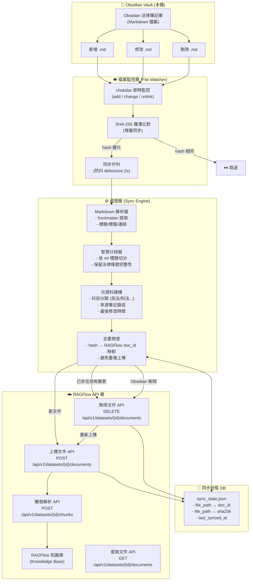
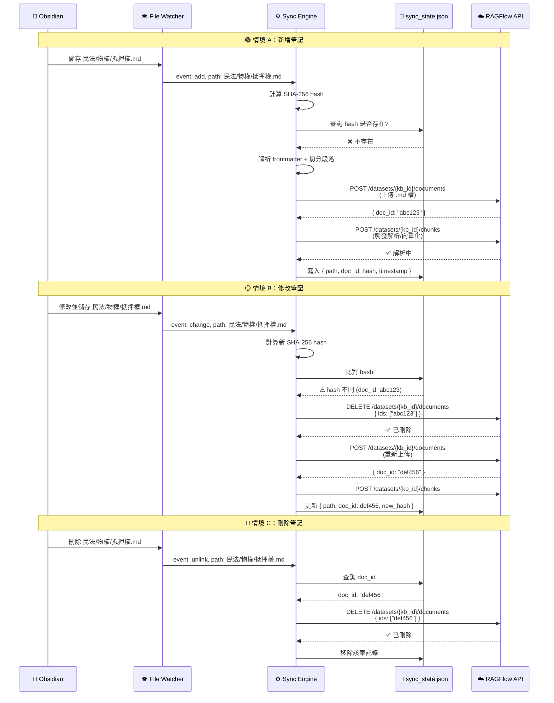
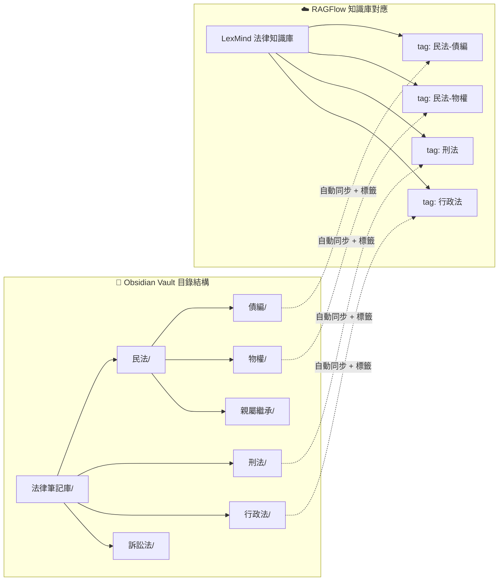

# Obsidian → RAGFlow 自動同步流程圖

## 一、整體架構總覽

---

## 二、詳細同步事件流

---

## 三、Obsidian Vault 結構對應 RAGFlow 知識庫

---

## 四、元資料映射規則

| Obsidian 來源 | RAGFlow 目標欄位 | 範例 |
|--------------|-----------------|------|
| 檔案路徑第 1 層資料夾 | `tag` (科目) | `民法/債編/保證.md` → tag: `民法-債編` |
| frontmatter `tags:` | `tag` (附加標籤) | `tags: [物權, 抵押權]` → tags 追加 |
| frontmatter `source:` | `metadata.source` | `source: 王澤鑑教授講義` |
| `# 標題` | `document.name` | `# 抵押權的效力` → 文件名 |
| 檔案修改時間 | `metadata.updated_at` | `2026-06-29T22:00:00` |
| `[[雙向連結]]` | `metadata.related_docs` | `[[物權法通則]]` → 關聯文件 |

---

## 五、實作計畫大綱

> [!IMPORTANT]
> 需要確認以下事項才能開始實作：

### 5.1 需確認的設定

| 項目 | 問題 |
|------|------|
| **Obsidian Vault 路徑** | 您的法律筆記庫放在哪個路徑？(例如 `D:/Obsidian/法律筆記`) |
| **RAGFlow 部署方式** | RAGFlow 是本機 Docker 部署還是雲端？API 地址是？ |
| **RAGFlow API Key** | 是否已有 API Key？ |
| **知識庫 ID** | 是否已在 RAGFlow 建立好知識庫？或需要自動建立？ |
| **同步頻率** | 即時監控 (chokidar) 或定時掃描 (cron)？ |
| **整合位置** | 嵌入到 LexMind server.ts 中？還是獨立服務？ |

### 5.2 預估實作項目

| 模組 | 檔案 | 說明 |
|------|------|------|
| 檔案監控器 | `src/utils/obsidianWatcher.ts` | chokidar 監控 + debounce |
| 同步引擎 | `src/utils/ragflowSync.ts` | 解析 → hash → 上傳 → 狀態管理 |
| RAGFlow 客戶端 | `src/utils/ragflowClient.ts` | API 封裝 (上傳/刪除/查詢/解析) |
| 同步狀態 DB | `data/obsidian_sync_state.json` | 檔案 → doc_id 映射 |
| API 端點 | `server.ts` 新增 3 個端點 | 手動觸發/狀態查詢/設定管理 |
| 前端面板 | `App.tsx` 新增同步面板 | 同步狀態、日誌、手動觸發按鈕 |
LexMind-Omni-法律實務-AI-工作站/
├── server.ts                          ← 🔴 主後端 Express 伺服器 (2460 行, 123KB)
├── src/
│   ├── App.tsx                        ← 🔵 主前端 React UI (309KB)
│   └── utils/
│       ├── gpuOrchestrator.ts         ← 🟢 GPU 雙卡排程器 (288 行)
│       └── legalProofer.ts            ← 🟡 法律術語 ASR 糾錯規則引擎 (126 行)
├── extracted_sources/
│   ├── app.py                         ← ⚪ 原始 Gradio 前端 (Legacy)
│   ├── legal_glossary.json            ← 📘 法律詞彙表
│   └── scripts/                       ← 🟣 Python Agent 腳本群
│       ├── process_multimodal_file.py
│       ├── agent_core_pro.py
│       ├── auto_ingest_bot.py
│       ├── backup_manager.py
│       ├── exam_trainer.py
│       ├── ingest_law_pro.py
│       ├── law_digester.py
│       ├── law_scraper_cli.py
│       ├── legal_calendar.py
│       └── multimodal_input.py
├── scripts/                           ← 🟣 頂層獨立 Python 腳本
│   ├── auto_ingest_bot.py
│   ├── law_scraper_cli.py
│   └── visual_analyzer.py
├── .agents/skills/                    ← 🧩 12 個 Agent Skill 定義
├── data/
│   ├── database.json                  ← 💾 主資料庫 (法律智庫)
│   ├── history.json                   ← 💾 對話歷史
│   ├── cases_data.json                ← 💾 案件資料
│   └── ingest_errors.log              ← 📝 錯誤日誌
└── .env                               ← ⚙️ 環境變數配置