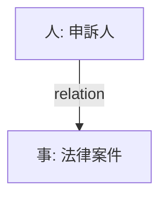

# 法律事件記憶 - 車禍大骨折求償案例

## 時間 (When)
- **時間**: 前年 至 經過的日期（具體時段或對話日期未提供）

## 人物 (Who)
- **人物**: 涉及的申訴人

## 事件 (What)
- **事件**: 車禍大骨折想要起訴求償，涉及消滅時效問題

## 地點 (Where)
- **地點**: 如果對話中有提到地點，否則填無。此处未提及地点。

## 核心物/標的 (Why/Object)
- **核心物/標的**: 相关案件事实和证據（如車禍largefracture case facts and evidence）

## AI 建議與行動點 (Action Points)
- 確保在六年內處理好相关案件，并在必要時提出appeals或re-审iz。如果五年內有新的證據或法律变化，需及時諮詢專業律師或法官以避免影響權益。

## 關係圖面 (Mermaid)
