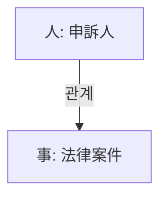

# 法律事件記憶 - 车禍大骨折起訴求償案例

## 事物流程

- **時間 (When)**: 2024年
- **人物 (Who)**: A["人: 申訴人"]
- **事件 (What)**: 车禍大骨折起訴求償，要求償金因被告拒付
- **地點 (Where)**: 無
- **核心物/標的 (Why/Object)**: 涉及 traffic accident 法律案件， relate to 时效問題 under 《中华人民共和國 traffic accident law》 第2條

## AI 建議與行動點 (Action Points)
1. 確保在五年內處理好相關 cases，並必要時提出appeals或re-审iz
2. 若有新的證據或 legal developments，在五年內及時諮詢 professional lawyers or judges
3. 考慮是否需要在五年內提出appeals或re-审iz以維持案子的validity

## 關係圖面 (Mermaid)
