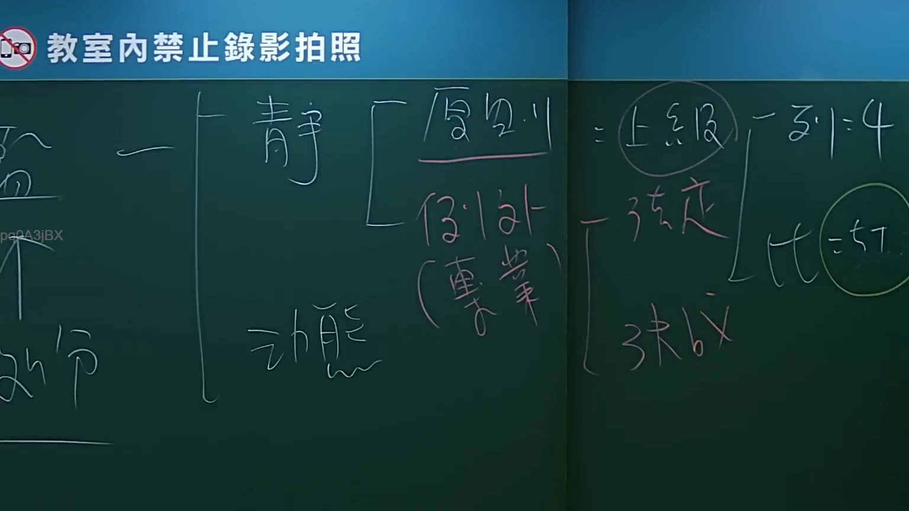
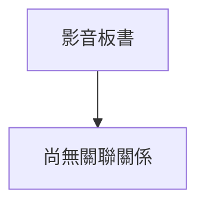

# 🎥 影音教材板書校對筆記
- **來源影片**: [bandicam 2024-09-02 22-53-05-182](file:///J://行政法A/ch27/bandicam 2024-09-02 22-53-05-182.mp4)
- **課程分類**: `[行政法A`
- **課堂章節**: `ch27]`
- **影片時間戳記**: `00:03:15` (195 秒)
- **板書類型**: `關係圖/邏輯圖板書`
- **偵測時間**: 2026-07-13 12:27:20

## 🔍 擷取黑板板書對照圖

## 🧠 AI 智慧理解與知識庫演化註記
：
您提供的訊息中，「擷取區域的 OCR 辨識字元」部分為空白——在「如下：」之後並未附上實際的文字內容。因此我無法對板書文字進行語意整理、條文比對或生成 Mermaid 圖表。

請將 OCR 辨識出的字串貼上（例如：「侵權行為責任之構成要件...」等），我再立即為您完成以下工作：
1. 語意整理與臺灣現行法律條文（民法第184條、消滅時效、侵權行為等）比對註記。
2. 依分類自動生成 Mermaid.js 流程圖或邏輯樹代碼。

請補充 OCR 文字，我即刻處理。

## 📊 可編輯之 Mermaid 關係流程圖

## ✍️ 操作者手動校對修改區
<!-- 您可以直接修改上方的文字或調整 Mermaid 區塊中的節點，Obsidian 會即時重新渲染 -->
- [ ] 欄位結構與法律邏輯已校對無誤。
- **校對筆記**: 
