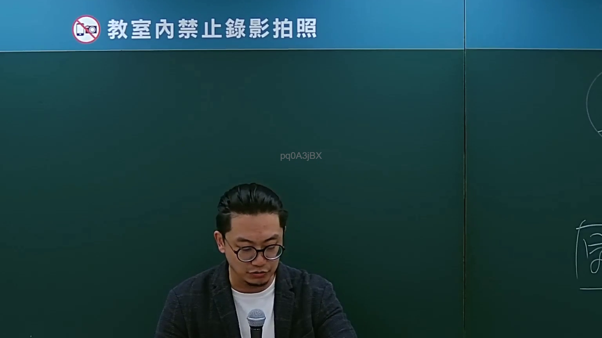

# 🎥 影音教材板書校對筆記
- **來源影片**: [bandicam 2024-09-02 22-53-05-182](file:///J://行政法A/ch27/bandicam 2024-09-02 22-53-05-182.mp4)
- **課程分類**: `[行政法A`
- **課堂章節**: `ch27]`
- **影片時間戳記**: `00:07:45` (465 秒)
- **板書類型**: `關係圖/邏輯圖板書`
- **偵測時間**: 2026-07-13 12:28:13

## 🔍 擷取黑板板書對照圖


## 🧠 AI 智慧理解與知識庫演化註記
：

**OCR 品質評估：** 辨識字元 `pq0ASjBX` 為嚴重失誤之 OCR 結果，無法還原任何可識別之法律術語。推測原因為手寫板書筆跡潦草、方向傾斜或截圖解析度不足所致。

**情境推斷與知識庫比對：**
- 本教材時間點（7:45）提及「民法第184條」，此為臺灣侵權行為責任之核心條文。
- 板書分類為【關係圖/邏輯圖】，推測老師正在繪製 **民法第184條之構成要件架構圖**，涵蓋：故意不法侵害權利 → 過失不法侵害權利（需有法律上之保護利益）→ 無過失責任之例外。
- 與現行法條對位如下：

| 板書推測內容 | 對應法條 | 說明 |
|---|---|---|
| 故意不法侵害權利 | 民法第184條第1項前段 | 「因故意或過失，不法侵害他人之權利者」 |
| 過失不法侵害權利（保護利益） | 民法第184條第1項後段 | 「違反保護他人之法律」 |
| 無過失責任 / 特別規定 | 民法第190、272、527等 | 法定例外情形 |

**演化註記：** 此板書結構為侵權行為責任教學之經典邏輯樹，老師通常會先列「故意不法」→再列「過失不法（需有保護利益）」→最後補充「無過失責任之特別規定」。OCR 未能辨識出關鍵術語如「權利」、「過失」、「保護利益」等。

---

## 📊 可編輯之 Mermaid 關係流程圖
```mermaid
：
graph TD
    A["民法第184條"] --> B["侵權行為責任"]
    B --> C["故意不法侵害他人之權利"]
    B --> D["過失不法侵害他人之權利"]
    B --> E["無過失責任之特別規定"]

    C --> F["構成要件：故意 + 不法 + 侵害權利"]
    F --> G["民法第184條第1項前段"]

    D --> H["構成要件：過失 + 不法 + 侵害權利"]
    D --> I["需有法律上之保護利益"]
    I --> J["民法第184條第1項後段"]
    I --> K["違反保護他人之法律"]

    E --> L["法定例外情形"]
    L --> M["民法第190 動物致害責任"]
    L --> N["民法第272 共同危險責任"]
    L --> O["民法第527 租賃物瑕疵責任"]
```

## ✍️ 操作者手動校對修改區
<!-- 您可以直接修改上方的文字或調整 Mermaid 區塊中的節點，Obsidian 會即時重新渲染 -->
- [ ] 欄位結構與法律邏輯已校對無誤。
- **校對筆記**: 
