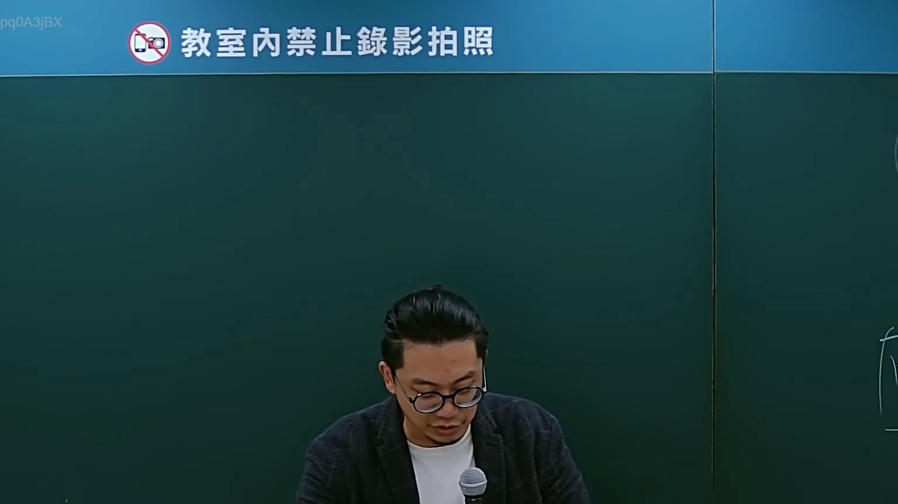
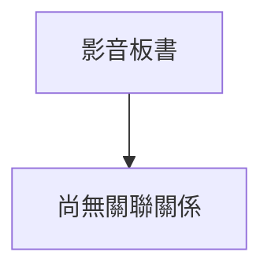

# 🎥 影音教材板書校對筆記
- **來源影片**: [bandicam 2024-09-02 22-53-05-182](file:///J://行政法A/ch27/bandicam 2024-09-02 22-53-05-182.mp4)
- **課程分類**: `[行政法A`
- **課堂章節**: `ch27]`
- **影片時間戳記**: `00:14:15` (855 秒)
- **板書類型**: `關係圖/邏輯圖板書`
- **偵測時間**: 2026-07-13 12:28:41

## 🔍 擷取黑板板書對照圖

## 🧠 AI 智慧理解與知識庫演化註記
：
您好！您的訊息中「擷取區域的 OCR 辨識字元如下：」之後並未附上實際的文字內容，因此我無法進行後續的法律條文比對與 Mermaid 圖表生成。

請您補充以下任一方式之一：

1. **直接貼上 OCR 辨識出的文字**（例如：「原告甲請求被告乙賠償新臺幣...」等）
2. **重新發送包含完整 OCR 字元的訊息**

一旦收到文字內容，我將立即為您完成：
- 📖 語意整理與臺灣現行法律條文比對（民法第184條、侵權行為責任、消滅時效等）
- 🔗 Mermaid.js 關係圖/邏輯樹代碼生成

請補充 OCR 文字，我隨時待命！

## 📊 可編輯之 Mermaid 關係流程圖

## ✍️ 操作者手動校對修改區
<!-- 您可以直接修改上方的文字或調整 Mermaid 區塊中的節點，Obsidian 會即時重新渲染 -->
- [ ] 欄位結構與法律邏輯已校對無誤。
- **校對筆記**: 
