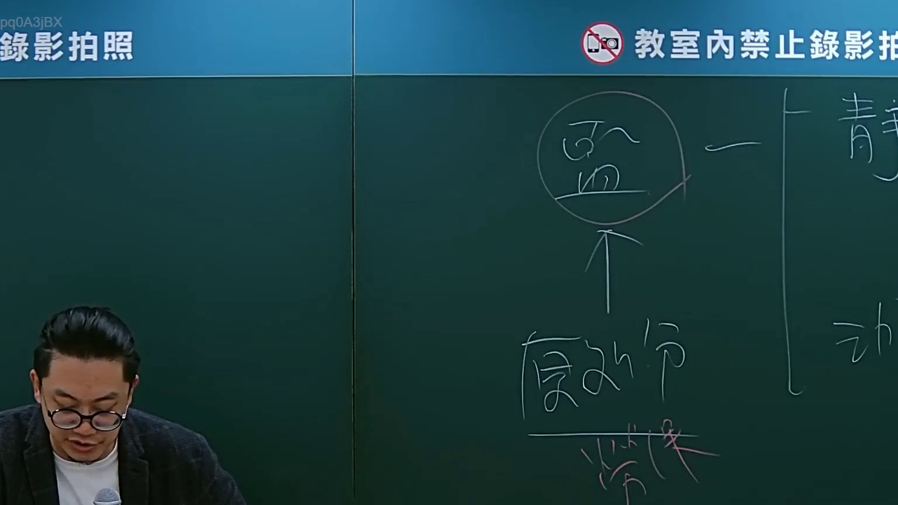
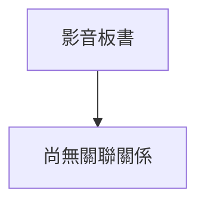

# 🎥 影音教材板書校對筆記
- **來源影片**: [bandicam 2024-09-02 22-53-05-182](file:///J://行政法A/ch27/bandicam 2024-09-02 22-53-05-182.mp4)
- **課程分類**: `[行政法A`
- **課堂章節**: `ch27]`
- **影片時間戳記**: `00:15:45` (945 秒)
- **板書類型**: `關係圖/邏輯圖板書`
- **偵測時間**: 2026-07-13 12:29:02

## 🔍 擷取黑板板書對照圖

## 🧠 AI 智慧理解與知識庫演化註記
您好！感謝您的詳細說明，但我注意到您的訊息中「擷取區域的 OCR 辨識字元如下：」之後**沒有附上實際的文字內容**。

能否請您將該時間點（15分45秒）截圖中的 **OCR 辨識文字** 貼上來？收到後我會立即為您完成以下工作：

1. 📖 **語意整理與法律條文比對** — 針對板書內容進行知識庫對位，寫下「知識庫比對與理解演化註記」
2. 🌳 **Mermaid.js 流程圖代碼生成** — 依分類（關係圖/邏輯圖 or 文字板書）輸出對應的 Mermaid 程式碼

請補充 OCR 字元內容，我隨時待命！

## 📊 可編輯之 Mermaid 關係流程圖

## ✍️ 操作者手動校對修改區
<!-- 您可以直接修改上方的文字或調整 Mermaid 區塊中的節點，Obsidian 會即時重新渲染 -->
- [ ] 欄位結構與法律邏輯已校對無誤。
- **校對筆記**: 
