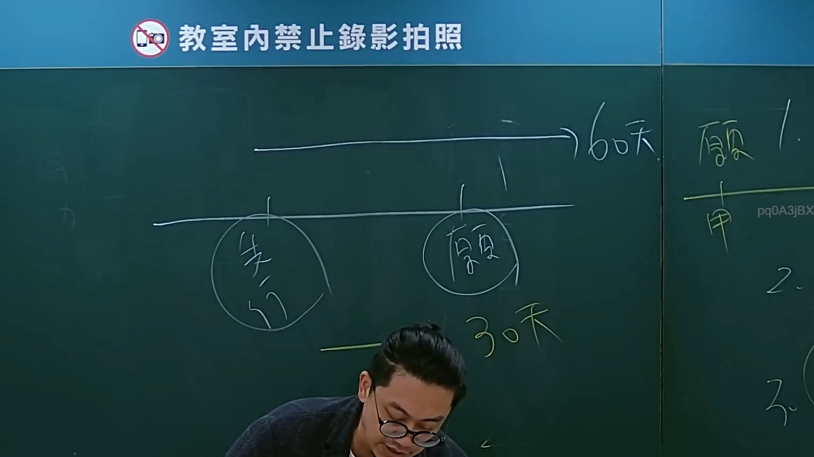
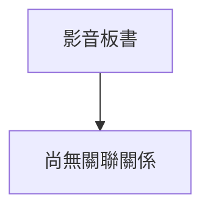

# 🎥 影音教材板書校對筆記
- **來源影片**: [bandicam 2024-09-02 22-53-05-182](file:///J://行政法A/ch27/bandicam 2024-09-02 22-53-05-182.mp4)
- **課程分類**: `[行政法A`
- **課堂章節**: `ch27]`
- **影片時間戳記**: `00:56:00` (3360 秒)
- **板書類型**: `關係圖/邏輯圖板書`
- **偵測時間**: 2026-07-13 12:30:11

## 🔍 擷取黑板板書對照圖

## 🧠 AI 智慧理解與知識庫演化註記
：

感謝您的提問，但我注意到您提供的訊息中，「擷取區域的 OCR 辨識字元如下：」之後**並未附上實際的 OCR 文字內容**。因此我目前無法進行以下工作：

1. **語意整理與條文比對** — 需要辨識出的板書文字才能與民法第184條、侵權行為責任、消滅時效等條文進行對位分析。
2. **Mermaid.js 流程圖生成** — 需要知道黑板上的邏輯結構（例如：原告→被告、構成要件、因果關係鏈等）才能繪製對應的圖表。

---

請您補充提供 OCR 辨識出的文字內容，我將立即為您完成：

- 📚 **知識庫比對與理解演化註記**（條文對位 + 實務見解）
- 📊 **Mermaid.js 流程圖代碼**（依板書結構自動生成）

期待您的補充！

## 📊 可編輯之 Mermaid 關係流程圖

## ✍️ 操作者手動校對修改區
<!-- 您可以直接修改上方的文字或調整 Mermaid 區塊中的節點，Obsidian 會即時重新渲染 -->
- [ ] 欄位結構與法律邏輯已校對無誤。
- **校對筆記**: 
