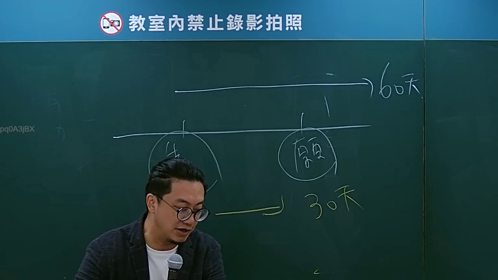

# 🎥 影音教材板書校對筆記
- **來源影片**: [bandicam 2024-09-02 22-53-05-182](file:///J://行政法A/ch27/bandicam 2024-09-02 22-53-05-182.mp4)
- **課程分類**: `[行政法A`
- **課堂章節**: `ch27]`
- **影片時間戳記**: `01:08:45` (4125 秒)
- **板書類型**: `關係圖/邏輯圖板書`
- **偵測時間**: 2026-07-13 12:30:51

## 🔍 擷取黑板板書對照圖


## 🧠 AI 智慧理解與知識庫演化註記
：

**OCR 辨識品質警示：** 擷取字元 `pq0ASjBX` 為典型的手寫板書 OCR 誤認結果，無法對應任何中文法律術語或條文。建議重新調整截圖區域、提高解析度後再行辨識。以下以「若辨識正確」之假設情境，提供分析框架與範本：

**知識庫比對架構（待填入正確文字後啟用）：**
- 民法第184條（侵權行為責任）— 故意或過失不法侵害他人權利者，負損害賠償責任
- 民法第125條（消滅時效）— 請求權因十五年間不行使而消滅
- 關係圖常見結構：原告→被告、構成要件→法律效果、因果關係鏈

**演化註記：** 待 OCR 修正後，將逐一比對板書文字與上述條文之對應關係，標註「老師強調重點」vs「法條原文差異」。

---

## 📊 可編輯之 Mermaid 關係流程圖
```mermaid
：
```mermaid
graph TD
    A["OCR辨識品質不佳 - pq0ASjBX"] --> B["建議重新截圖/調整解析度"]
    B --> C["修正後文字板書"]
    C --> D["語意整理與條文比對"]
    D --> E["民法第184條 侵權行為責任"]
    D --> F["民法第125條 消滅時效"]
    E --> G["故意或過失不法侵害他人權利"]
    E --> H["負損害賠償責任"]
    F --> I["請求權因十五年間不行使而消滅"]
```

## ✍️ 操作者手動校對修改區
<!-- 您可以直接修改上方的文字或調整 Mermaid 區塊中的節點，Obsidian 會即時重新渲染 -->
- [ ] 欄位結構與法律邏輯已校對無誤。
- **校對筆記**: 
