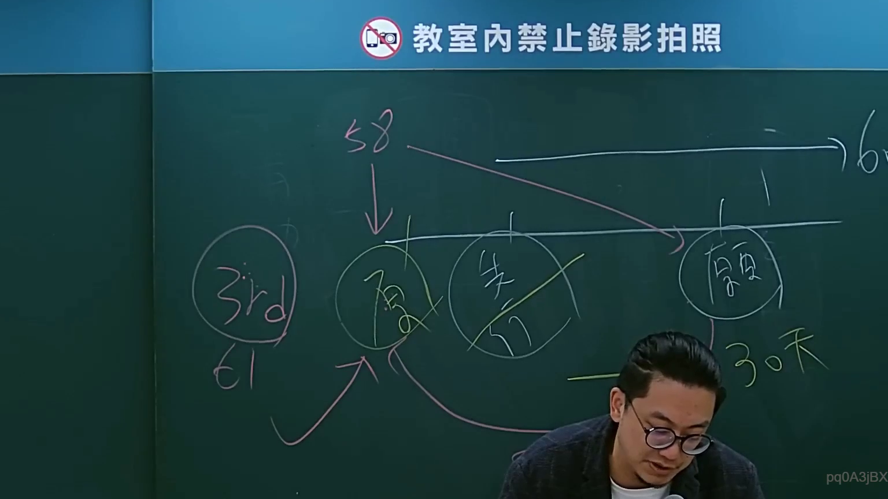
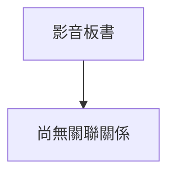

# 🎥 影音教材板書校對筆記
- **來源影片**: [bandicam 2024-09-02 22-53-05-182](file:///J://行政法A/ch27/bandicam 2024-09-02 22-53-05-182.mp4)
- **課程分類**: `[行政法A`
- **課堂章節**: `ch27]`
- **影片時間戳記**: `01:13:45` (4425 秒)
- **板書類型**: `關係圖/邏輯圖板書`
- **偵測時間**: 2026-07-13 12:31:14

## 🔍 擷取黑板板書對照圖

## 🧠 AI 智慧理解與知識庫演化註記
：

您好！您的訊息中「擷取區域的 OCR 辨識字元」部分為空白，未實際提供老師板書上的文字內容。因此我無法進行以下工作：

1. **語意整理** — 無辨識文字可分析
2. **條文比對**（如民法第184條、侵權行為、消滅時效等）— 無具體法律概念可對位
3. **Mermaid 流程圖生成** — 無結構資訊可繪製

---

📌 **請您補充以下任一方式，我即可立即為您處理：**

- **直接貼上 OCR 辨識出的文字內容**（即使有錯字也無妨）
- 或描述板書的大致內容與邏輯關係

一旦收到文字，我會：
1. 依臺灣現行法律實務進行語意整理與條文比對註記
2. 生成對應的 Mermaid.js 流程圖代碼（含雙引號包裹節點）

## 📊 可編輯之 Mermaid 關係流程圖

## ✍️ 操作者手動校對修改區
<!-- 您可以直接修改上方的文字或調整 Mermaid 區塊中的節點，Obsidian 會即時重新渲染 -->
- [ ] 欄位結構與法律邏輯已校對無誤。
- **校對筆記**: 
