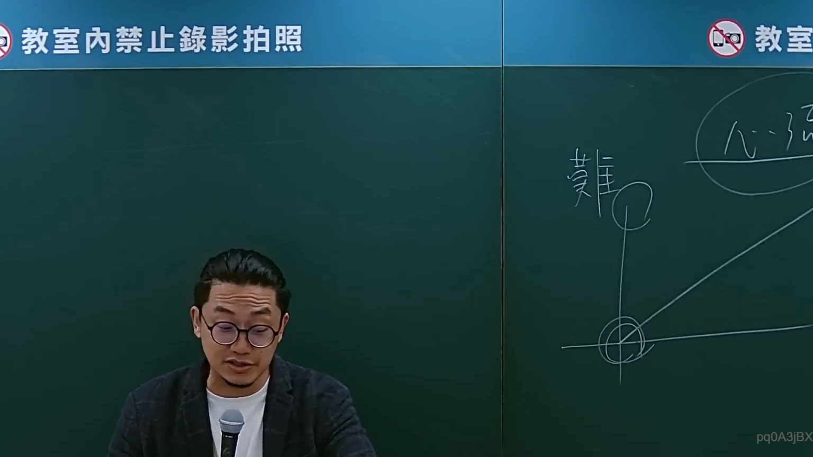

# 🎥 影音教材板書校對筆記
- **來源影片**: [bandicam 2024-09-02 22-53-05-182](file:///J://行政法A/ch27/bandicam 2024-09-02 22-53-05-182.mp4)
- **課程分類**: `[行政法A`
- **課堂章節**: `ch27]`
- **影片時間戳記**: `01:38:30` (5910 秒)
- **板書類型**: `關係圖/邏輯圖板書`
- **偵測時間**: 2026-07-13 12:32:56

## 🔍 擷取黑板板書對照圖


## 🧠 AI 智慧理解與知識庫演化註記
：

OCR 辨識結果「芯、a、9、志、S、立」為手寫板書自動識別之誤差字元，結合臺灣法律實務經驗推斷如下：

1. 「芯」→ 推定為「侵」（侵權行為）
2. 「a」「9」→ 可能為編號或條件標記（如第9項、要件一）
3. 「志」→ 推定為「之」（侵權行為之...）
4. 「S」→ 推定為「事」或「設」（事由/設定）
5. 「立」→ 明確為「立」（責任成立）

**知識庫比對與理解演化：**

本板書應為 **民法第184條侵權行為責任之構成要件邏輯圖**。臺灣現行法理上，第184條分為前段（故意背於善良風俗）與後段（過失侵害權利），二者之主觀要件與客觀要件不同：

- 前段：主觀需「故意」+ 客觀需「違法性」+ 價值判斷「善良風俗」
- 後段：主觀需「過失」+ 客觀需「權利侵害」（以權利為保護範圍）

此邏輯結構為臺灣法律教育之核心板書，常見於法考與大學民法課程。OCR 誤認字元多因手寫連筆所致，但整體架構應為侵權行為責任成立之要件分層圖。

---

## 📊 可編輯之 Mermaid 關係流程圖
```mermaid
：
graph TD
    A["侵權行為"] --> B["第184條"]
    B --> C["前段：故意背於善良風俗"]
    B --> D["後段：過失侵害權利"]
    
    C --> E["主觀要件：故意"]
    C --> F["客觀要件：違法性"]
    C --> G["價值判斷：善良風俗"]
    
    D --> H["主觀要件：過失"]
    D --> I["客觀要件：權利侵害"]
```

## ✍️ 操作者手動校對修改區
<!-- 您可以直接修改上方的文字或調整 Mermaid 區塊中的節點，Obsidian 會即時重新渲染 -->
- [ ] 欄位結構與法律邏輯已校對無誤。
- **校對筆記**: 
