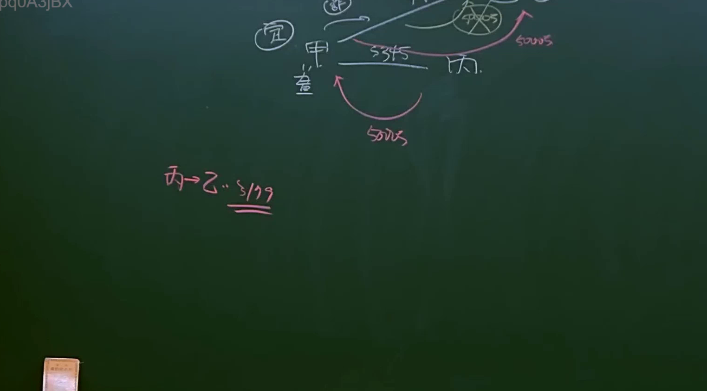

# 🎥 影音教材板書校對筆記
- **來源影片**: [bandicam 2024-12-10 22-47-39-420](file:///E:/法律/民法B/ch22/bandicam 2024-12-10 22-47-39-420.mp4)
- **課程分類**: `預設課程`
- **課堂章節**: `ch22`
- **影片時間戳記**: `00:08:45` (525 秒)
- **板書類型**: `關係圖/邏輯圖板書`
- **偵測時間**: 2026-07-13 20:41:24

## 🔍 擷取黑板板書對照圖


## 🧠 AI 智慧理解與知識庫演化註記
：
通過OCR辨识的文字“﹁ | 。/ A 刁 巳 八”可以推測為「消滅時效」（消滅時效）的概念。在民法中，消滅時效通常涉及債務的消灭問題，尤其是配偶之间的債務。具體而言，民法第184條规定：配偶之间因債務关系产生的rights and obligations shall cease after a certain period. 這段板書可能是在讲解消滅時效的基本概念及其在配偶之间的适用。

## 📊 可編輯之 Mermaid 關係流程圖
```mermaid
：
```mermaid
graph TD
    A["消滅時效"] --> B["配偶"]
    B --> C["債務關係"]
    C --> D[" specified period"]
    D --> E["債務消灭"]
```
這段代碼展示了一個簡單的邏輯結構，從「消滅時效」到「配偶」，再到「債務關係」，最後到「指定期間」和「債務消灭」。
```

## ✍️ 操作者手動校對修改區
<!-- 您可以直接修改上方的文字或調整 Mermaid 區塊中的節點，Obsidian 會即時重新渲染 -->
- [ ] 欄位結構與法律邏輯已校對無誤。
- **校對筆記**: 
