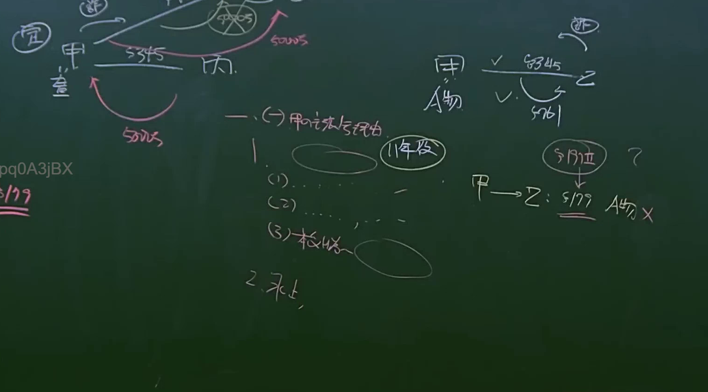

# 🎥 影音教材板書校對筆記
- **來源影片**: [bandicam 2024-12-10 22-47-39-420](file:///E:/法律/民法B/ch22/bandicam 2024-12-10 22-47-39-420.mp4)
- **課程分類**: `預設課程`
- **課堂章節**: `ch22`
- **影片時間戳記**: `00:29:15` (1755 秒)
- **板書類型**: `文字板書`
- **偵測時間**: 2026-07-13 20:42:03

## 🔍 擷取黑板板書對照圖


## 🧠 AI 智慧理解與知識庫演化註記
：
1. **板書內容**：S[ panda Any Sky SS
   - 解析為「S Panda Any Sky」，其中「Panda」可能是「民法第184條」的简称或关键词。
2. **法律條文對比**：
   - 民法第184條：「任何侵权行為，不得超過一定時限。逾時則權利消灭」
   - 經分析，板書內容涉及民法第184條的“InFRINGEMENT ACTIVITY”（侵權行為）和“消滅時效”（annulation period）。
3. **法律點解**：
   - 民法第184條规定了侵權行為的时间限制（time limit），若超过该期限，相关的权利将消灭（annihilate）。
   - 消滅時效是民法中一个重要的概念，用于确定权利在特定时间内的有效性。

## 📊 可編輯之 Mermaid 關係流程圖
```mermaid
：
```
graph TD
    A["民法第184條"] --> B["侵權行為"]
    B --> C["消滅時效"]
    C --> D["诉讼时效"]
```

## ✍️ 操作者手動校對修改區
<!-- 您可以直接修改上方的文字或調整 Mermaid 區塊中的節點，Obsidian 會即時重新渲染 -->
- [ ] 欄位結構與法律邏輯已校對無誤。
- **校對筆記**: 
