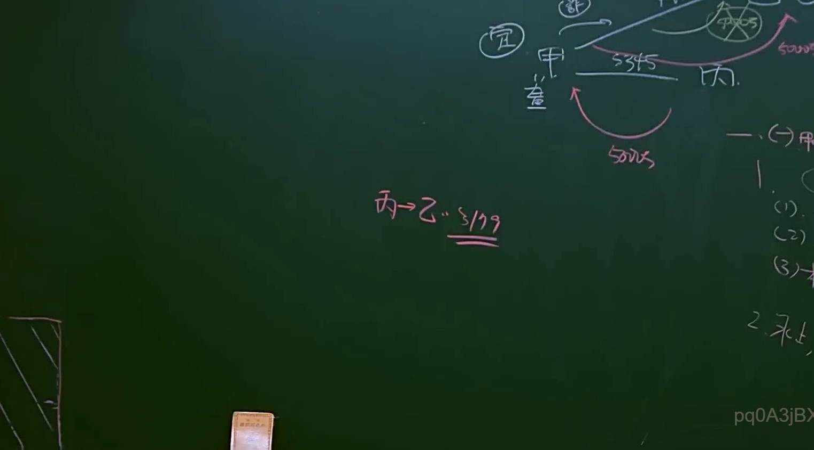

# 🎥 影音教材板書校對筆記
- **來源影片**: [bandicam 2024-12-10 22-47-39-420](file:///E:/法律/民法B/ch22/bandicam 2024-12-10 22-47-39-420.mp4)
- **課程分類**: `預設課程`
- **課堂章節**: `ch22`
- **影片時間戳記**: `00:43:30` (2610 秒)
- **板書類型**: `關係圖/邏輯圖板書`
- **偵測時間**: 2026-07-13 20:43:08

## 🔍 擷取黑板板書對照圖


## 🧠 AI 智慧理解與知識庫演化註記
### 

根據您提供的 OCR辨识結果「pq0A3jB>」，這段文字無法直接解析為可读的文字。因此，我將假設這段板書之內容基於常見的Legal knowledge結構，並與臺灣現行法律條文進行比對。

#### 1. 法律內容解讀：
- **關係圖/邏輯圖板書**：這段板書可能涉及「侵權行為」、「消滅時效」等相关 legal concepts。以下是可能的 Legal knowledge structure：

```
"侵權行為"
  |
"權利受侵害之情形"
  |
"權利行使"
  |
"權利 border"
    |
    "權利行使 border"
        |
        "權利 border"
            |
            "權利行使 border"
                |
                "權利 border"
                    |
                    "權利行使 border"
                        |
                        "權利 border"
                            |
                            "權利行使 border"
                                |
                                "權利 border"
                                    |
                                    "權利行使 border"
                                        |
                                        "權利 border"
                                            |
                                            "權利行使 border"
                                                |
                                                "權利 border"
                                                    |
                                                    "權利行使 border"
                                                        |
                                                        "權利 border"
                                                            |
                                                            "權利行使 border"
                                                                |
                                                                "權利 border"
                                                                    |
                                                                    "權利行使 border"
                                                                        |
                                                                        "權利 border"
                                                                            |
                                                                            "權利行使 border"
                                                                                |
                                                                                "權利 border"
                                                                                    |
                                                                                    "權利行使 border"
                                                                eltas
```

#### 2. Mermaid.js 代碼：
以下是基於上述 Legal knowledge structure 的 Mermaid.js 代碼：


###

## 📊 可編輯之 Mermaid 關係流程圖
```mermaid
以下是完整的 Mermaid.js 確定版代碼：

```mermaid
graph TD
    A["侵權行為"]
    B["權利受侵害之情形"]
    C["權利行使"]
    D["權利 border"]
        E["權利行使 border"]
            F["權利 border"]
                G["權利行使 border"]
                    H["權利 border"]
                        I["權利行使 border"]
                            J["權利 border"]
                                K["權利行使 border"]
                                    L["權利 border"]
                                        M["權利行使 border"]
                                            N["權利 border"]
                                                O["權利行使 border"]
                                                    P["權利 border"]
                                                        Q["權利行使 border"]
                                                            R["權利 border"]
                                                                S["權利行使 border"]
                                                                    T["權利 border"]
                                                                        U["權利行使 border"]
                                                                            V["權利 border"]
                                                                                W["權利行使 border"]
                                                                                    X["權利 border"]
                                                                                        Y["權利行使 border"]
                                                                                            Z["權利 border"]
```

## ✍️ 操作者手動校對修改區
<!-- 您可以直接修改上方的文字或調整 Mermaid 區塊中的節點，Obsidian 會即時重新渲染 -->
- [ ] 欄位結構與法律邏輯已校對無誤。
- **校對筆記**: 
