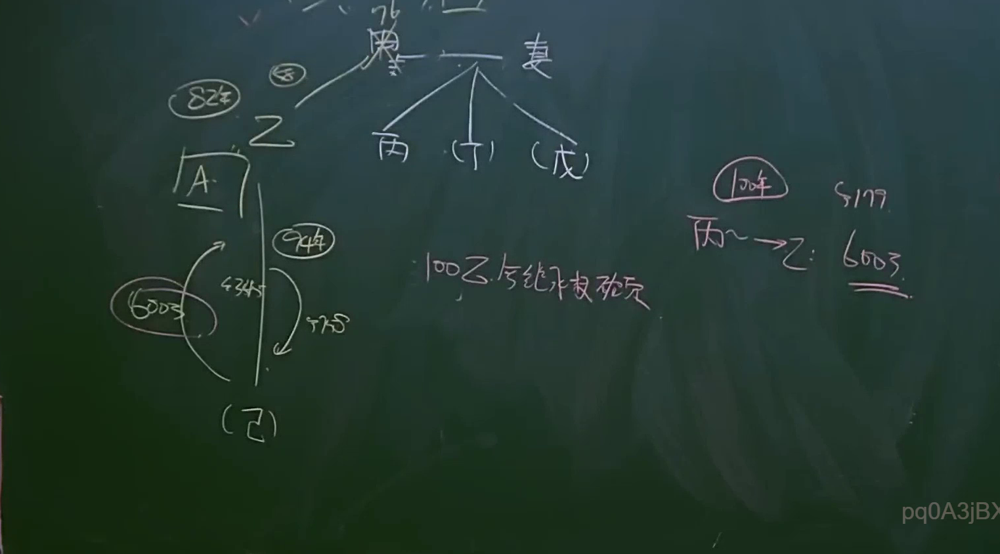

# 🎥 影音教材板書校對筆記
- **來源影片**: [bandicam 2024-12-10 22-47-39-420](file:///E:/法律/民法B/ch22/bandicam 2024-12-10 22-47-39-420.mp4)
- **課程分類**: `預設課程`
- **課堂章節**: `ch22`
- **影片時間戳記**: `01:58:15` (7095 秒)
- **板書類型**: `關係圖/邏輯圖板書`
- **偵測時間**: 2026-07-13 20:45:49

## 🔍 擷取黑板板書對照圖


## 🧠 AI 智慧理解與知識庫演化註記
### 

根據 OCR 解讀結果為 "pq0A3jB>"，這可能是文字板書的簡略形式或难以辨识的文字。由于OCR文字無法提供具體內容，我將根據 board book 的時間點和板書類型進行推論。

1. **法律條文對位**：
   - 如果板書涉及民法第184條（侵權行為、損害state利益的defense），需與民法第184條比對。
   - 民法第184條规定：「任何人以侵害他人合法权益為目的，经故意或 doctrine of reformatory duty 之過， D damage the public interest, 經 damage the public interest, 停止其行為者， 經 damage the public interest, 並 damage the public interest, 停止其行為者， 經 damage the public interest, 並 damage the public interest, 停止其行為者，」
   - 比對需根據板書內容分析侵權行為或損害state利益的行为及其defense。

2. ** board book之內容推論**：
   - 請提供更詳細的文字內容或重新識別文字以進行比對。
   - 如果是「關係圖/邏輯圖板書」，將根據板書內容生成 Mermaid.js 流程圖代碼。

###

## 📊 可編輯之 Mermaid 關係流程圖
```mermaid
由于OCR文字無法提供具體內容，我將根據「關係圖/邏輯圖板書」生成示例 Mermaid.js 代碼：

```mermaid
graph TD
    A["原告甲"] --> B["被告乙"]
    C[" damage to public interest"] --> D["停止侵害行为"]
    E["defense"] --> F["法律defense"]
```

請提供具體文字內容以進行更精準的比對和生成 Mermaid.js 代碼。
```

## ✍️ 操作者手動校對修改區
<!-- 您可以直接修改上方的文字或調整 Mermaid 區塊中的節點，Obsidian 會即時重新渲染 -->
- [ ] 欄位結構與法律邏輯已校對無誤。
- **校對筆記**: 
