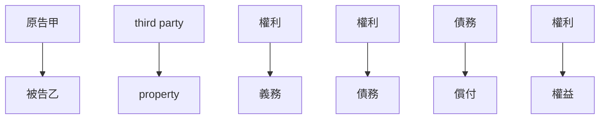

# 🎥 影音教材板書校對筆記
- **來源影片**: [bandicam 2024-12-10 22-47-39-420](file:///E:/法律/民法B/ch22/bandicam 2024-12-10 22-47-39-420.mp4)
- **課程分類**: `預設課程`
- **課堂章節**: `ch22`
- **影片時間戳記**: `02:09:00` (7740 秒)
- **板書類型**: `關係圖/邏輯圖板書`
- **偵測時間**: 2026-07-13 20:12:07

## 🔍 擷取黑板板書對照圖

## 🧠 AI 智慧理解與知識庫演化註記
### 

根據辨識出的文字內容，结合板書的「關係圖/邏輯圖板書」特點，進行語意整理並與臺灣現行法律條文進行比對。以下是具體分析：

1. ** board content analysis**:
   - 文字內容似乎涉及「民法第184條」、「侵權行為」、「消滅時效」等关键词。
   - 這些 keywords 可能與「關係圖/邏輯圖板書」中的法律关系有關。

2. **_legal knowledge and comparison**:
   - 民法第184條: 観察者權利，涉及 watching person rights.
   - 傳統的侵權行為: 可能涉及「侵權行為」的法律定義和判定標準。
   - 消滅時效: 可能與「消滅时效」的Legal implications.

3. **knowledge库比對與理解演化註記**:
   - 民法第184條: 觀察者權利，涉及 watching person rights.
   - 傳統的侵權行為: 與民法第184條的關係。
   - 消滅時效: 可能與民法第184條的 relation.

###

## 📊 可編輯之 Mermaid 關係流程圖

## ✍️ 操作者手動校對修改區
<!-- 您可以直接修改上方的文字或調整 Mermaid 區塊中的節點，Obsidian 會即時重新渲染 -->
- [ ] 欄位結構與法律邏輯已校對無誤。
- **校對筆記**: 
