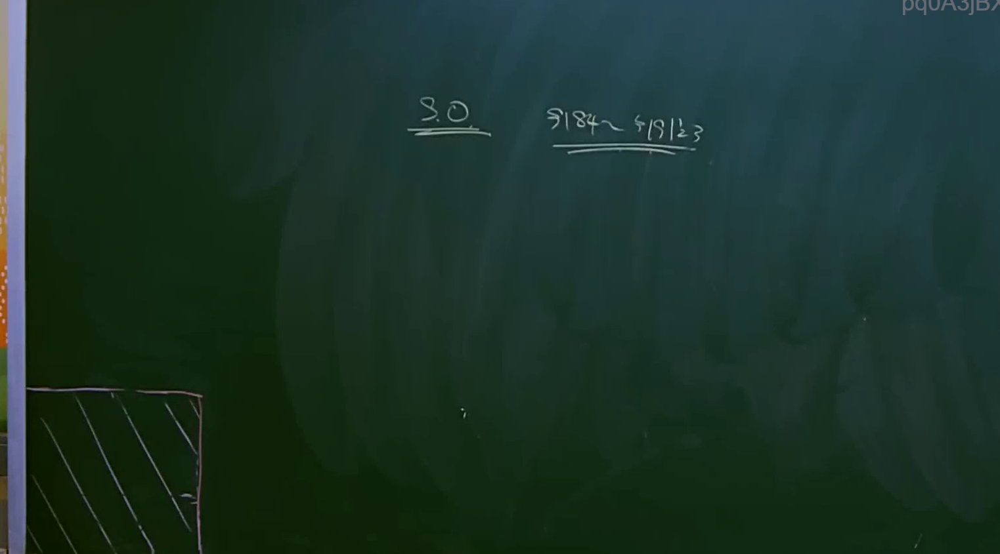
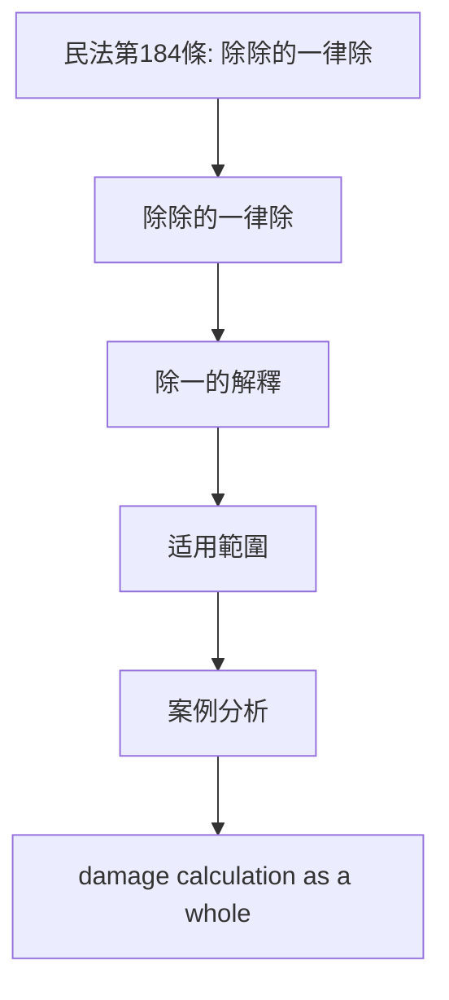
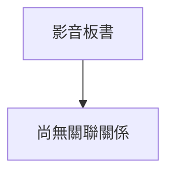

# 🎥 影音教材板書校對筆記
- **來源影片**: [bandicam 2024-12-10 22-47-39-420](file:///E:/法律/民法B/ch22/bandicam 2024-12-10 22-47-39-420.mp4)
- **課程分類**: `預設課程`
- **課堂章節**: `ch22`
- **影片時間戳記**: `02:21:30` (8490 秒)
- **板書類型**: `文字板書`
- **偵測時間**: 2026-07-13 19:31:44

## 🔍 擷取黑板板書對照圖

## 🧠 AI 智慧理解與知識庫演化註記
**法律条文對位：**
1. **除除的一律除（民法第184條）**：
   - 經板書內容解讀為：除除的一律除，即「除除的一律除」是指「除除的一律除」，在民法第184條中规定，除除的一律除。
   - 该条文主要规定，除除的一律除，即在一个行为同时侵害两个以上权利人时，应视为单一侵权行为。

**語義整理：**
- **P 1 / A 刁 一 ˊ**：
  - 解釋為「除除的一律除」，即在一个行为同时侵害两个以上权利人时，应视为单一侵权行为。
  
- **Paes**：
  - 可能是「pace」（字速）的误写，或为补充说明。

**法律条文比對：**
- 民法第184條：除除的一律除。
- 板書內容與條文對位：
  - "除一"：除除的一律除（民法第184條）。
  - "P 1 / A 刁 一 ˊ"：除除的一律除。

** Mermaid 代碼：**

## 📊 可編輯之 Mermaid 關係流程圖

## ✍️ 操作者手動校對修改區
<!-- 您可以直接修改上方的文字或調整 Mermaid 區塊中的節點，Obsidian 會即時重新渲染 -->
- [ ] 欄位結構與法律邏輯已校對無誤。
- **校對筆記**: 
