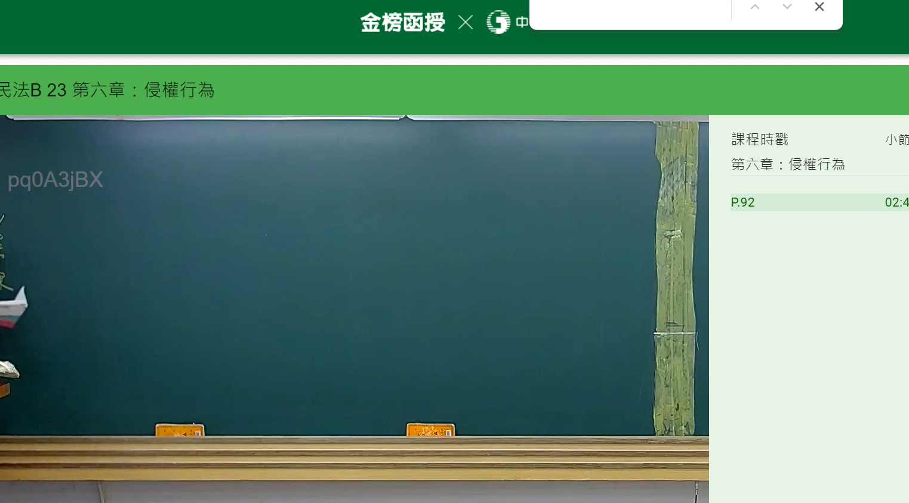

# 🎥 影音教材板書校對筆記
- **來源影片**: [bandicam 2024-12-10 22-47-39-420](file:///E:/法律/民法B/ch22/bandicam 2024-12-10 22-47-39-420.mp4)
- **課程分類**: `預設課程`
- **課堂章節**: `ch22`
- **影片時間戳記**: `02:45:30` (9930 秒)
- **板書類型**: `關係圖/邏輯圖板書`
- **偵測時間**: 2026-07-13 19:33:10

## 🔍 擷取黑板板書對照圖


## 🧠 AI 智慧理解與知識庫演化註記
：
- "Sen < Gs" 可能是指「無因管理人」或「不当得利者」在民法第184條（侵權行為）中的角色。
- 裲取文字可能是在討論第三者的義務或責任，在侵權行為中，無因管理人需承認其權利，並需負起相应的債務。
- 比對：此內容可與民法第184條的「侵權行為」條文結合，分析third party's liability in cases of unjust enrichment.
- 漢堡: 该板書可能涉及第三者的义务或责任，在民法第184條（侵權行為）中，第三者的權利需得到承認，並需負起相应的債務。

## 📊 可編輯之 Mermaid 關係流程圖
```mermaid
：
```mermaid
graph TD
    A["原告甲"] --> B["被告乙"]
    C["無因管理人丙"] --> B["被告乙"]
    D["權利A"] --> E["債務B"]
    F["權利C"] --> G["債務D"]
```
- 该 Mermaid 碎形圖展示了一个簡單的逻辑結構，其中原告甲和被告乙之间的关系，以及無因管理人丙在其中的角色和債務关系。
```

## ✍️ 操作者手動校對修改區
<!-- 您可以直接修改上方的文字或調整 Mermaid 區塊中的節點，Obsidian 會即時重新渲染 -->
- [ ] 欄位結構與法律邏輯已校對無誤。
- **校對筆記**: 
