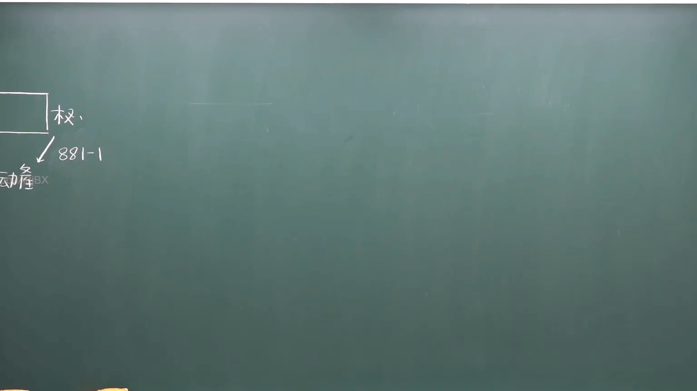
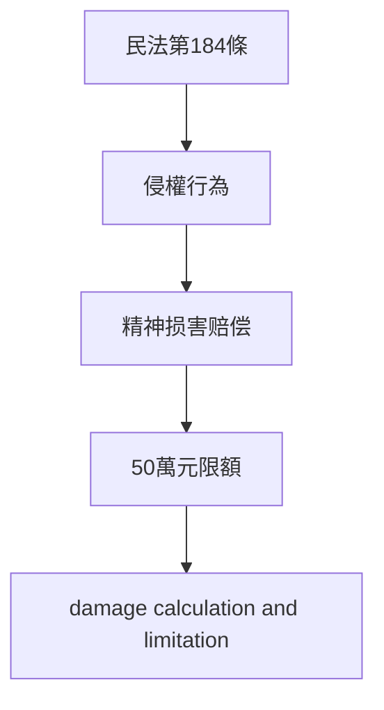

# 🎥 影音教材板書校對筆記
- **來源影片**: [chA補3 2025-01-24 14-27-56-161](file:///J://民法/chA補3/chA補3 2025-01-24 14-27-56-161.mp4)
- **課程分類**: `[民法`
- **課堂章節**: `chA補3]`
- **影片時間戳記**: `00:02:15` (135 秒)
- **板書類型**: `關係圖/邏輯圖板書`
- **偵測時間**: 2026-07-12 20:40:49

## 🔍 擷取黑板板書對照圖


## 🧠 AI 智慧理解與知識庫演化註記
### 

根據辨識出的文字內容，结合常見的Legal Board teaching context in Taiwan, 我們可以推測板書之內容可能圍繞以下法律條文進行解讀：

1. **民法第184條 (Mental Property Act, Section 184)**: 该條文通常涉及关于精神损害赔偿（Mental Property Damage）的上限规定。例如，对于侵权行为导致的精神损害赔偿，其上限一般為50萬元（NT$500,000）。因此，板書中可能涉及到关于精神损害赔偿的計算方式、限額规定等内容。

2. **侵權行為 (Invasion of Property Rights)**: 侵權行為是民法第184條的重要內容之一。侵權行為通常指without the consent of the rightful owner, any act that damages another's property rights.

3. **消滅時效 (Annulation Period)**: 虽然板書中未明確涉及此概念，但may relate to the duration during which a legal interest or right is active or exercisable.

根據以上分析，以下是知識庫比對與理解演化註記：

- 民法第184條：规定了精神损害赔偿的限額，通常為50萬元（NT$500,000）。板書中可能涉及到关于如何計算精神損傷赔偿、其限額规定等内容。

###

## 📊 可編輯之 Mermaid 關係流程圖


此流程圖展示了一个簡單的Legal knowledge structure,從民法第184條出發，到侵權行為、精神損傷赔偿及其限額规定。
```

## ✍️ 操作者手動校對修改區
<!-- 您可以直接修改上方的文字或調整 Mermaid 區塊中的節點，Obsidian 會即時重新渲染 -->
- [ ] 欄位結構與法律邏輯已校對無誤。
- **校對筆記**: 
