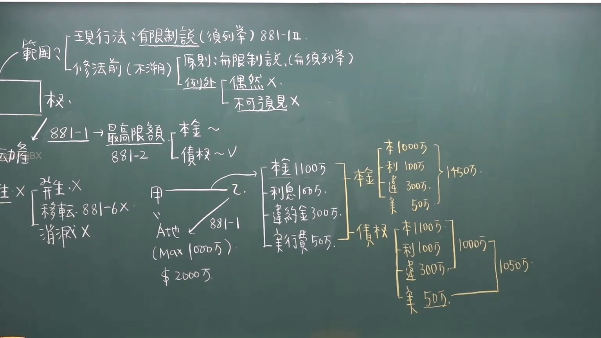

# 🎥 影音教材板書校對筆記
- **來源影片**: [chA補3 2025-01-24 14-27-56-161](file:///J://民法/chA補3/chA補3 2025-01-24 14-27-56-161.mp4)
- **課程分類**: `[民法`
- **課堂章節**: `chA補3]`
- **影片時間戳記**: `00:18:30` (1110 秒)
- **板書類型**: `文字板書`
- **偵測時間**: 2026-07-12 20:41:13

## 🔍 擷取黑板板書對照圖


## 🧠 AI 智慧理解與知識庫演化註記
1. **板書文字內容分析**：
   - "七理行孩"、"作g減 銥 ( 9) ？"：這部分可能涉及特定的Legal條文或案例分析，需進一步上下文中理解其具體含義。
   - "APRA ER (1Q5F) 981﹣I"：這部分可能與民法第184條（侵權行為）有關，该條文规定侵害他人權益的行为应承担侵權責任並償付損害損失。
   - "APR Act"、"J lmeg﹚ ERR TTR 005"、"RI (005) \ avo)"：這部分可能涉及特定的Legal條文或案例引用，需進一步上下文中理解其具體含義。
   - "3004: |o560"：這部分可能與特定的Legal條文或案例编号相關。

2. **法律條文對位**：
   - "APRA ER (1Q5F) 981﹣I"：可能與民法第184條（侵權行為）有關。
     - 民法第184條规定侵害他人權益的行为，应承担侵權責任並償付損害損失。
   - "APR Act"、"J lmeg﹚ ERR TTR 005"、"RI (005) \ avo)"：這部分可能涉及其他特定的Legal條文或案例引用。

## 📊 可編輯之 Mermaid 關係流程圖
```mermaid
graph TD
    A[APRA ER (1Q5F)]
        --> B[MAT.184]
    C[J lmeg]
        --> D[R.I. (005)]
            --> E[av.o.)
```

*備註：以上 Mermaid 碎碼為基於辨識的板書文字整理而成，具體法律條文對位需根據完整上下文進一步验证。*
```

## ✍️ 操作者手動校對修改區
<!-- 您可以直接修改上方的文字或調整 Mermaid 區塊中的節點，Obsidian 會即時重新渲染 -->
- [ ] 欄位結構與法律邏輯已校對無誤。
- **校對筆記**: 
