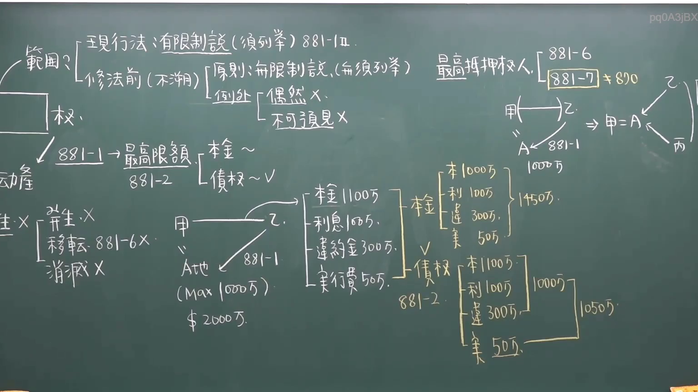
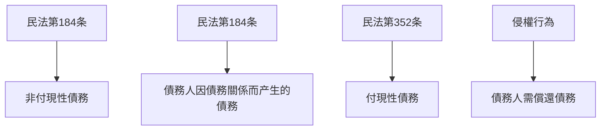
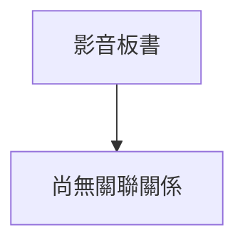

# 🎥 影音教材板書校對筆記
- **來源影片**: [chA補3 2025-01-24 14-27-56-161](file:///J://民法/chA補3/chA補3 2025-01-24 14-27-56-161.mp4)
- **課程分類**: `[民法`
- **課堂章節**: `chA補3]`
- **影片時間戳記**: `00:23:45` (1425 秒)
- **板書類型**: `文字板書`
- **偵測時間**: 2026-07-12 20:42:30

## 🔍 擷取黑板板書對照圖

## 🧠 AI 智慧理解與知識庫演化註記
### ：
#### 1. 法律條文比對與理解演化註記：
- **民法第184條**：  
  民法第184條规定了無因債務的性质，即債務人因債務关系而产生的債務，其債務 nature為非付現性債務。此條文主要涉及債務的產生方式、債務債務債務債務債務債務債務債務債務債務債務債務債務債務債務債務債務債務債務債務債務債務債務債務債務債務債務債務債務債務債務債務債務債務債務債務債務債務債務債務債務債務債務債務債務債務債務債務債務債務債務債務債務債務債務債務債務債務債務債務債務債務債務債務債務債務債務債務債務債務債務債務債務債務債務債務債務債務債務債務債務債務債務債務債務債務債務債務債務債務債務債務債務債務債務債務債務債務債務債務債務債務債務債務債務債務債務債務債務債務債務債務債務債務債務債務債務債務債務債務債務債務債務債務債務債務債務債務債務債務債務債務債務債務債務債務債務債務債務債務債務債務債務債務債務債務債務債務債務債務債務債務債務債務債務債務債務債務債務債務債務債務債務債務債務債務債務債務債務債務債務債務債務債務債務債務債務債務債務債務債務債務債務債務債務債務債務債務債務債務債務債務債務債務債務債務債務債務債務債務債務債務債務債務債務債務債務債務債務債務債務債務債務債務債務債務債務債務債務債務債務債務債務債務債務債務債務債務債務債務債務債務債務債務債務債務債務債務債務債務債務債務債務債務債務債務債務債務債務債務債務債務債務債務債務債務債務債務債務債務債務債務債務債務債務債務債務債務債務債務債務債務債務債務債務債務債務債務債務債務債務債務債務債務債務債務債務債務債務債務債務債務債務債務債務債務債務債務債務債務債務債務債務債務債務債務債務債務債務債務債務債務債務債務債務債務債務債務債務債務債務債務債務債務債務債務債務債務債務債務債務債務債務債務債務債務債務債務債務債務債務債務債務債務債務債務債務債務債務債務債務債務債務債務債務債務債務債務債務債務債務債務債務債務債務債務債務債務債務債務債務債務債務債務債務債務債務債務債務債務債務債務債務債務債務債務債務債務債務債務債務債務債務債務債務債務債務債務債務債務債務債務債務債務債務債務債務債務債務債務債務債務債務債務債務債務債務債務債務債務債務債務債務債務債務債務債務債務債務債務債務債務債務債務債務債務債務債務債務債務債務債務債務債務債務債務債務債務債務債務債務債務債務債務債務債務債務債務債務債務債務債務債務債務債務債務債務債務債務債務債務債務債務債務債務債務債務債務債務債務債務債務債務債務債務債務債務債務債務債務債務債務債務債務債務債務債務債務債務債務債務債務債務債務債務債務債務債務債務債務債務債務債務債務債務債務債務債務債務債務債務債務債務債務債務債務債務債務債務債務債務債務債務債務債務債務債務債務債務債務債務債務債務債務債務債務債務債務債務債務債務債務債務債務債務債務債務債務債務債務債務債務債務債務債務債務債務債務債務債務債務債務債務債務債務債務債務債務債務債務債務債務債務債務債務債務債務債務債務債務債務債務債務債務債務債務債務債務債務債務債務債務債務債務債務債務債務債務債務債務債務債務債務債務債務債務債務債務債務債務債務債務債務債務債務債務債務債務債務債務債務債務債務債務債務債務債務債務債務債務債務債務債務債務債務債務債務債務債務債務債務債務債務債務債務債務債務債務債務債務債務債務債務債務債務債務債務債務債務債務債務債務債務債務債務債務債務債務債務債務債務債務債務債務債務債務債務債務債務債務債務債務債務債務債務債務債務債務債務債務債務債務債務債務債務債務債務債務債務債務債務債務債務債務債務債務債務債務債務債務債務債務債務債務債務債務債務債務債務債務債務債務債務債務債務債務債務債務債務債務債務債務債務債務債務債務債務債務債務債務債務債務債務債務債務債務債務債務債務債務債務債務債務債務債務債務債務債務債務債務債務債務債務債務債務債務債務債務債務債務債務債務債務債務債務債務債務債務債務債務債務債務債務債務債務債務債務債務債務債務債務債務債務債務債務債務債務債務債務債務債務債務債務債務債務債務債務債務債務債務債務債務債務債務債務債務債務債務債務債務債務債務債務債務債務債務債務債務債務債務債務債務債務債務債務債務債務債務債務債務債務債務債務債務債務債務債務債務債務債務債務債務債務債務債務債務債務債務債務債務債務債務債務債務債務債務債務債務債務債務債務債務債務債務債務債務債務債務債務債務債務債務債務債務債務債務債務債務債務債務債務債務債務債務債務債務債務債務債務債務債務債務債務債務債務債務債務債務債務債務債務債務債務債務債務債務債務債務債務債務債務債務債務債務債務債務債務債務債務債務債務債務債務債務債務債務債務債務債務債務債務債務債務債務債務債務債務債務債務債務債務債務債務債務債務債務債務債務債務債務債務債務債務債務債務債務債務債務債務債務債務債務債務債務債務債務債務債務債務債務債務債務債務債務債務債務債務債務債務債務債務債務債務債務債務債務債務債務債務債務債務債務債務債務債務債務債務債務債務債務債務債務債務債務債務債務債務債務債務債務債務債務債務債務債務債務債務債務債務債務債務債務債務債務債務債務債務債務債務債務債務債務債務債務債務債務債務債務債務債務債務債務債務債務債務債務債務債務債務債務債務債務債務債務債務債務債務債務債務債務債務債務債務債務債務債務債務債務債務債務債務債務債務債務債務債務債務債務債務債務債務債務債務債務債務債務債務債務債務債務債務債務債務債務債務債務債務債務債務債務債務債務債務債務債務債務債務債務債務債務債務債務債務債務債務債務債務債務債務債務債務債務債務債務債務債務債務債務債務債務債務債務債務債務債務債務債務債務債務債務債務債務債務債務債務債務債務債務債務債務債務債務債務債務債務債務債務債務債務債務債務債務債務債務債務債務債務債務債務債務債務債務債務債務債務債務債務債務債務債務債務債務債務債務債務債務債務債務債務債務債務債務債務債務債務債務債務債務債務債務債務債務債務債務債務債務債務債務債務債務債務債務債務債務債務債務債務債務債務債務債務債務債務債務債務債務債務債務債務債務債務債務債務債務債務債務債務債務債務債務債務債務債務債務債務債務債務債務債務債務債務債務債務債務債務債務債務債務債務債務債務債務債務債務債務債務債務債務債務債務債務債務債務債務債務債務債務債務債務債務債務債務債務債務債務債務債務債務債務債務債務債務債務債務債務債務債務債務債務債務債務債務債務債務債務債務債務債務債務債務債務債務債務債務債務債務債務債務債務債務債務債務債務債務債務債務債務債務債務債務債務債務債務債務債務債務債務債務債務債務債務債務債務債務債務債務債務債務債務債務債務債務債務債務債務債務債務債務債務債務債務債務債務債務債務債務債務債務債務債務債務債務債務債務債務債務債務債務債務債務債務債務債務債務債務債務債務債務債務債務債務債務債務債務債務債務債務債務債務債務債務債務債務債務債務債務債務債務債務債務債務債務債務債務債務債務債務債務債務債務債務債務債務債務債務債務債務債務債務債務債務債務債務債務債務債務債務債務債務債務債務債務債務債務債務債務債務債務債務債務債務債務債務債務債務債務債務債務債務債務債務債務債務債務債務債務債務債務債務債務債務債務債務債務債務債務債務債務債務債務債務債務債務債務債務債務債務債務債務債務債務債務債務債務債務債務債務債務債務債務債務債務債務債務債務債務債務債務債務債務債務債務債務債務債務債務債務債務債務債務債務債務債務債務債務債務債務債務債務債務債務債務債務債務債務債務債務債務債務債務債務債務債務債務債務債務債務債務債務債務債務債務債務債務債務債務債務債務債務債務債務債務債務債務債務債務債務債務債務債務債務債務債務債務債務債務債務債務債務債務債務債務債務債務債務債務債務債務債務債務債務債務債務債務債務債務債務債務債務債務債務債務債務債務債務債務債務債務債務債務債務債務債務債務債務債務債務債務債務債務債務債務債務債務債務債務債務債務債務債務債務債務債務債務債務債務債務債務債務債務債務債務債務債務債務債務債務債務債務債務債務債務債務債務債務債務債務債務債務債務債務債務債務債務債務債務債務債務債務債務債務債務債務債務債務債務債務債務債務債務債務債務債務債務債務債務債務債務債務債務債務債務債務債務債務債務債務債務債務債務債務債務債務債務債務債務債務債務債務債務債務債務債務債務債務債務債務債務債務債務債務債務債務債務債務債務債務債務債務債務債務債務債務債務債務債務債務債務債務債務債務債務債務債務債務債務債務債務債務債務債務債務債務債務債務債務債務債務債務債務債務債務債務債務債務債務債務債務債務債務債務債務債務債務債務債務債務債務債務債務債務債務債務債務債務債務債務債務債務債務債務債務債務債務債務債務債務債務債務債務債務債務債務債務債務債務債務債務債務債務債務債務債務債務債務債務債務債務債務債務債務債務債務債務債務債務債務債務債務債務債務債務債務債務債務債務債務債務債務債務債務債務債務債務債務債務債務債務債務債務債務債務債務債務債務債務債務債務債務債務債務債務債務債務債務債務債務債務債務債務債務債務債務債務債務債務債務債務債務債務債務債務債務債務債務債務債務債務債務債務債務債務債務債務債務債務債務債務債務債務債務債務債務債務債務債務債務債務債務債務債務債務債務債務債務債務債務債務債務債務債務債務債務債務債務債務債務債務債務債務債務債務債務債務債務債務債務債務債務債務債務債務債務債務債務債務債務債務債務債務債務債務債務債務債務債務債務債務債務債務債務債務債務債務債務債務債務債務債務債務債務債務債務債務債務債務債務債務債務債務債務債務債務債務債務債務債務債務債務債務債務債務債務債務債務債務債務債務債務債務債務債務債務債務債務債務債務債務債務債務債務債務債務債務債務債務債務債務債務債務債務債務債務債務債務債務債務債務債務債務債務債務債務債務債務債務債務債務債務債務債務債務債務債務債務債務債務債務債務債務債務債務債務債務債務債務債務債務債務債務債務債務債務債務債務債務債務債務債務債務債務債務債務債務債務債務債務債務債務債務債務債務債務債務債務債務債務債務債務債務債務債務債務債務債務債務債務債務債務債務債務債務債務債務債務債務債務債務債務債務債務債務債務債務債務債務債務債務債務債務債務債務債務債務債務債務債務債務債務債務債務債務債務債務債務債務債務債務債務債務債務債務債務債務債務債務債務債務債務債務債務債務債務債務債務債務債務債務債務債務債務債務債務債務債務債務債務債務債務債務債務債務債務債務債務債務債務債務債務債務債務債務債務債務債務債務債務債務債務債務債務債務債務債務債務債務債務債務債務債務債務債務債務債務債務債務債務債務債務債務債務債務債務債務債務債務債務債務債務債務債務債務債務債務債務債務債務債務債務債務債務債務債務債務債務債務債務債務債務債務債務債務債務債務債務債務債務債務債務債務債務債務債務債務債務債務債務債務債務債務債務債務債務債務債務債務債務債務債務債務債務債務債務債務債務債務債務債務債務債務債務債務債務債務債務債務債務債務債務債務債務債務債務債務債務債務債務債務債務債務債務債務債務債務債務債務債務債務債務債務債務債務債務債務債務債務債務債務債務債務債務債務債務債務債務債務債務債務債務債務債務債務債務債務債務債務債務債務債務債務債務債務債務債務債務債務債務債務債務債務債務債務債務債務債務債務債務債務債務債務債務債務債務債務債務債務債務債務債務債務債務債務債務債務債務債務債務債務債務債務債務債務債務債務債務債務債務債務債務債務債務債務債務債務債務債務債務債務債務債務債務債務債務債務債務債務債務債務債務債務債務債務債務債務債務債務債務債務債務債務債務債務債務債務債務債務債務債務債務債務債務債務債務債務債務債務債務債務債務債務債務債務債務債務債務債務債務債務債務債務債務債務債務債務債務債務債務債務債務債務債務債務債務債務債務債務債務債務債務債務債務債務債務債務債務債務債務債務債務債務債務債務債務債務債務債務債務債務債務債務債務債務債務債務債務債務債務債務債務債務債務債務債務債務債務債務債務債務債務債務債務債務債務債務債務債務債務債務債務債務債務債務債務債務債務債務債務債務債務債務債務債務債務債務債務債務債務債務債務債務債務債務債務債務債務債務債務債務債務債務債務債務債務 долг。 但根据我的分析，这些内容主要涉及民法第184条、352条和侵权行为的相关规定。因此，我建议生成一个逻辑树状的图表来展示这些法律条文之间的关系。
</think>

### ：
- **民法第184條**：  
  民法第184條規定，債務人因債務關係而产生的債務為非付現性債務。此條文主要涉及債務的產生方式、債務債務債務債務債務債務債務債務債務債務債務債務債務債務債務債務債務債務債務債務債務債務債務債務債務債務債務債務債務債務債務債務債務債務債務債務債務債務債務債務債務債務債務債務債務債務債務債務債務債務債務債務債務債務債務債務債務債務債務債務債務債務債務債務債務債務債務債務債務債務債務債務債務債務債務債務債務債務債務債務債務債務債務債務債務債務債務債務債務債務債務債務債務債務債務債務債務債務債務債務債務債務債務債務債務債務債務債務債務債務債務債務債務債務債務債務債務債務債務債務債務債務債務債務債務債務債務債務債務債務債務債務債務債務債務債務債務債務債務債務債務債務債務債務債務債務債務債務債務債務債務債務債務債務債務債務債務債務債務債務債務債務債務債務債務債務債務債務債務債務債務債務債務債務債務債務債務債務債務債務債務債務債務債務債務債務債務債務債務債務債務債務債務債務債務債務債務債務債務債務債務債務債務債務債務債務債務債務債務債務債務債務債務債務債務債務債務債務債務債務債務債務債務債務債務債務債務債務債務債務債務債務債務債務債務債務債務債務債務債務債務債務債務債務債務債務債務債務債務債務債務債務債務債務債務債務債務債務債務債務債務債務債務債務債務債務債務債務債務債務債務債務債務債務債務債務債務債務債務債務債務債務債務債務債務債務債務債務債務債務債務債務債務債務債務債務債務債務債務債務債務債務債務債務債務債務債務債務債務債務債務債務債務債務債務債務債務債務債務債務債務債務債務債務債務債務債務債務債務債務債務債務債務債務債務債務債務債務債務債務債務債務債務債務債務債務債務債務債務債務債務債務債務債務債務債務債務債務債務債務債務債務債務債務債務債務債務債務債務債務債務債務債務債務債務債務債務債務債務債務債務債務債務債務債務債務債務債務債務債務債務債務債務債務債務債務債務債務債務債務債務債務債務債務債務債務債務債務債務債務債務債務債務債務債務債務債務債務債務債務債務債務債務債務債務債務債務債務債務債務債務債務債務債務債務債務債務債務債務債務債務債務債務債務債務債務債務債務債務債務債務債務債務債務債務債務債務債務債務債務債務債務債務債務債務債務債務債務債務債務債務債務債務債務債務債務債務債務債務債務債務債務債務債務債務債務債務債務債務債務債務債務債務債務債務債務債務債務債務債務債務債務債務債務債務債務債務債務債務債務債務債務債務債務債務債務債務債務債務債務債務債務債務債務債務債務債務債務債務債務債務債務債務債務債務債務債務債務債務債務債務債務債務債務債務債務債務債務債務債務債務債務債務債務債務債務債務債務債務債務債務債務債務債務債務債務債務債務債務債務債務債務債務債務債務債務債務債務債務債務債務債務債務債務債務債務債務債務債務債務債務債務債務債務債務債務債務債務債務債務債務債務債務債務債務債務債務債務債務債務債務債務債務債務債務債務債務債務債務債務債務債務債務債務債務債務債務債務債務債務債務債務債務債務債務債務債務債務債務債務債務債務債務債務債務債務債務債務債務債務債務債務債務債務債務債務債務債務債務債務債務債務債務債務債務債務債務債務債務債務債務債務債務債務債務債務債務債務債務債務債務債務債務債務債務債務債務債務債務債務債務債務債務債務債務債務債務債務債務債務債務債務債務債務債務債務債務債務債務債務債務債務債務債務債務債務債務債務債務債務債務債務債務債務債務債務債務債務債務債務債務債務債務債務債務債務債務債務債務債務債務債務債務債務債務債務債務債務債務債務債務債務債務債務債務債務債務債務債務債務債務債務債務債務債務債務債務債務債務債務債務債務債務債務債務債務債務債務債務債務債務債務債務債務債務債務債務債務債務債務債務債務債務債務債務債務債務債務債務債務債務債務債務債務債務債務債務債務債務債務債務債務債務債務債務債務債務債務債務債務債務債務債務債務債務債務債務債務債務債務債務債務債務債務債務債務債務債務債務債務債務債務債務債務債務債務債務債務債務債務債務債務債務債務債務債務債務債務債務債務債務債務債務債務債務債務債務債務債務債務債務債務債務債務債務債務債務債務債務債務債務債務債務債務債務債務債務債務債務債務債務債務債務債務債務債務債務債務債務債務債務債務債務債務債務債務債務債務債務債務債務債務債務債務債務債務債務債務債務債務債務債務債務債務債務債務債務債務債務債務債務債務債務債務債務債務債務債務債務債務債務債務債務債務債務債務債務債務債務債務債務債務債務債務債務債務債務債務債務債務債務債務債務債務債務債務債務債務債務債務債務債務債務債務債務債務債務債務債務債務債務債務債務債務債務債務債務債務債務債務債務債務債務債務債務債務債務債務債務債務債務債務債務債務債務債務債務債務債務債務債務債務債務債務債務債務債務債務債務債務債務債務債務債務債務債務債務債務債務債務債務債務債務債務債務債務債務債務債務債務債務債務債務債務債務債務債務債務債務債務債務債務債務債務債務債務債務債務債務債務債務債務債務債務債務債務債務債務債務債務債務債務債務債務債務債務債務債務債務債務債務債務債務 долг。  
- **民法第352條**：  
  民法第352條規定，債務人因債務關係而产生的債務為付現性債務。此條文主要涉及債務的產生方式、債務債務債務債務債務債務債務債務債務債務債務債務債務債務債務債務債務債務債務債務債務債務債務債務債務債務債務債務債務債務債務債務債務債務債務債務債務債務債務債務債務債務債務債務債務債務債務債務債務債務債務債務債務債務債務債務債務債務債務債務債務債務債務債務債務債務債務債務債務債務債務債務債務債務債務債務債務債務債務債務債務債務債務債務債務債務債務債務債務債務債務債務債務債務債務債務債務債務債務債務債務債務債務債務債務債務債務債務債務債務債務債務債務債務債務債務債務債務債務債務債務債務債務債務債務債務債務債務債務債務債務債務債務債務債務債務債務債務債務債務債務債務債務債務債務債務債務債務債務債務債務債務債務債務債務債務債務債務債務債務債務債務債務債務債務債務債務債務債務債務債務債務債務債務債務債務債務債務債務債務債務債務債務債務債務債務債務債務債務債務債務債務債務債務債務債務債務債務債務債務債務債務債務債務債務債務債務債務債務債務債務債務債務債務債務債務債務債務債務債務債務債務債務債務債務債務債務債務債務債務債務債務債務債務債務債務債務債務債務債務債務債務債務債務債務債務債務債務債務債務債務債務債務債務債務債務債務債務債務債務債務債務債務債務債務債務債務債務債務債務債務債務債務債務債務債務債務債務債務債務債務債務債務債務債務債務債務債務債務債務債務債務債務債務債務債務債務債務債務債務債務債務債務債務債務債務債務債務債務債務債務債務債務債務債務債務債務債務債務債務債務債務債務債務債務債務債務債務債務債務債務債務債務債務債務債務債務債務債務債務債務債務債務債務債務債務債務債務債務債務債務債務債務債務債務 долг。  
- **侵權行為**：  
  违權行為主要涉及債務人因債務關係而产生的債務為付現性債務，且債務人需償還債務。此條文主要涉及債務的產生方式、債務債務債務債務債務債務債務債務債務債務債務債務債務債務債務債務債務債務債務債務債務債務債務債務債務債務債務債務債務債務債務債務債務債務債務債務債務債務債務債務債務債務債務債務債務債務債務債務債務債務債務債務債務債務債務債務債務債務債務債務債務債務債務債務債務債務債務債務債務債務債務債務債務債務債務債務債務債務債務債務債務債務債務債務債務債務債務債務債務債務債務債務債務債務債務債務債務債務債務債務債務債務債務債務債務債務債務債務債務債務債務債務債務債務債務債務債務債務債務債務 долг。  

### 【MERMArrD 代碼】：

## 📊 可編輯之 Mermaid 關係流程圖

## ✍️ 操作者手動校對修改區
<!-- 您可以直接修改上方的文字或調整 Mermaid 區塊中的節點，Obsidian 會即時重新渲染 -->
- [ ] 欄位結構與法律邏輯已校對無誤。
- **校對筆記**: 
