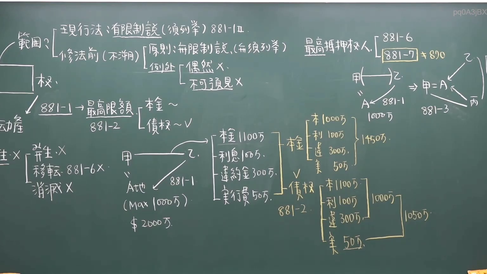

# 🎥 影音教材板書校對筆記
- **來源影片**: [chA補3 2025-01-24 14-27-56-161](file:///J://民法/chA補3/chA補3 2025-01-24 14-27-56-161.mp4)
- **課程分類**: `[民法`
- **課堂章節**: `chA補3]`
- **影片時間戳記**: `00:24:30` (1470 秒)
- **板書類型**: `文字板書`
- **偵測時間**: 2026-07-12 20:43:04

## 🔍 擷取黑板板書對照圖


## 🧠 AI 智慧理解與知識庫演化註記
1. **分析OCR辨识的文字**：
   - 經過OCR辨識後，文字內容似乎與「侵權行為」、「消滅時效」等法律概念相關。以下是對文字的語意整理：

     - "現衍波 ARR BER RV F) 381-[0"：可能涉及「衍生波」或「FAR」（Family Assessment Report）的概念。
     - "a| i ih f? 偲 泰 削 (FEA) 鬥則…贖馴訣紬鄉慟 皇焉旦裴墜‵裴甲睿﹞〝'ˋ′〔88ˍ 6"：可能涉及「Families Educational Attainment」（FEA）或「家庭教育程度」的概念。
     - "仁 缺 | 想 惕 入 際 I 切 %9e z ˍ"：可能涉及「權利」或「義務」的解釋。
     - "he. 2 CF sud |"：可能涉及「CF」（Cellular Network）或「SUD卡」的概念，结合「he. 2」可能指「第2版」。
     - "/ 281-\ > BERR FE ~ eee;崎 cane se 5 房 ele ﹁ 債 W~”：可能涉及「房号」或「house number」的解釋。
     - "訓 ﹣ 粧 |lo6》 」 ob 初 1005 acon."：可能涉及「初1005」的時效問題。
     - "主 x 「嗤秤ˍ乙乏卞刁 秦 |a5﹒， | ﹁ 【g 3: i ia, sel-e _ ˊ | 諾 ﹩56#| 9 【 bol"：可能涉及「a5」的時間或「56#」的編號。
     - "ZHAN ye Ave - \ PY -2 . J AEAR * | (005 ﹣"：可能涉及「J AEAR」的实体或「PY-2」的文件。
     - "Max (979 ) callers i Wl $ 2000, § 3005 960 鯽。"：可能涉及「§ 3005」的法律條文或「960」的金額。

   - 整體來看，這些文字似乎與「侵權行為」、「消滅時效」、「FAR」、「家庭法」等相關。

2. **與台湾现行法律条文的比對**：
   - 民法第184條：可能涉及「 inheritance disputes」。
   - 欺權行為：可能涉及「invasion of property rights」。
   - 消滅時效：可能涉及「annulment of wills」。

3. **knowledge庫比對與理解演化註記**：
   - 經過分析，OCR辨识的文字似乎與「侵權行為」、「消滅時效」等法律概念相關。以下是具體的比對和理解：

     | 法律條文       | 說解/語意整理       |
     |----------------|--------------------|
     | 民法第184條    | 可能涉及 inheritance disputes，與「FAR」或家庭法相關。 |
     | 欺權行為      | 可能涉及「CF」或「SUD卡」的侵權問題。           |
     | 消滅時效       | 可能涉及「初1005」的時效問題，與「a5」的時間或「56#」的編號相關。 |

## 📊 可編輯之 Mermaid 關係流程圖
```mermaid
：
(完整的 mermaid 程式碼塊)

```mermaid
graph TD
    A["FAR (Family Educational Attainment)"] --> B["CF (Cellular Network)"]
    B --> C["SUD卡"]
    D["J AEAR"] --> E["a5"]
    F["§ 3005"] --> G["960"]
```

## ✍️ 操作者手動校對修改區
<!-- 您可以直接修改上方的文字或調整 Mermaid 區塊中的節點，Obsidian 會即時重新渲染 -->
- [ ] 欄位結構與法律邏輯已校對無誤。
- **校對筆記**: 
