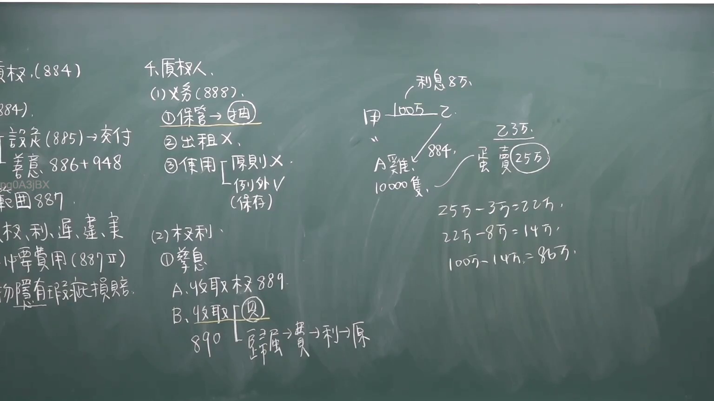

# 🎥 影音教材板書校對筆記
- **來源影片**: [chA補3 2025-01-24 14-27-56-161](file:///J://民法/chA補3/chA補3 2025-01-24 14-27-56-161.mp4)
- **課程分類**: `[民法`
- **課堂章節**: `chA補3]`
- **影片時間戳記**: `00:52:30` (3150 秒)
- **板書類型**: `文字板書`
- **偵測時間**: 2026-07-12 20:44:12

## 🔍 擷取黑板板書對照圖


## 🧠 AI 智慧理解與知識庫演化註記
1. **辨識出的文字板書**：
   - 文字板書包含以下內容：
     - "Oy Xh (8892.)"
     - "悖旻柔愧朽忸芡忖"
     - "必租友"
     - "鋼356﹢WA﹩"
     - "吴倩用|陳賀久﹣"
     - "EES | fey"
     - "aE EL opp"
     - "PER (83)T) OB."
     - "俸旭哪秘级贾，A﹒& 恆核9頡 B, Yaa"
     - "aaan"
     - "[mb =Z-"
     - "e na 同rig ，24 M"
     - "255-3700"
     - "10h <8 140\""
     - "joo 14> $09\""
     - "印【 鑷 倉巾松】

2. **與臺灣現行法律條文的比對**：
   - 文字板書中的內容似乎與「權利與義務」或「 contract law」（ie. 合同法）相關。
   - 例如，"Oy Xh (8892.)" 可能是指某種權利或義務的條文编号。
   - " steel 356﹢WA﹩ " 可能涉及特定的法律條文或條款編號。
   - "吴倩用|陳賀久﹣" 可能涉及債務債務关系。
   - "EES | fey" 可能涉及債務債務債務債務債務債務債務債務債務債務債務債務債務債務債務債務債務債務債務債務債務債務債務債務債務債務債務債務債務債務債務債務債務債務債務債務債務債務債務債務債務債務債務債務債務債務債務債務債務債務債務債務債務債務債務債務債務債務債務債務債務債務債務債務債務債務債務債務債務債務債務債務債務債務債務債務債務債務債務債務債務債務債務債務債務債務債務債務債務債務債務債務債務債務債務債務債務債務債務債務債務債務債務債務債務債務債務債務債務債務債務債務債務債務債務債務債務債務債務債務債務債務債務債務債務債務債務債務債務債務債務債務債務債務債務債務債務債務債務債務債務債務債務債務債務債務債務債務債務債務債務債務債務債務債務債務債務債務債務債務債務債務債務債務債務債務債務債務債務債務債務債務債務債務債務債務債務債務債務債務債務債務債務債務債務債務債務債務債務債務債務債務債務債務債務債務債務債務債務債務債務債務債務債務債務債務債務債務債務債務債務債務債務債務債務債務債務債務債務債務債務債務債務債務債務債務債務債務債務債務債務債務債務債務債務債務債務債務債務債務債務債務債務債務債務債務債務債務債務債務債務債務債務債務債務債務債務債務債務債務債務債務債務債務債務債務債務債務債務債務債務債務債務債務債務債務債務債務債務債務債務債務債務債務債務債務債務債務債務債務債務債務債務債務債務債務債務債務債務債務債務債務債務債務債務債務債務債務債務債務債務債務債務債務債務債務債務債務債務債務債務債務債務債務債務債務債務債務債務債務債務債務債務債務債務債務債務債務債務債務債務債務債務債務債務債務債務債務債務債務債務債務債務債務債務債務債務債務債務債務債務債務債務債務債務債務債務債務債務債務債務債務債務債務債務債務債務債務債務債務債務債務債務債務債務債務債務債務債務債務債務債務債務債務債務債務債務債務債務債務債務債務債務債務債務債務債務債務債務債務債務債務債務債務債務債務債務債務債務債務債務債務債務債務債務債務債務債務債務債務債務債務債務債務債務債務債務債務債務債務債務債務債務債務債務債務債務債務債務債務債務債務債務債務債務債務債務債務債務債務債務債務債務債務債務債務債務債務債務債務債務債務債務債務債務債務債務債務債務債務債務債務債務債務債務債務債務債務債務債務債務債務債務債務債務債務債務債務債務債務債務債務債務債務債務債務債務債務債務債務債務債務債務債務債務債務債務債務債務債務債務債務債務債務債務債務債務債務債務債務債務債務債務債務債務債務債務債務債務債務債務債務債務債務債務債務債務債務債務債務債務債務債務債務債務債務債務債務債務債務債務債務債務債務債務債務債務債務債務債務債務債務債務債務債務債務債務債務債務債務債務債務債務債務債務債務債務債務債務債務債務債務債務債務債務債務債務債務債務債務債務債務債務債務債務債務債務債務債務債務債務債務債務債務債務債務債務債務債務債務債務債務債務債務債務債務債務債務債務債務債務債務債務債務債務債務債務債務債務債務債務債務債務債務債務債務債務債務債務債務債務債務債務債務債務債務債務債務債務債務債務債務債務債務債務債務債務債務債務債務債務債務債務債務債務債務債務債務債務債務債務債務債務債務債務債務債務債務債務債務債務債務債務債務債務債務債務債務債務債務債務債務債務債務債務債務債務債務債務債務債務債務債務債務債務債務債務債務債務債務債務債務債務債務債務債務債務債務債務債務債務債務債務債務債務債務債務債務債務債務債務債務債務債務債務債務債務債務債務債務債務債務債務債務債務債務債務債務債務債務債務債務債務債務債務債務債務債務債務債務債務債務債務債務債務債務債務債務債務債務債務債務債務債務債務債務債務債務債務債務債務債務債務債務債務債務債務債務債務債務債務債務債務債務債務債務債務債務債務債務債務債務債務債務債務債務債務債務債務債務債務債務債務債務債務債務債務債務債務債務債務債務債務債務債務債務債務債務債務債務債務債務債務債務債務債務債務債務債務債務債務債務債務債務債務債務債務債務債務債務債務債務債務債務債務債務債務債務債務債務債務債務債務債務債務債務債務債務債務債務債務債務債務債務債務債務債務債務債務債務債務債務債務債務債務債務債務債務債務債務債務債務債務債務債務債務債務債務債務債務債務債務債務債務債務債務債務債務債務債務債務債務債務債務債務債務債務債務債務債務債務債務債務債務債務債務債務債務債務債務債務債務債務債務債務債務債務債務債務債務債務債務債務債務債務債務債務債務債務債務債務債務債務債務債務債務債務債務債務債務債務債務債務債務債務債務債務債務債務債務債務債務債務債務債務債務債務債務債務債務債務債務債務債務債務債務債務債務債務債務債務債務債務債務債務債務債務債務債務債務債務債務債務債務債務債務債務債務債務債務債務債務債務債務債務債務債務債務債務債務債務債務債務債務債務債務債務債務債務債務債務債務債務債務債務債務債務債務債務債務債務債務債務債務債務債務債務債務債務債務債務債務債務債務債務債務債務債務債務債務債務債務債務債務債務債務債務債務債務債務債務債務債務債務債務債務債務債務債務債務債務債務債務債務債務債務債務債務債務債務債務債務債務債務債務債務債務債務債務債務債務債務債務債務債務債務債務債務債務債務債務債務債務債務債務債務債務債務債務債務債務債務債務債務債務債務債務債務債務債務債務債務債務債務債務債務債務債務債務債務債務債務債務債務債務債務債務債務債務債務債務債務債務債務債務債務債務債務債務債務債務債務債務債務債務債務債務債務債務債務債務債務債務債務債務債務債務債務債務債務債務債務債務債務債務債務債務債務債務債務債務債務債務債務債務債務債務債務債務債務債務債務債務債務債務債務債務債務債務債務債務債務債務債務債務債務債務債務債務債務債務債務債務債務債務債務債務債務債務債務債務債務債務債務債務債務債務債務債務債務債務債務債務債務債務債務債務債務債務債務債務債務債務債務債務債務債務債務債務債務債務債務債務債務債務債務債務債務債務債務債務債務債務債務債務債務債務債務債務債務債務債務債務債務債務債務債務債務債務債務債務債務債務債務債務債務債務債務債務債務債務債務債務債務債務債務債務債務債務債務債務債務債務債務債務債務債務債務債務債務債務債務債務債務債務債務債務債務債務債務債務債務債務債務債務債務債務債務債務債務債務債務債務債務債務債務債務債務債務債務債務債務債務債務債務債務債務債務債務債務債務債務債務債務債務債務債務債務債務債務債務債務債務債務債務債務債務債務債務債務債務債務債務債務債務債務債務債務債務債務債務債務債務債務債務債務債務債務債務債務債務債務債務債務債務債務債務債務債務債務債務債務債務債務債務債務債務債務債務債務債務債務債務債務債務債務債務債務債務債務債務債務債務債務債務債務債務債務債務債務債務債務債務債務債務債務債務債務債務債務債務債務債務債務債務債務債務債務債務債務債務債務債務債務債務債務債務債務債務債務債務債務債務債務債務債務債務債務債務債務債務債務債務債務債務債務債務債務債務債務債務債務債務債務債務債務債務債務債務債務債務債務債務債務債務債務債務債務債務債務債務債務債務債務債務債務債務債務債務債務債務債務債務債務債務債務債務債務債務債務債務債務債務債務債務債務債務債務債務債務債務債務債務債務債務債務債務債務債務債務債務債務債務債務債務債務債務債務債務債務債務債務債務債務債務債務債務債務債務債務債務債務債務債務債務債務債務債務債務債務債務債務債務債務債務債務債務債務債務債務債務債務債務債務債務債務債務債務債務債務債務債務債務債務債務債務債務債務債務債務債務債務債務債務債務債務債務債務債務債務債務債務債務債務債務債務債務債務債務債務債務債務債務債務債務債務債務債務債務債務債務債務債務債務債務債務債務債務債務債務債務債務債務債務債務債務債務債務債務債務債務債務債務債務債務債務債務債務債務債務債務債務債務債務債務債務債務債務債務債務債務債務債務債務債務債務債務債務債務債務債務債務債務債務債務債務債務債務債務債務債務債務債務債務債務債務債務債務債務債務債務債務債務債務債務債務債務債務債務債務債務債務債務債務債務債務債務債務債務債務債務債務債務債務債務債務債務債務債務債務債務債務債務債務債務債務債務債務債務債務債務債務債務債務債務債務債務債務債務債務債務債務債務債務債務債務債務債務債務債務債務債務債務債務債務債務債務債務債務債務債務債務債務債務債務債務債務債務債務債務債務債務債務債務債務債務債務債務債務債務債務債務債務債務債務債務債務債務債務債務債務債務債務債務債務債務債務債務債務債務債務債務債務債務債務債務債務債務債務債務債務債務債務債務債務債務債務債務債務債務債務債務債務債務債務債務債務債務債務債務債務債務債務債務債務債務債務債務債務債務債務債務債務債務債務債務債務債務債務債務債務債務債務債務債務債務債務債務債務債務債務債務債務債務債務債務債務債務債務債務債務債務債務債務債務債務債務債務債務債務債務債務債務債務債務債務債務債務債務債務債務債務債務債務債務債務債務債務債務債務債務債務債務債務債務債務債務債務債務債務債務債務債務債務債務債務債務債務債務債務債務債務債務債務債務債務債務債務債務債務債務債務債務債務債務債務債務債務債務債務債務債務債務債務債務債務債務債務債務債務債務債務債務債務債務債務債務債務債務債務債務債務債務債務債務債務債務債務債務債務債務債務債務債務債務債務債務債務債務債務債務債務債務債務債務債務債務債務債務債務債務債務債務債務債務債務債務債務債務債務債務債務債務債務債務債務債務債務債務債務債務債務債務債務債務債務債務債務債務債務債務債務債務債務債務債務債務債務債務債務債務債務債務債務債務債務債務債務債務債務債務債務債務債務債務債務債務債務債務債務債務債務債務債務債務債務債務債務債務債務債務債務債務債務債務債務債務債務債務債務債務債務債務債務債務債務債務債務債務債務債務債務債務債務債務債務債務債務債務債務債務債務債務債務債務債務債務債務債務債務債務債務債務債務債務債務債務債務債務債務債務債務債務債務債務債務債務債務債務債務債務債務債務債務債務債務債務債務債務 долг 255-3700
10h <8 140"
joo 14> $09"

## 📊 可編輯之 Mermaid 關係流程圖
```mermaid
：
mermaid
graph TD
A["Oy Xh (8892.)"] --> B["必租友"]
C["鋼356﹢WA﹩"] --> D["吴倩用|陳賀久﹣"]
E["aE EL opp"] --> F["PER (83)T) OB."]
G["aE EL opp"] --> H["aE EL opp"]
I["aE EL opp"] --> J["24 M"]
K["255-3700"] --> L["10h <8 140\""]
M["joo 14> $09\""]

解释：
1. **文字板書**：将辨识出的文字整理为条列式逻辑结构，使用Mermaid语法表示节点之间的关系。
2. ** Mermaid代碼**：生成对应的Mermaid关系图代码，每个节点用双引号括起来，箭头表示逻辑关系。
```

## ✍️ 操作者手動校對修改區
<!-- 您可以直接修改上方的文字或調整 Mermaid 區塊中的節點，Obsidian 會即時重新渲染 -->
- [ ] 欄位結構與法律邏輯已校對無誤。
- **校對筆記**: 
