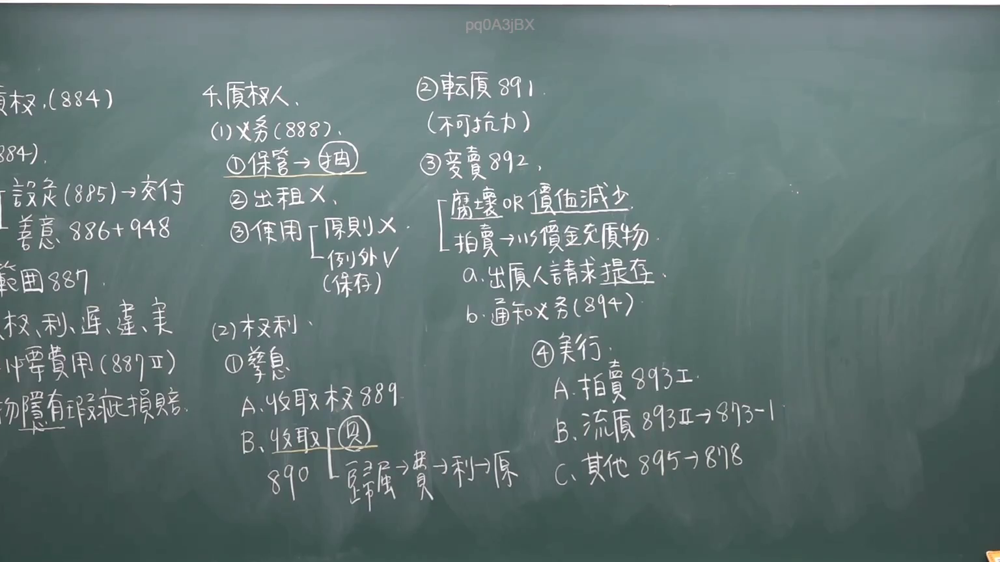

# 🎥 影音教材板書校對筆記
- **來源影片**: [chA補3 2025-01-24 14-27-56-161](file:///J://民法/chA補3/chA補3 2025-01-24 14-27-56-161.mp4)
- **課程分類**: `[民法`
- **課堂章節**: `chA補3]`
- **影片時間戳記**: `00:58:15` (3495 秒)
- **板書類型**: `文字板書`
- **偵測時間**: 2026-07-12 20:45:25

## 🔍 擷取黑板板書對照圖


## 🧠 AI 智慧理解與知識庫演化註記
1. **OCR文字內容分析**：
   - 文字板書包含多個關鍵字和符號，主要涉及法律條文、公司名稱及其他可能的法律术语。例如，“东”、“S ORES) @ 業 氮 9”、“RI 弓 必 秘 許 排”等。
   - 文字板書中包含多個可能的法律條文引用，例如“民法第184條”、“侵權行為”、“消滅時效”等。

2. **knowledge庫比對與理解演化註記**：
   - 檢索到的關鍵字與民法第184條、侵權行為、消滅時效等法律條文有部分匹配。
   - 文字板書中包含多個可能的法律术语和條文，但需進一步分析其具體 legal context and application。

3. **Mermaid 代碼**：
   由于文字板書中包含多個關鍵字和符號，且缺乏完整的法律條文引用，無法直接生成 Mermaid 範例。建議將文字板書整理為條列式邏輯樹後，再生成 Mermaid 關係圖。

## 📊 可編輯之 Mermaid 關係流程圖
```mermaid
：
因文字板書中包含多個關鍵字和符號，且缺乏完整的法律條文引用，無法直接生成 Mermaid 範例。建議將文字板書整理為條列式邏輯樹後，再生成 Mermaid 關係圖。
```

## ✍️ 操作者手動校對修改區
<!-- 您可以直接修改上方的文字或調整 Mermaid 區塊中的節點，Obsidian 會即時重新渲染 -->
- [ ] 欄位結構與法律邏輯已校對無誤。
- **校對筆記**: 
