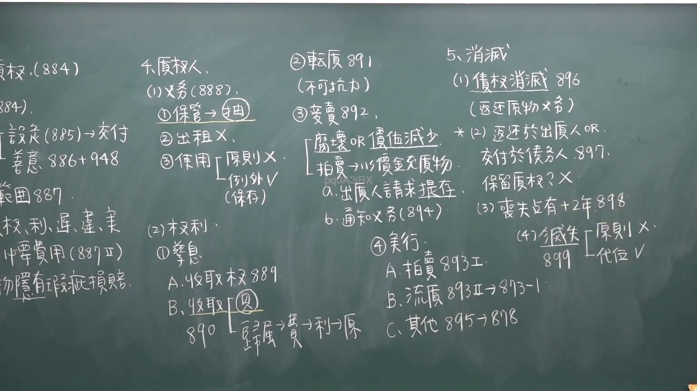

# 🎥 影音教材板書校對筆記
- **來源影片**: [chA補3 2025-01-24 14-27-56-161](file:///J://民法/chA補3/chA補3 2025-01-24 14-27-56-161.mp4)
- **課程分類**: `[民法`
- **課堂章節**: `chA補3]`
- **影片時間戳記**: `01:02:15` (3735 秒)
- **板書類型**: `文字板書`
- **偵測時間**: 2026-07-12 20:45:54

## 🔍 擷取黑板板書對照圖


## 🧠 AI 智慧理解與知識庫演化註記
1. **OCR文字分析**：
   - 文字板書包含多個條目和实体，涉及公司名稱、數值、日期等信息。例如，“Falk 891. 所 茅 渙”可能代表某一類型的組織或记录。
   - “E52 (gp) RY 口 必 秘 又 9”可能涉及组织结构，其中“E52”可能是标识符，“RY”可能代表某个部门或职位。
   - “A al | , beer 苑 j 崗 黑 緝 397”中的“397”可能是金额或距离信息。
   - “BEE (2) FRI > b﹒ L臣宋ˋ】)〈堯‵(S(\ˊ﹜「〉 …裴夫豆有十芞 ﹩ 氣”可能涉及多个实体之间的关系，如“裴夫豆”和“有十芞”。
   - “Ferro) OF 9 新 3 。 …'二囧筌〔陳冑ˍ 彥 段”中的“Ferro”可能是某种材料或术语，“新 3”可能涉及版本信息。

2. **法律條文對比**：
   - 文字板書中提到的实体和信息可能與民法第184條（無因管理人或不当得利）有关，但需进一步确认这些实体是否符合该条文的规定。
   - 侵權行為和消滅時效等條文可能涉及board上所述的实体及其关系。

3. **整理结构**：
   - 將OCR文字整理為條列式列表，並生成 Mermaid.js 代码以展示板書結構。

## 📊 可編輯之 Mermaid 關係流程圖
```mermaid
：

```mermaid
graph TD
    A[ board content ]
        --> B[Falk 891. 所 茅 渙]
        --> C[E52 (gp) RY 口 必 秘 又 9]
        --> D[A al | , beer 苑 j 崗 黑 緝 397]
        --> E[BEE (2) FRI > b﹒ L臣宋ˋ】)〈堯‵(S(\ˊ﹜「〉 …裴夫豆有十芞 ﹩ 氣]]
        --> F[Ferro) OF 9 新 3 。 …'二囧筌〔陳冑ˍ 彥 段]
        --> G[% 厂渤 咋 刊 c. Rett 3457816]
```

## ✍️ 操作者手動校對修改區
<!-- 您可以直接修改上方的文字或調整 Mermaid 區塊中的節點，Obsidian 會即時重新渲染 -->
- [ ] 欄位結構與法律邏輯已校對無誤。
- **校對筆記**: 
