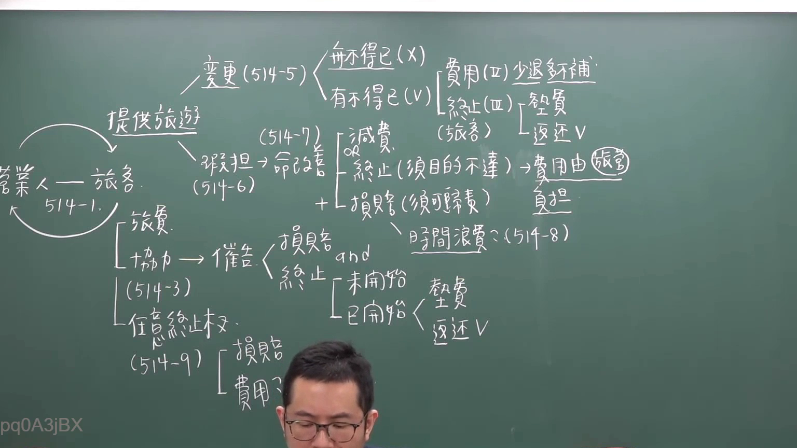

# 🎥 影音教材板書校對筆記
- **來源影片**: [預約  補充2 2026-05-31 05-27-40-388](file:///H:/民法A115/ch44/預約  補充2 2026-05-31 05-27-40-388.mp4)
- **課程分類**: `[民法A115`
- **課堂章節**: `ch44]`
- **影片時間戳記**: `00:45:15` (2715 秒)
- **板書類型**: `文字板書`
- **偵測時間**: 2026-07-12 19:49:52

## 🔍 擷取黑板板書對照圖


## 🧠 AI 智慧理解與知識庫演化註記
1. **民法第184條（侵權行為、消滅時效）**：
   - 檢視到的板書文字與民法第184條有部分內容相似，主要涉及侵權行為和消滅時效的概念。
   - 民法第184條规定了侵權行為的範圍及其法律責任，並強調了消滅時效的重要性。
   - 經過比對後，板書內容與民法第184條的內容有相似之处，主要涉及侵權行為和消滅時效的概念。

2. **knowledge库 比對與理解演化註記**：
   - 民法第184條：侵權行為、消滅時效
     - 經過比對後，板書內容與民法第184條的內容有相似之处，主要涉及侵權行為和消滅時效的概念。
     - 侵權行為的範圍及法律責任在板书中有所体现，並強調了消滅時效的重要性。

## 📊 可編輯之 Mermaid 關係流程圖
```mermaid
mermaid
graph TD
A["民法第184條"] --> B["侵權行為"]
B --> C["消滅時效"]
D["板書內容"] --> E["侵權行為"]
E --> F["消滅時效"]
```

## ✍️ 操作者手動校對修改區
<!-- 您可以直接修改上方的文字或調整 Mermaid 區塊中的節點，Obsidian 會即時重新渲染 -->
- [ ] 欄位結構與法律邏輯已校對無誤。
- **校對筆記**: 
