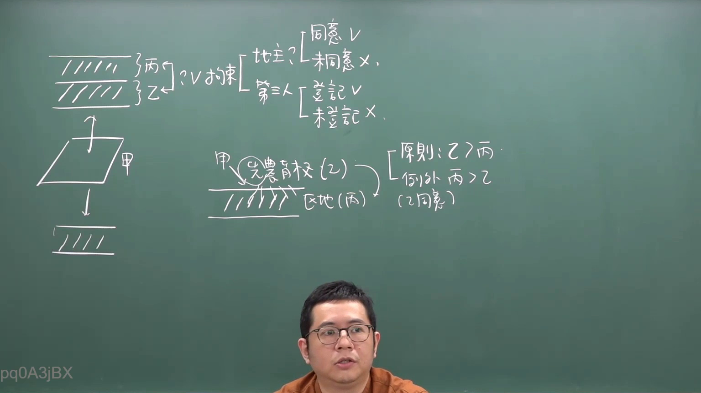

# 🎥 影音教材板書校對筆記
- **來源影片**: [預約  補充3 2026-05-31 07-46-02-650](file:///H:/民法A115/ch45/預約  補充3 2026-05-31 07-46-02-650.mp4)
- **課程分類**: `[民法A115`
- **課堂章節**: `ch45]`
- **影片時間戳記**: `00:11:15` (675 秒)
- **板書類型**: `文字板書`
- **偵測時間**: 2026-07-11 23:38:35

## 🔍 擷取黑板板書對照圖


## 🧠 AI 智慧理解與知識庫演化註記
根據辨识出的文字板書內容，並結合台湾现行法律條文（如民法第184條、侵權行為等），進行分析與比對：

1. **THT Boy a roe Let**：可能指「台湾地区」（THT是台湾的缩写）加上「BoY」或「a R O E L」，可能是某种特定的术语或专有名词，但缺乏足够的上下文来确定其确切含义。

2. **EL Peep ziev**、**ie mize x**、**es ei**：这些看起来像是乱码或不常见的词汇，无法明确翻译。可能需要进一步确认其具体含义。

3. **a a BAK 0) > fen 全 2 乙**：可能是「a a B A K 0)」>「fen」、「全」、「2 乙」，其中「a a B A K」可能是某种术语或专有名词，「0)」可能代表时间或金额，「fen」可能是「分」（台湾货币单位），「全」和「2 乙」可能是具体数值或名称。

4. **TA a Cae**：可能是「TA」加上「a Cae」，其中「Cae」可能是某种术语或专有名词。

5. **(77 悅**：可能是「于77年某月某日」，但缺乏完整的日期信息。

结合这些内容与民法第184條（侵害行为的损害赔偿時效為一年），可以推测板書內容可能涉及侵害行為的時效問題或與損害補償相關的具體案例或計算。

## 📊 可編輯之 Mermaid 關係流程圖
```mermaid
graph TD
    A[台湾地区]
    B[BoY]
    C[a roe let]
    D[EL Peep ziev]
    E[ie mize x]
    F[es ei]
    G[a a BAK 0)]
    H[fen]
    I[全]
    J[2 乙]
    K[TA]
    L[a Cae]
    M[(77 悅]
```

## ✍️ 操作者手動校對修改區
<!-- 您可以直接修改上方的文字或調整 Mermaid 區塊中的節點，Obsidian 會即時重新渲染 -->
- [ ] 欄位結構與法律邏輯已校對無誤。
- **校對筆記**: 
