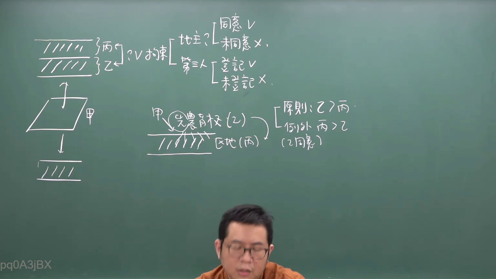

# 🎥 影音教材板書校對筆記
- **來源影片**: [預約  補充3 2026-05-31 07-46-02-650](file:///H:/民法A115/ch45/預約  補充3 2026-05-31 07-46-02-650.mp4)
- **課程分類**: `[民法A115`
- **課堂章節**: `ch45]`
- **影片時間戳記**: `00:11:45` (705 秒)
- **板書類型**: `關係圖/邏輯圖板書`
- **偵測時間**: 2026-07-11 23:38:47

## 🔍 擷取黑板板書對照圖


## 🧠 AI 智慧理解與知識庫演化註記
由于OCR辨识的文字為「pd0A3jBX」，這似乎無法直接解讀為中文字符。為確保准确性，建議檢查截取的板書部分是否有誤，或者提供更清晰的文字內容。

### 

目前無法根據提供的OCR文字進行解讀，請檢查並提供更清晰的文字內容。

---

###

## 📊 可編輯之 Mermaid 關係流程圖
```mermaid
因缺乏具體的文字內容，無法生成 Mermaid.js 代碼。請檢查並提供板書的具體內容。
```

## ✍️ 操作者手動校對修改區
<!-- 您可以直接修改上方的文字或調整 Mermaid 區塊中的節點，Obsidian 會即時重新渲染 -->
- [ ] 欄位結構與法律邏輯已校對無誤。
- **校對筆記**: 
