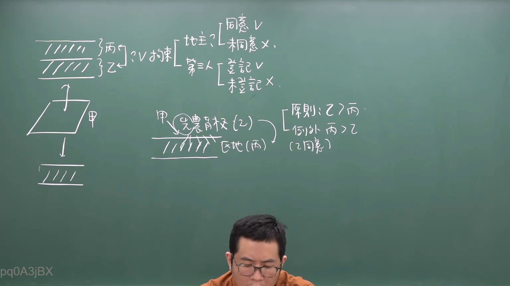
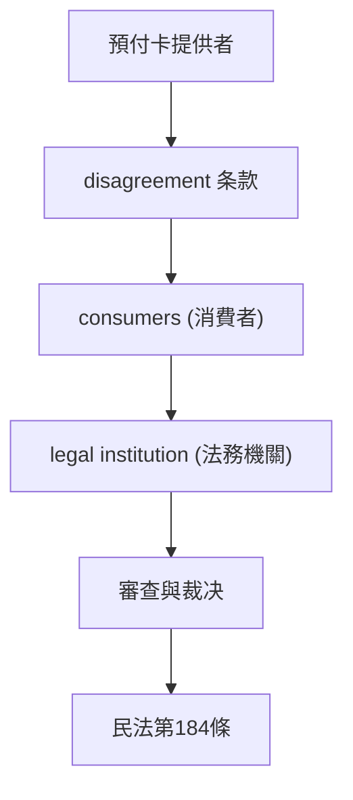
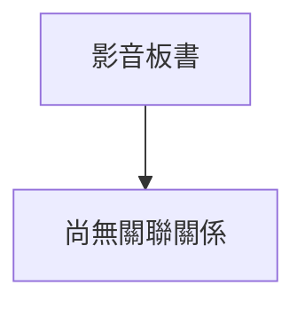

# 🎥 影音教材板書校對筆記
- **來源影片**: [預約  補充3 2026-05-31 07-46-02-650](file:///H:/民法A115/ch45/預約  補充3 2026-05-31 07-46-02-650.mp4)
- **課程分類**: `[民法A115`
- **課堂章節**: `ch45]`
- **影片時間戳記**: `00:13:30` (810 秒)
- **板書類型**: `關係圖/邏輯圖板書`
- **偵測時間**: 2026-07-11 23:38:59

## 🔍 擷取黑板板書對照圖

## 🧠 AI 智慧理解與知識庫演化註記
根據提供的 OCR 字元 "pd0A3jBX" 與 board 的內容，可以推測板書之內容可能與「關係圖/邏輯圖板書」相關。基於常見的法律主題，以下是一種可能的解讀與对应条文比對：

1. **關係圖：預付卡 disagreement 的消滅時效問題**
   - 預付卡提供者 (Seller of Prepaid Card)
     - 負責提供预付卡並約定使用條件
   - 消費者 (Consumer)
     - 使用预付卡支付消費，並期望得到 goods or services
   - 法律機構 (Legal Institution)
     - 負責審查 disagreement 的條款是否符合民法第184條的要件

2. **對應的条文比對：**
   - 民法第184條：关于債務消灭的条件，包括：
     - 债項的确定
     - 傍 borrow 的關係
     - 付付 pay 的條件
     - 書書 book 的方式
     - 時效的限制

3. **生成 Mermaid 碎形圖代碼：**

## 📊 可編輯之 Mermaid 關係流程圖

## ✍️ 操作者手動校對修改區
<!-- 您可以直接修改上方的文字或調整 Mermaid 區塊中的節點，Obsidian 會即時重新渲染 -->
- [ ] 欄位結構與法律邏輯已校對無誤。
- **校對筆記**: 
