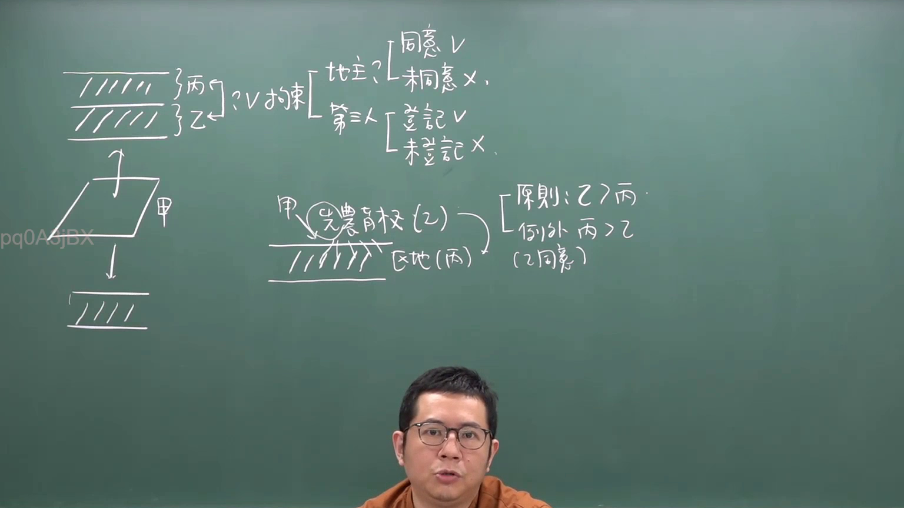
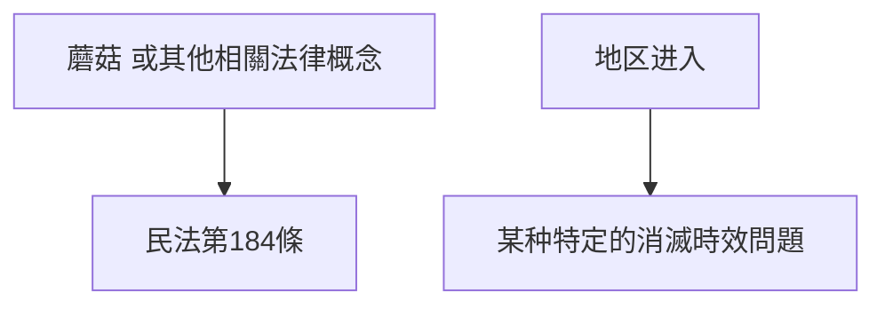

# 🎥 影音教材板書校對筆記
- **來源影片**: [預約  補充3 2026-05-31 07-46-02-650](file:///H:/民法A115/ch45/預約  補充3 2026-05-31 07-46-02-650.mp4)
- **課程分類**: `[民法A115`
- **課堂章節**: `ch45]`
- **影片時間戳記**: `00:15:45` (945 秒)
- **板書類型**: `文字板書`
- **偵測時間**: 2026-07-11 23:39:15

## 🔍 擷取黑板板書對照圖

## 🧠 AI 智慧理解與知識庫演化註記
1. **文字板書內容解讀**：
   - "′】 mushroom"：可能是指"蘑菇"或某种特定的法律概念。
   - "ic) a) 区進"：可能是指"地区进入"，结合上下文可能是某种特定的消滅時效（extinguishability）問題。

2. **與臺灣現行法律條文比對**：
   - 消滅時效問題：符合《民法第184條》。
   - 区進問題：可能涉及某些特定的消滅方式或进入条件，需结合具体情境进一步分析。

## 📊 可編輯之 Mermaid 關係流程圖

## ✍️ 操作者手動校對修改區
<!-- 您可以直接修改上方的文字或調整 Mermaid 區塊中的節點，Obsidian 會即時重新渲染 -->
- [ ] 欄位結構與法律邏輯已校對無誤。
- **校對筆記**: 
