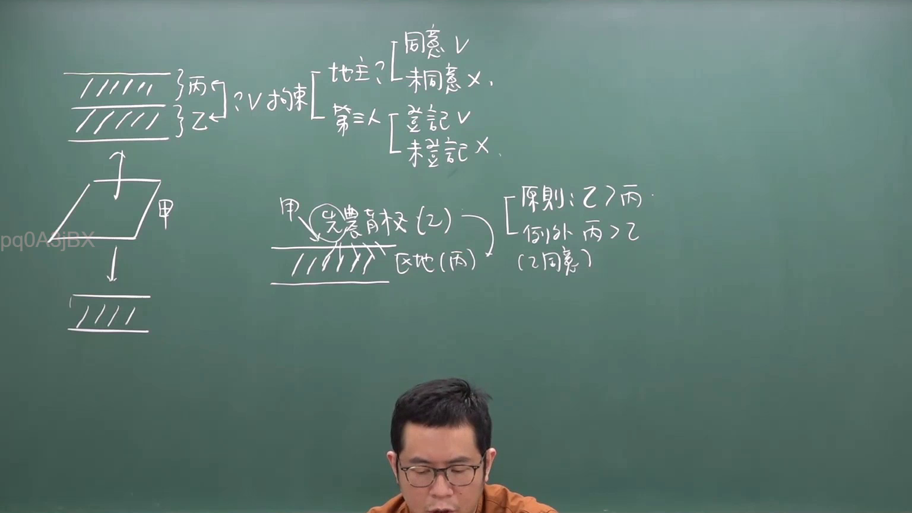
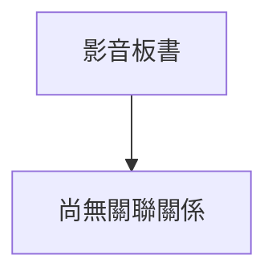

# 🎥 影音教材板書校對筆記
- **來源影片**: [預約  補充3 2026-05-31 07-46-02-650](file:///H:/民法A115/ch45/預約  補充3 2026-05-31 07-46-02-650.mp4)
- **課程分類**: `[民法A115`
- **課堂章節**: `ch45]`
- **影片時間戳記**: `00:16:30` (990 秒)
- **板書類型**: `關係圖/邏輯圖板書`
- **偵測時間**: 2026-07-11 23:39:27

## 🔍 擷取黑板板書對照圖

## 🧠 AI 智慧理解與知識庫演化註記

目前，根據您提供的資訊，我們無法直接解析辨識出的文字內容。以下是可能的進一步行動建議：

1. **提供更詳細的文字內容**：請您將板書中的文字內容以更加詳細的方式提供（例如，將文字分成單独的字或短句），這将帮助我們進行更精準的分析。

2. **重新檢視OCR文字內容**：如果可能的话，您可以重新提供更清晰的OCR文字內容，以便我們能更清楚地解析板書內容。

3. **進一步说明板書內容**：請您描述板書中的主要內容或結構，這将帮助我們更好地理解其法律內容並與之對比。

當您提供更多的信息後，我們可以继续進行語意整理、知識庫比對和生成 Mermaid.js 代碼等步驟。

## 📊 可編輯之 Mermaid 關係流程圖

## ✍️ 操作者手動校對修改區
<!-- 您可以直接修改上方的文字或調整 Mermaid 區塊中的節點，Obsidian 會即時重新渲染 -->
- [ ] 欄位結構與法律邏輯已校對無誤。
- **校對筆記**: 
