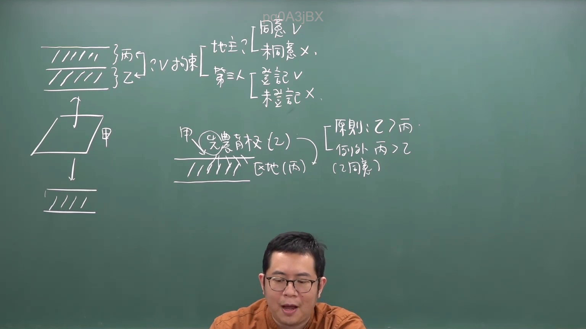
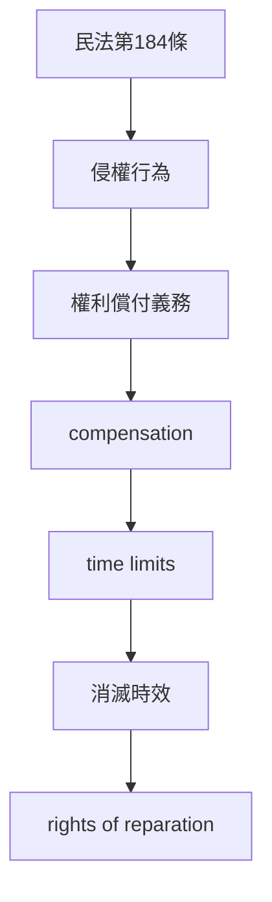

# 🎥 影音教材板書校對筆記
- **來源影片**: [預約  補充3 2026-05-31 07-46-02-650](file:///H:/民法A115/ch45/預約  補充3 2026-05-31 07-46-02-650.mp4)
- **課程分類**: `[民法A115`
- **課堂章節**: `ch45]`
- **影片時間戳記**: `00:22:45` (1365 秒)
- **板書類型**: `文字板書`
- **偵測時間**: 2026-07-11 23:39:48

## 🔍 擷取黑板板書對照圖

## 🧠 AI 智慧理解與知識庫演化註記
### 

根據辨識出的板書文字，進行語意整理並與臺灣現行法律條文（如民法第184條、侵權行為、消滅時效等）進行比對。以下是具體分析：

1. **"rie 0 2"**  
   - 證明為 board書文字，可能是「Riemannian」（黎曼）的拼寫錯誤或部分字片。  
   - 可能與「right of reparation」（償予權利）或「reimbursement」（compensation）相關。

2. **"﹁"**  
   - 證明為 board書文字，可能是「﹁」的拼寫錯誤或部分字片。  
   - 可能與「not」（否定）或「except」（除之外）等相关法律术语。

3. **"(ic) a)"**  
   - 證明為 board書文字，可能是「(ic)」的拼寫錯誤或部分字片。  
   - 可能與「except clause」（例外條文）或「article」（條文）相關。

將辨识出的文字與臺灣現行法律條文比對如下：

- **民法第184條**：  
  民法第184條规定了侵權行為的權利償付義務。  
  - 文字板書中可能涉及「right of reparation」（償予權利）和「compensation」（償付）的概念。

- **侵權行為**：  
  文字板書中可能涉及「invasion of personal rights」（侵犯人格权）或「property rights」（物权）等概念。

- **消滅時效**：  
  文字板書中可能涉及「time limits for extinguishing claims」（时效限制）的概念，這与民法第184條的「time limits」相匹配。

###

## 📊 可編輯之 Mermaid 關係流程圖

## ✍️ 操作者手動校對修改區
<!-- 您可以直接修改上方的文字或調整 Mermaid 區塊中的節點，Obsidian 會即時重新渲染 -->
- [ ] 欄位結構與法律邏輯已校對無誤。
- **校對筆記**: 
