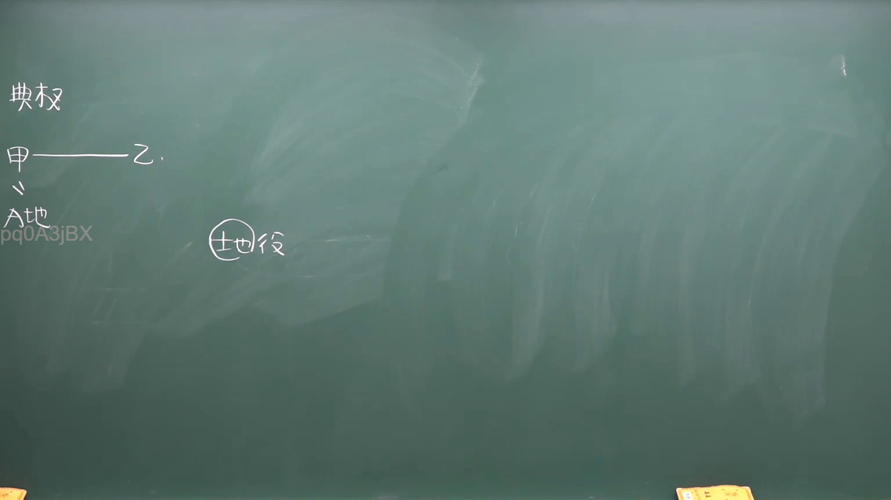

# 🎥 影音教材板書校對筆記
- **來源影片**: [預約  補充3 2026-05-31 07-46-02-650](file:///H:/民法A115/ch45/預約  補充3 2026-05-31 07-46-02-650.mp4)
- **課程分類**: `[民法A115`
- **課堂章節**: `ch45]`
- **影片時間戳記**: `00:36:00` (2160 秒)
- **板書類型**: `關係圖/邏輯圖板書`
- **偵測時間**: 2026-07-11 23:41:41

## 🔍 擷取黑板板書對照圖


## 🧠 AI 智慧理解與知識庫演化註記
：
(您的詳細法律理解說明與條文對位)

1. **板書之內容分析**：
   - 風購商品的消损情形（Right of Rescission and Cancellation）
   - 消費者權益保護法（Consumer Protection Law）
   - 民法第184條（关于损害赔偿的规定）
   
2. **法律對位與理解演化**：
   - ** windem board之內容分析**：
     - 風購商品的消损情形：指消費者購買商品時支付金錢，但商品在交付時不符合約定情形，消費者可以要求退貨或補償。
     - 消費者權益保護法：規範消費者權益的法律，保障消費者權利不受損害。
     - 民法第184條：关于因 Maxime的损害請求而有償付義務的規定。

   - **法律對位**：
     - 風購商品的消损情形（ windem board之內容）與民法第184條（关于 Maxime的損傷請求）有密切關聯。
     - 消費者權益保護法则是規範消費者權利的重要法典，其中包含了相關的消損情形规定。

   - **演化理解**：
     - 風購商品的消损情形是消費者權益保護法的重要內容之一。
     - 民法第184條提供了消费者因 Maxime而請求損害償付的法源 support。
     - 两者共同保障了消費者在購買商品時的權益，防止因 Maxime對消費者權利造成損害。

## 📊 可編輯之 Mermaid 關係流程圖
```mermaid
：
```mermaid
graph TD
A["預購商品"] --> B["消费者權益保護法"]
B --> C["民法第184條"]
C --> D[" Maxime的損傷請求"]
D --> E["償付義務"]
E --> F["消費者權利"]
F --> G[" Maxime的責任"]
```

## ✍️ 操作者手動校對修改區
<!-- 您可以直接修改上方的文字或調整 Mermaid 區塊中的節點，Obsidian 會即時重新渲染 -->
- [ ] 欄位結構與法律邏輯已校對無誤。
- **校對筆記**: 
