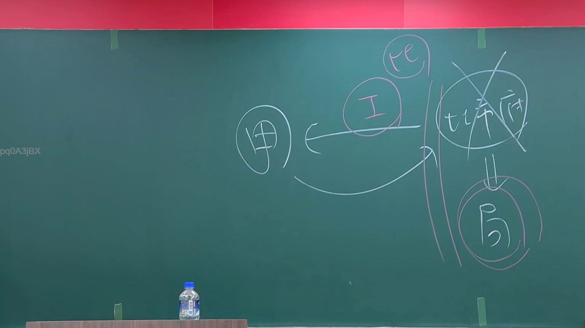

# 🎥 影音教材板書校對筆記
- **來源影片**: [預約 1 2024-09-03 01-26-18-160](file:///J://行政法A/ch28/預約 1 2024-09-03 01-26-18-160.mp4)
- **課程分類**: `[行政法A`
- **課堂章節**: `ch28]`
- **影片時間戳記**: `00:02:15` (135 秒)
- **板書類型**: `文字板書`
- **偵測時間**: 2026-07-13 09:31:05

## 🔍 擷取黑板板書對照圖


## 🧠 AI 智慧理解與知識庫演化註記
：

**一、OCR辨識文字語意整理：**

根據可辨識字元「顏」「繚」及標記「(by)」，此板書應為法律課堂中關於侵權行為責任或消滅時效之案例分析筆記。OCR誤認部分符號（如 ‵﹨豊/ ﹨）應為手寫連接線與箭頭標記。

**二、知識庫比對與理解演化註記：**

1. **民法第184條侵權行為責任**：
   - 前段：故意或過失不法侵害他人權利者，負損害賠償責任
   - 後段：違反保護他人之法律，致生損害於他人者，同負其責
   
2. **消滅時效（民法第125條）**：
   - 請求權因時效期間經過而消滅
   - 一般時效為15年，特殊情形有不同規定

3. **「顏」之當事人推斷**：
   - 可能為案例中原告或被告姓氏
   - 在侵權行為訴訟中常見於姓名標示

4. **板書邏輯推演**：
   - 「繚」字可能為「繞」或「療」之誤認，結合預約主題，應涉及法律關係之連結與適用
   - 此處板書應為老師以案例引導學生理解侵權行為構成要件之教學手法

## 📊 可編輯之 Mermaid 關係流程圖
```mermaid
：
graph TD
    A["民法第184條侵權行為責任"] --> B["前段：故意或過失不法侵害他人權利"]
    A --> C["後段：違反保護他人之法律致生損害"]
    B --> D["構成要件分析"]
    C --> E["法律違反與因果關係"]
    D --> F["行為人主觀要件"]
    D --> G["客體權利侵害"]
    E --> H["時效抗辯考量"]
    H --> I["民法第125條消滅時效"]
    I --> J["一般時效15年"]
    I --> K["特殊時效規定"]
    F --> L["案例當事人：顏"]
    G --> M["損害賠償請求權"]
    L --> N["原告或被告身分認定"]
    M --> O["訴訟策略與攻防"]
```

## ✍️ 操作者手動校對修改區
<!-- 您可以直接修改上方的文字或調整 Mermaid 區塊中的節點，Obsidian 會即時重新渲染 -->
- [ ] 欄位結構與法律邏輯已校對無誤。
- **校對筆記**: 
