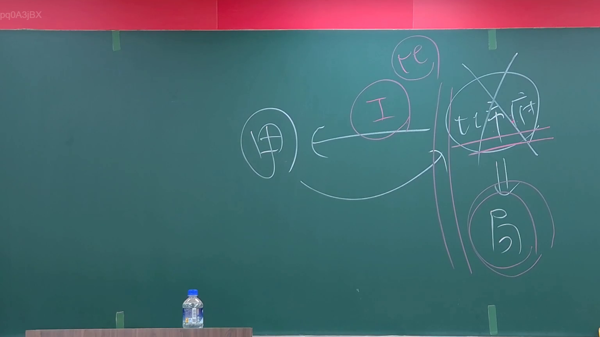

# 🎥 影音教材板書校對筆記
- **來源影片**: [預約 1 2024-09-03 01-26-18-160](file:///J://行政法A/ch28/預約 1 2024-09-03 01-26-18-160.mp4)
- **課程分類**: `[行政法A`
- **課堂章節**: `ch28]`
- **影片時間戳記**: `00:08:15` (495 秒)
- **板書類型**: `關係圖/邏輯圖板書`
- **偵測時間**: 2026-07-13 09:31:44

## 🔍 擷取黑板板書對照圖


## 🧠 AI 智慧理解與知識庫演化註記
：

**OCR辨識結果分析：** 僅辨識出單字「N」，結合分類為【關係圖/邏輯圖板書】，此處「N」可能為法律概念標記或編號系統之一環。在臺灣民法預約制度中，常見涉及權利義務關係的邏輯推演。

**知識庫比對與理解演化註記：**

1. **民法第425條（買賣不破租賃）相關邏輯**：若「N」代表特定權利狀態標記，可能涉及物權變動與債權關係之交互作用
2. **民法第184條侵權行為責任**：在預約契約中，若一方違反誠信原則，可能構成侵權行為
3. **消滅時效（民法第125-131條）**：預約權利主張之時效起算點之邏輯推演
4. **預約制度本質**：預約為債權性質契約，其效力範圍與物權變動之區隔

**板書結構推測：** 老師可能以「N」作為關係圖中某個關鍵概念節點（如特定權利標記、當事人代號或邏輯分支標記），用於呈現法律關係之因果鏈或條件判斷樹。

---

## 📊 可編輯之 Mermaid 關係流程圖
```mermaid
：
graph TD
    A["預約契約成立"] --> B["債權效力發生"]
    B --> C["N - 權利狀態標記"]
    C --> D["物權變動要件"]
    C --> E["侵權行為責任"]
    D --> F["民法第425條"]
    E --> G["民法第184條"]
    H["消滅時效起算"] --> I["民法第125-131條"]
    B --> H
```

## ✍️ 操作者手動校對修改區
<!-- 您可以直接修改上方的文字或調整 Mermaid 區塊中的節點，Obsidian 會即時重新渲染 -->
- [ ] 欄位結構與法律邏輯已校對無誤。
- **校對筆記**: 
