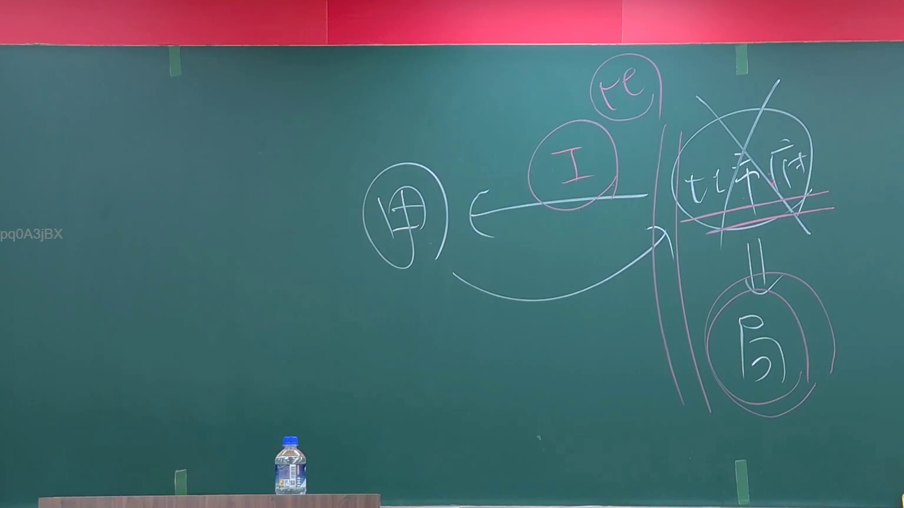

# 🎥 影音教材板書校對筆記
- **來源影片**: [預約 1 2024-09-03 01-26-18-160](file:///J://行政法A/ch28/預約 1 2024-09-03 01-26-18-160.mp4)
- **課程分類**: `[行政法A`
- **課堂章節**: `ch28]`
- **影片時間戳記**: `00:09:30` (570 秒)
- **板書類型**: `關係圖/邏輯圖板書`
- **偵測時間**: 2026-07-13 09:32:17

## 🔍 擷取黑板板書對照圖


## 🧠 AI 智慧理解與知識庫演化註記
：

⚠️ **重要提醒**：您提供的 OCR 辨識字元內容為空白（「擷取區域的 OCR 辨識字元如下：」之後無實際文字）。因此我無法針對具體板書進行語意整理與條文比對。

以下提供一個**基於民法第184條侵權行為常見教學主題的範例**，供您參考格式。若您能提供實際 OCR 文字，我可重新生成精確對應內容。

---

## 📊 可編輯之 Mermaid 關係流程圖
```mermaid
：
graph TD
    A["民法第184條"] --> B["一般侵權行為責任"]
    A --> C["特殊侵權行為責任"]
    
    B --> D["故意或過失不法侵害他人權利"]
    D --> E["構成要件"]
    E --> F["加害人行為"]
    E --> G["損害結果"]
    E --> H["因果關係"]
    E --> I["違法性"]
    E --> J["歸責事由：故意或過失"]
    
    B --> K["責任成立後之效果"]
    K --> L["損害賠償"]
    K --> M["消滅時效：2年（第197條）"]
    
    C --> N["特殊侵權行為類型"]
    N --> O["無行為能力人致害"]
    N --> P["產品責任"]
    N --> Q["動物致害"]

---

**請提供實際 OCR 辨識文字，我將為您生成精確對應的法律條文比對與 Mermaid 圖表。**
```

## ✍️ 操作者手動校對修改區
<!-- 您可以直接修改上方的文字或調整 Mermaid 區塊中的節點，Obsidian 會即時重新渲染 -->
- [ ] 欄位結構與法律邏輯已校對無誤。
- **校對筆記**: 
