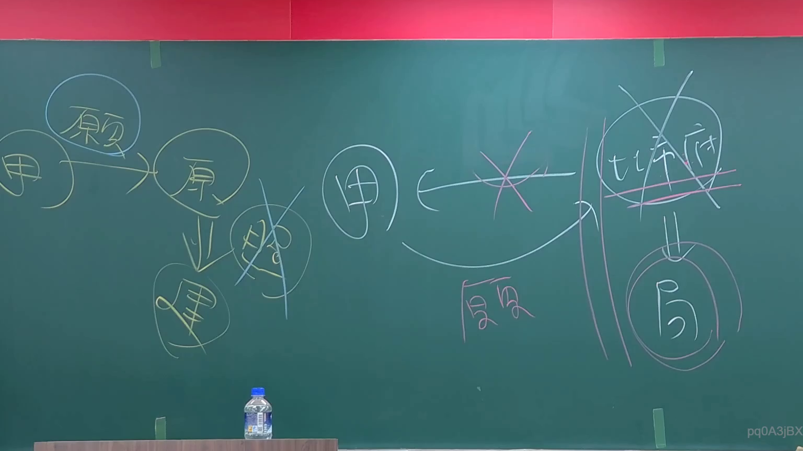
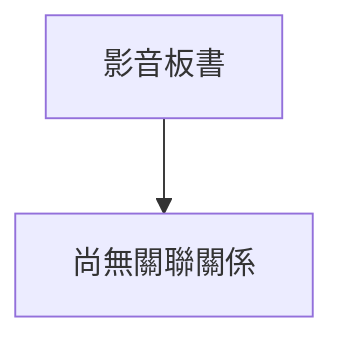

# 🎥 影音教材板書校對筆記
- **來源影片**: [預約 1 2024-09-03 01-26-18-160](file:///J://行政法A/ch28/預約 1 2024-09-03 01-26-18-160.mp4)
- **課程分類**: `[行政法A`
- **課堂章節**: `ch28]`
- **影片時間戳記**: `00:15:00` (900 秒)
- **板書類型**: `關係圖/邏輯圖板書`
- **偵測時間**: 2026-07-13 09:32:40

## 🔍 擷取黑板板書對照圖

## 🧠 AI 智慧理解與知識庫演化註記
您好！我注意到您的訊息中「擷取區域的 OCR 辨識字元」部分似乎是空的或沒有成功貼上。

請您將老師黑板上的 **OCR 辨識文字** 提供給我，我才能協助您完成以下工作：

1. 🔍 **語意整理與條文比對** — 針對板書內容進行法律概念梳理，並與臺灣現行法條（如民法第184條侵權行為、消滅時效等）做知識庫對位註記。
2. 📊 **Mermaid.js 流程圖生成** — 根據板書的邏輯結構（關係圖/邏輯圖或文字板書），自動產出對應的 Mermaid 代碼，方便後續教學素材製作。

請貼上 OCR 辨識出的字元內容，我立刻為您處理！

## 📊 可編輯之 Mermaid 關係流程圖

## ✍️ 操作者手動校對修改區
<!-- 您可以直接修改上方的文字或調整 Mermaid 區塊中的節點，Obsidian 會即時重新渲染 -->
- [ ] 欄位結構與法律邏輯已校對無誤。
- **校對筆記**: 
