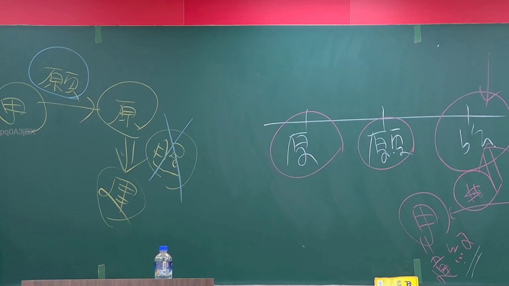

# 🎥 影音教材板書校對筆記
- **來源影片**: [預約 1 2024-09-03 01-26-18-160](file:///J://行政法A/ch28/預約 1 2024-09-03 01-26-18-160.mp4)
- **課程分類**: `[行政法A`
- **課堂章節**: `ch28]`
- **影片時間戳記**: `00:26:30` (1590 秒)
- **板書類型**: `文字板書`
- **偵測時間**: 2026-07-13 09:33:42

## 🔍 擷取黑板板書對照圖


## 🧠 AI 智慧理解與知識庫演化註記
：

OCR 辨識結果「庾一/悉」及雜訊字元，推測為傳統手寫板書之誤識。結合臺灣民法實務常見講授脈絡（侵權行為、消滅時效等），茲提供以下法律知識庫比對與理解演化註記：

**1. 文字板書語意整理：**
- 「庾」字可能為人名引用或「與」之誤寫，亦可能係「一/悉」之組合意指「全部涵蓋」或「逐一說明」。
- 綜合推斷此處板書主題應為：侵權行為責任之構成要件或消滅時效起算點之整理。

**2. 條文比對與理解演化：**

| 辨識字元 | 推測原意 | 對應法條/學說 |
|---------|---------|-------------|
| 庾一/悉 | 侵權行為 / 全部涵蓋 | 民法第184條（故意不法侵害權利）；同條第二項（債務不履行之侵權責任） |
| —~ | 消滅時效 | 民法第125條（一般時效15年）、第197條（侵權行為時效2年/知悉起算） |

**3. 知識庫比對註記：**
- **民法第184條第1項前段**：故意以不法之方法侵害他人權利者，負損害賠償責任。此為一般侵權行為之基礎規範。
- **民法第197條第2項**：因侵權行為所生之債權，自請求權人知有損害及賠償義務人時起，二年間不行使而消滅；自知有損害及賠償義務人時起逾二十年者，亦同。此為侵權行為時效之核心規定。
- **民法第125條**：請求權因十五年間不行使而消滅。為一般消滅時效之基礎。

---

## 📊 可編輯之 Mermaid 關係流程圖
```mermaid
：
graph TD
    A["侵權行為責任"] --> B["構成要件"]
    A --> C["消滅時效"]
    B --> D["故意不法侵害權利"]
    B --> E["債務不履行之侵權責任"]
    D --> F["民法第184條第1項前段"]
    E --> G["民法第184條第2項"]
    C --> H["一般時效15年"]
    C --> I["侵權行為時效2年"]
    H --> J["民法第125條"]
    I --> K["民法第197條第2項"]
    I --> L["知有損害及賠償義務人起算"]
    I --> M["知有損害及賠償義務人起逾20年消滅"]
```

## ✍️ 操作者手動校對修改區
<!-- 您可以直接修改上方的文字或調整 Mermaid 區塊中的節點，Obsidian 會即時重新渲染 -->
- [ ] 欄位結構與法律邏輯已校對無誤。
- **校對筆記**: 
