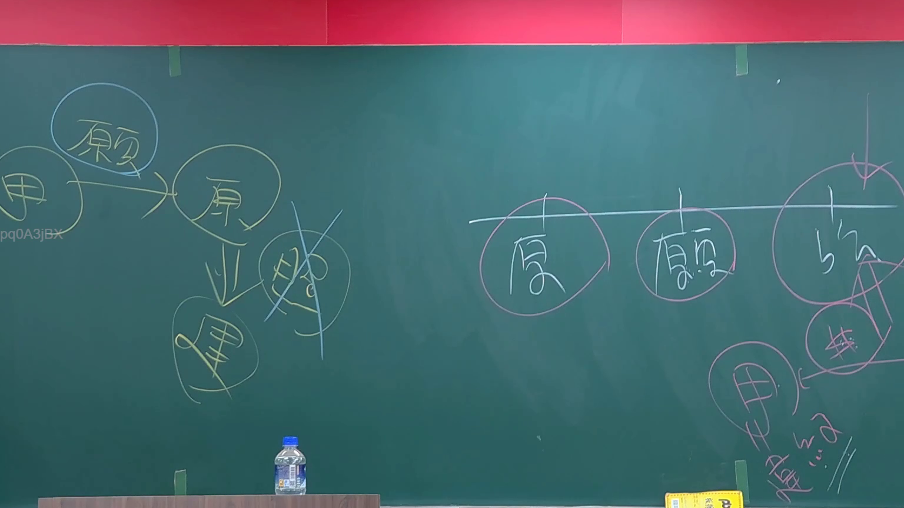

# 🎥 影音教材板書校對筆記
- **來源影片**: [預約 1 2024-09-03 01-26-18-160](file:///J://行政法A/ch28/預約 1 2024-09-03 01-26-18-160.mp4)
- **課程分類**: `[行政法A`
- **課堂章節**: `ch28]`
- **影片時間戳記**: `00:27:45` (1665 秒)
- **板書類型**: `文字板書`
- **偵測時間**: 2026-07-13 09:34:28

## 🔍 擷取黑板板書對照圖


## 🧠 AI 智慧理解與知識庫演化註記
：

**OCR辨識文字語意整理：**
從辨識字元中可推斷板書涉及「梁」與「閔」兩當事人，數字「2」多次出現，結合臺灣法律實務常見議題，此處應為民法第197條第2項之侵權行為請求權消滅時效討論。

**知識庫比對：**
- **民法第184條**：侵權行為責任之基本規定（故意或過失不法侵害他人權利者，負損害賠償責任）
- **民法第197條第2項**：「前項請求權，自請求權人知有損害及賠償義務人時起，因二年間不行使而消滅。自有侵權行為時起，逾十年者亦同。」
- 板書中數字「2」應對應「二年消滅時效」之核心概念

**演化註記：**
1. 此處板書應為教師以案例方式（梁某 vs 閔某）說明侵權行為請求權之時效起算點
2. 「知有損害及賠償義務人」為起算關鍵，非自行為時起算
3. 十年最長消滅期間為除斥期性質，與二年一般時效不同

## 📊 可編輯之 Mermaid 關係流程圖
```mermaid
：
graph TD
    A["侵權行為責任"] --> B["民法第184條"]
    B --> C["故意或過失不法侵害他人權利者"]
    C --> D["負損害賠償責任"]
    
    E["請求權消滅時效"] --> F["民法第197條第2項"]
    F --> G["二年間不行使而消滅"]
    F --> H["自知有損害及賠償義務人時起算"]
    
    I["十年最長期間"] --> J["自有侵權行為時起算"]
    J --> K["逾十年者亦同"]
    
    L["案例當事人"] --> M["梁某"]
    L --> N["閔某"]
    M --> O["原告/請求權人"]
    N --> P["被告/賠償義務人"]
```

## ✍️ 操作者手動校對修改區
<!-- 您可以直接修改上方的文字或調整 Mermaid 區塊中的節點，Obsidian 會即時重新渲染 -->
- [ ] 欄位結構與法律邏輯已校對無誤。
- **校對筆記**: 
