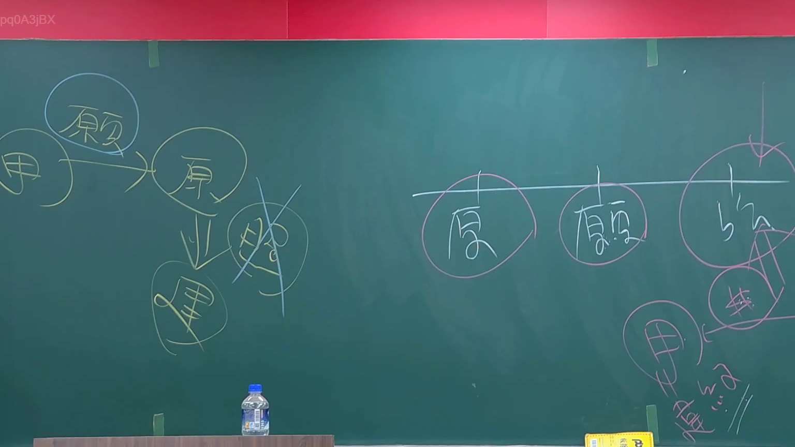
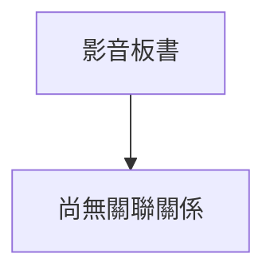

# 🎥 影音教材板書校對筆記
- **來源影片**: [預約 1 2024-09-03 01-26-18-160](file:///J://行政法A/ch28/預約 1 2024-09-03 01-26-18-160.mp4)
- **課程分類**: `[行政法A`
- **課堂章節**: `ch28]`
- **影片時間戳記**: `00:29:00` (1740 秒)
- **板書類型**: `關係圖/邏輯圖板書`
- **偵測時間**: 2026-07-13 09:34:52

## 🔍 擷取黑板板書對照圖

## 🧠 AI 智慧理解與知識庫演化註記
：

您好，您的訊息中「擷取區域的 OCR 辨識字元」部分為空白，未提供實際的文字內容。因此我無法進行以下工作：

1. **語意整理** — 無文字可分析
2. **條文比對**（如民法第184條、侵權行為、消滅時效等）— 無辨識結果可供對位
3. **Mermaid 流程圖生成** — 無法從空資料建構邏輯結構

---

**請您補充以下任一方式，我即可立即為您處理：**

- 📋 **直接貼上 OCR 辨識出的文字內容**（即使有錯字或斷行也無妨）
- 🖼️ **提供截圖圖片**，我可嘗試自行 OCR 辨識後再分析
- 📝 **口述板書內容**，我會依您的描述重建邏輯結構

一旦取得文字資料，我將立即：
1. 整理語意並對位臺灣現行法律條文（民法、消費者保護法、侵權行為法等）
2. 生成符合您格式要求的 Mermaid.js 流程圖代碼（節點用雙引號括住）

期待您的補充！

## 📊 可編輯之 Mermaid 關係流程圖

## ✍️ 操作者手動校對修改區
<!-- 您可以直接修改上方的文字或調整 Mermaid 區塊中的節點，Obsidian 會即時重新渲染 -->
- [ ] 欄位結構與法律邏輯已校對無誤。
- **校對筆記**: 
