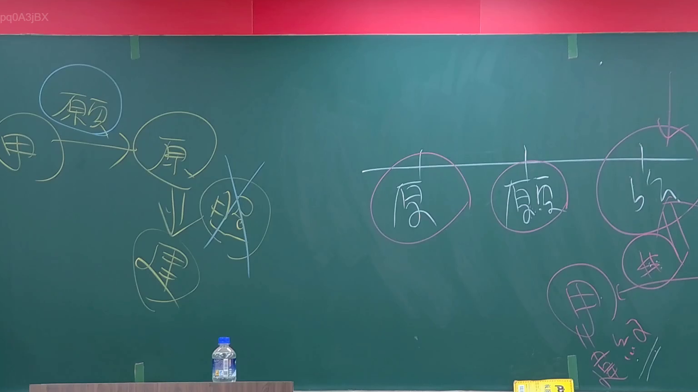
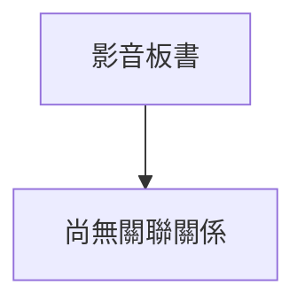

# 🎥 影音教材板書校對筆記
- **來源影片**: [預約 1 2024-09-03 01-26-18-160](file:///J://行政法A/ch28/預約 1 2024-09-03 01-26-18-160.mp4)
- **課程分類**: `[行政法A`
- **課堂章節**: `ch28]`
- **影片時間戳記**: `00:29:45` (1785 秒)
- **板書類型**: `關係圖/邏輯圖板書`
- **偵測時間**: 2026-07-13 09:35:15

## 🔍 擷取黑板板書對照圖

## 🧠 AI 智慧理解與知識庫演化註記
：
您好！您的訊息中「擷取區域的 OCR 辨識字元」部分似乎為空白，未顯示實際辨識出的文字內容。因此我無法進行以下工作：

1. **語意整理** — 需要辨識出的板書文字才能分析其法律概念（如侵權行為構成要件、消滅時效起算等）
2. **條文比對** — 需與民法第184條、侵權行為責任、消滅時效等現行法條進行交叉驗證
3. **Mermaid 圖表生成** — 需要板書中的邏輯關係或結構才能繪製流程圖

請您補充提供 OCR 辨識出的實際文字內容，我將立即為您完成：
- 語意整理與法律概念歸納
- 臺灣現行法條（民法、訴訟法等）比對註記
- Mermaid.js 流程圖代碼生成

期待您的回覆！

## 📊 可編輯之 Mermaid 關係流程圖

## ✍️ 操作者手動校對修改區
<!-- 您可以直接修改上方的文字或調整 Mermaid 區塊中的節點，Obsidian 會即時重新渲染 -->
- [ ] 欄位結構與法律邏輯已校對無誤。
- **校對筆記**: 
