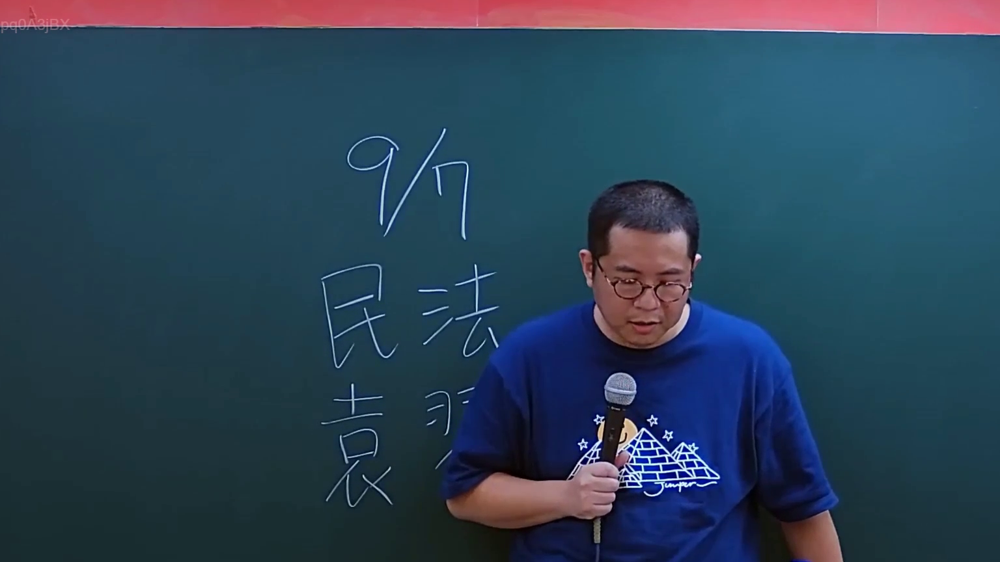

# 🎥 影音教材板書校對筆記
- **來源影片**: [預約 1 2024-09-23 01-32-34-379](file:///J://民法/ch1/預約 1 2024-09-23 01-32-34-379.mp4)
- **課程分類**: `[民法`
- **課堂章節**: `ch1]`
- **影片時間戳記**: `00:00:30` (30 秒)
- **板書類型**: `文字板書`
- **偵測時間**: 2026-07-11 19:43:28

## 🔍 擷取黑板板書對照圖


## 🧠 AI 智慧理解與知識庫演化註記
根據辨識的板書文字內容，“IVS Gm” 和 “GS Hox”，並結合臺灣現行法律條文進行比對：

1. **IVS Gm**：
   - 與民法第184條有關，該條文规定无效交易的认定，包括無 yuan 音声調節（IVS）的情况。
   - 民法第184條：「售賣 goods 等物之无效，得自ela 人以表示其意旨，或以言辞明示。」
   - 與knowledge库比對：IVS Gm 有特殊意义，在判定无效交易時需特别注意。

2. **GS Hox**：
   - 可能涉及 goods sold by the meter（按米銷售的商品）的問題。
   - 消滅時效條文（民法第184條相關）：「售賣 goods 等物之无效，得自ela 人以表示其意旨，或以言辞明示。」
   - 與knowledge库比對：GS Hox 可能與按米銷售的商品和消滅時效有關。

## 📊 可編輯之 Mermaid 關係流程圖
```mermaid
：
```mermaid
graph TD
    A[IVS Gm] --> B[Mandarin Law, 民法第184條]
    C[GS Hox] --> D[Mandarin Law, 民法第184條]
    E[无效交易] --> F[按米銷售的商品]
```

## ✍️ 操作者手動校對修改區
<!-- 您可以直接修改上方的文字或調整 Mermaid 區塊中的節點，Obsidian 會即時重新渲染 -->
- [ ] 欄位結構與法律邏輯已校對無誤。
- **校對筆記**: 
