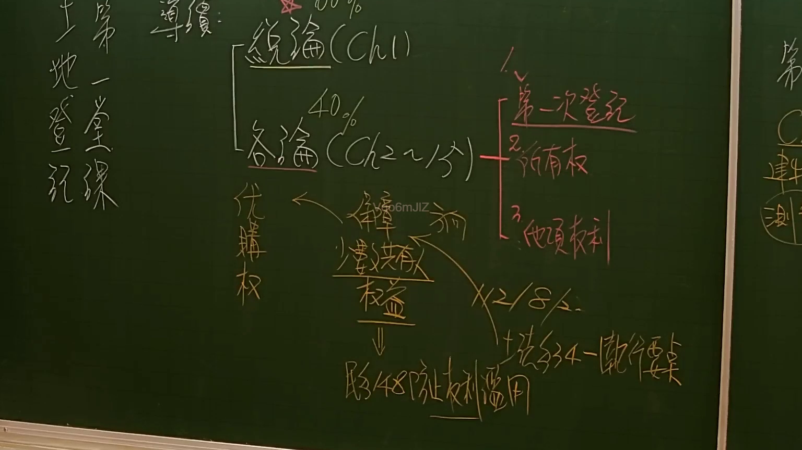

# 🎥 影音教材板書校對筆記
- **來源影片**: [預約 1 2024-11-29 17-26-30-544](file:///J:/土地登記/ch1/預約 1 2024-11-29 17-26-30-544.mp4)
- **課程分類**: `[土地登記`
- **課堂章節**: `ch1]`
- **影片時間戳記**: `00:13:15` (795 秒)
- **板書類型**: `影音板書`
- **偵測時間**: 2026-07-09 12:49:03

## 🔍 擷取黑板板書對照圖


## 🧠 AI 智慧理解與知識庫演化註記
：
這張板書圖片來自一份法律影音教材，內容聚焦於土地登記相關的法律課程。板書清晰地勾勒了課程的結構、重要的法律概念及其相互關係，並引用了關鍵的法律條文。

**辨識出的文字與符號：**

*   **左側標題區塊：**
    *   第一堂課 (First Class)
    *   土地登記 紀課 (Land Registration Lecture/Notes)
*   **課程內容結構區塊：**
    *   緒論 (Ch 1) (Underlined) (Introduction, Chapter 1)
        *   60% (Weighting)
    *   各論 (Ch 2~15) (Underlined) (Specific Topics, Chapter 2 to 15)
        *   40% (Weighting)
    *   （從「各論」延伸的列表，框起）
        *   1. 第一次登記 (Underlined) (First Registration)
        *   2. 所有權 (Ownership)
        *   3. 他項權利 (Other Real Rights)
*   **核心法律概念與連結區塊：**
    *   優購權 (Preferential Purchase Right / Pre-emption Right)
    *   → 準用 (Apply Mutatis Mutandis / Analogous Application)
    *   → 前 (Before / Prior)
    *   （方形框內）準共有 權益 (Quasi-co-ownership Rights and Interests)
    *   （從「準共有 權益」向下）→ 略/148 防止權利濫用 (Briefly / Civil Code Article 148 Prevention of Abuse of Rights)
    *   （從「準共有 權益」向右）→ X2/8/人 (Possibly a specific article reference like "Article 2 Paragraph 8" or an interpretation number)
    *   （從「X2/8/人」向下）→ +法§34-施行要點 (Plus Land Act Article 34 - Implementation Essentials)

**板書詳細解讀與法條對照：**

1.  **課程結構：** 課程以「土地登記 紀課」為主題，主要分為兩大部分：「緒論 (Ch 1)」和「各論 (Ch 2~15)」。兩者分別佔課程比重或考試比重為 60% 和 40%，總計 100%，顯示了其在課程設計上的重要性。
    *   「緒論」通常介紹土地登記的基礎概念、目的、原則等。
    *   「各論」則深入探討具體議題，板書中列出了三個核心子題：
        *   **第一次登記：** 指土地或建物首次進行權利登記，確立其所有權及其他物權的法律狀態。這是所有權利登記的起點，對於財產權的公示和保護至關重要。
        *   **所有權：** 土地登記的核心之一，指對土地或建物享有全面支配的權利，包括占有、使用、收益及處分。
        *   **他項權利：** 除所有權以外的物權，如地上權、永佃權、地役權、典權、抵押權、耕作權等，這些權利賦予權利人在他人土地或建物上享有特定用途的權能。

2.  **優購權 (Preferential Purchase Right)：** 這是一個重要的物權法概念，指特定人（如共有人、基地承租人、地上權人等）在土地或建物出賣時，有權在同等條件下優先購買的權利。此權利旨在維護共有關係的穩定性、促進土地利用或保護特定權利人的權益。
    *   **「優購權 → 準用 → 前」：** 這段關係可能指優購權的適用方式涉及「準用」其他法律規定，並且可能存在「前」提條件或「優先」順序的考量。例如，特定條件下的優購權可能準用民法或相關特別法的規定。

3.  **準共有權益 (Quasi-co-ownership Rights and Interests)：** 「準共有」通常指雖然不是嚴格意義上的民法共有關係，但其權益關係類似共有，或在法律上類推適用共有制度的規定。例如，區分所有建築物的共有部分、公同共有（如繼承未分割遺產）等，都可能涉及到「準共有」的概念。許多情況下，與共有相關的法律規範（如處分、管理）也會類推適用於準共有。

4.  **略/民法§148 防止權利濫用 (Briefly / Civil Code Article 148 Prevention of Abuse of Rights)：**
    *   **法條對照：** 臺灣《民法》第 148 條規定：「權利之行使，不得違反公共利益，或以損害他人為主要目的。行使財產權，亦不得與公共利益相悖。」
    *   **解讀：** 此處明確指出「準共有權益」的行使必須受到《民法》第 148 條「禁止權利濫用原則」的約束。這意味著，即使共有人或準共有人享有合法權利，其行使也不能違背公共利益，或以損害他人為主要目的。這在涉及土地或建物處分、優先購買權行使等共有爭議中尤為重要，以平衡各方權益，防止惡意行為。

5.  **X2/8/人 (Specific Reference)：** 儘管具體條文編號或解釋不明，其連結位置顯示它與「準共有權益」和「法§34-施行要點」緊密相關。在法律實務中，這可能是一個法院判決、司法院解釋、或特定法律條文（例如，某法第 2 條第 8 項）的縮寫，用以闡明或限制準共有權益的適用。

6.  **法§34-施行要點 (Land Act Article 34 - Implementation Essentials)：**
    *   **法條對照：** 臺灣《土地法》第 34 條之 1 是關於共有土地或建築改良物處分、變更及設定負擔的重要規定。其核心是要求共有人過半數及其應有部分合計過半數之同意，才能進行處分等行為；若應有部分合計逾三分之二者，其人數不予計算。同時，該條文亦賦予其他共有人優先購買權。
    *   **解讀：** 「土地法§34-施行要點」指的是針對《土地法》第 34 條之 1 及其相關條文的具體實施細則或解釋性規定。這些「施行要點」通常由主管機關發布，旨在規範共有物處分、變更及設定負擔的程序，明確優先購買權的行使方式、公示程序等。這進一步強化了「優購權」和「準共有權益」與《土地法》中共有物管理制度的緊密關聯。

總結而言，板書內容系統性地講解了土地登記課程的架構，並深入探討了「優購權」與「準共有權益」等核心概念，強調其在適用時須遵守《民法》的權利濫用禁止原則，並依照《土地法》第 34 條之 1 及其施行細則的規範。

## 📊 可編輯之 Mermaid 關係流程圖
```mermaid
：
graph TD
    A["第一堂課 土地登記 紀課"]

    B["緒論 (Ch 1) (60%)"]
    C["各論 (Ch 2~15) (40%)"]

    A --> B
    A --> C

    C --> D["1. 第一次登記"]
    C --> E["2. 所有權"]
    C --> F["3. 他項權利"]

    G["優購權"]
    H["準用"]
    I["前"]

    G --> H
    H --> I

    J["準共有 權益"]
    G --- J

    K["略/148 防止權利濫用"]
    L["X2/8/人"]

    J --> K
    J --> L

    M["法§34-施行要點"]

    L --> M
```

## ✍️ 操作者手動校對修改區
<!-- 您可以直接修改上方的文字或調整 Mermaid 區塊中的節點，Obsidian 會即時重新渲染 -->
- [ ] 欄位結構與法律邏輯已校對無誤。
- **校對筆記**: 
