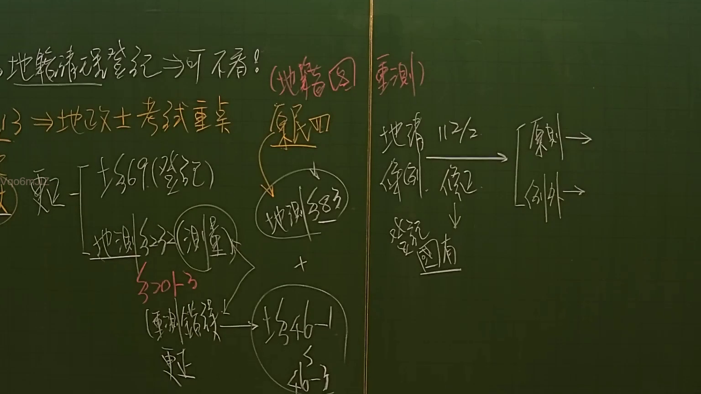

# 🎥 影音教材板書校對筆記
- **來源影片**: [預約 1 2024-11-29 17-26-30-544](file:///J:/土地登記/ch1/預約 1 2024-11-29 17-26-30-544.mp4)
- **課程分類**: `[土地登記`
- **課堂章節**: `ch1]`
- **影片時間戳記**: `00:23:45` (1425 秒)
- **板書類型**: `影音板書`
- **偵測時間**: 2026-07-09 12:51:15

## 🔍 擷取黑板板書對照圖


## 🧠 AI 智慧理解與知識庫演化註記
：
這張板書詳細闡述了臺灣土地法規中關於「地籍圖重測」與「地籍清理」的重要概念、相關法條及其法律效果，尤其強調了對「地政士考試」的重要性。內容涵蓋了土地登記與測量中的變更、錯誤更正程序，以及在特定情況下土地登記為國有的原則與例外。

1.  **「地籍清理登記 → 可不看！」**：這是一個教學指示，可能意味著在本次課程或特定考點中，地籍清理登記的某些細節可暫時略過，或僅需掌握核心概念。然而，從板書右側的內容來看，地籍清理導致「登記國有」仍是重要議題。

2.  **「13 → 地政士考試重點」**：表示板書內容屬於課程第13章或第13節，且是地政士專業證照考試的重點內容。這突顯了這些法規和實務操作在臺灣地政專業領域的關鍵性。

3.  **「(地籍圖重測)」**：這是整個板書的核心主題之一。地籍圖重測是指對舊有、錯誤或模糊的地籍圖進行全面性的重新測量與繪製，以建立精確的土地登記資料。這個過程是現代化地籍管理的重要環節。

4.  **「變更」**：此區塊列出了土地資料變更的三種主要法源與情境。
    *   **「├ 土§69 (登記)」**：指《土地法》第69條。該條規定，土地登記後，因登記錯誤或遺漏而生糾葛，經利害關係人申請更正，地政機關應查明處理。此處強調的是涉及「登記」層面的錯誤更正。
    *   **「├ 地測§32-2 (測量)」**：指《地籍測量實施規則》第32條之2。該條規定，已辦竣登記之土地，因測量、計算錯誤，致登記面積與實際面積不符者，土地所有權人得申請複丈或更正。此處強調的是涉及「測量」層面的錯誤更正。
    *   **「└ 地測§370-3 (重測錯誤) 更正」**：指《地籍測量實施規則》第370條之3。該條規定了地籍圖重測後，發現重測成果有錯誤時，地政機關應辦理更正的程序與原則。此處專指因「重測」本身所導致的錯誤更正。

5.  **「原則四 → (地測§38-3) + (土§46-1) → §46-3」**：這是一個關於地籍重測程序和法律效果的邏輯鏈條。
    *   **「原則四」**：可能是某個地籍測量或土地法規中的第四條原則或重點。
    *   **「(地測§38-3)」**：指《地籍測量實施規則》第38條之3。該條規定了地籍測量的基準點設置及相關規範，是確保測量準確性的基礎。它與重測密切相關。
    *   **「+」**：表示將「地測§38-3」和「土§46-1」結合理解或應用。
    *   **「(土§46-1)」**：指《土地法》第46條之1。該條規定，地籍圖因破損、滅失、比例尺變更或其他重大事由，經公告後得重新實施測量。這是地籍圖重測的法律依據。
    *   **「→ §46-3」**：指《土地法》第46條之3。該條規定，地籍圖重測公告期滿無異議或異議經調處、訴請司法機關判決確定者，其重測結果即告確定。這條文確立了地籍重測成果的法律效力與安定性。

6.  **「地籍 112/2 條例 修正 ↓ 登記國有 [原則 → [例外 →」**：此區塊討論了地籍清理的最終結果之一：土地登記為國有。
    *   **「地籍 112/2 條例 修正」**：最有可能指在民國112年2月（即2023年2月）對某項與「地籍」相關的「條例」進行了修正。結合下方的「登記國有」，此處極可能與**《地籍清理條例》**相關。雖然《地籍清理條例》本身在該日期沒有重大修正，但可能涉及相關子法、施行細則、解釋函令或實務見解的更新，特別是關於無主土地登記為國有的程序。
    *   **「登記國有」**：這是《地籍清理條例》的核心目標之一。對於那些權屬不明、無人繼承或無人主張權利的土地，經過法定的公告及清理程序後，最終會登記為國家所有，以釐清地籍、活化土地利用。相關條文如《地籍清理條例》第11條（無所有權或權利人不明土地）及第12條（登記名義人與實際權利人不符土地）。
    *   **「[原則 →」**：指土地登記為國有的一般原則。通常涉及土地長期無人管理、無人主張權利，且經過法定公告程序。
    *   **「[例外 →」**：指土地在特定情況下，即便符合表面上的「無主」條件，也可能不登記為國有，例如後來有合法繼承人出現，或土地性質特殊另有處置規定等。

總體而言，板書內容勾勒出一個從地籍資料變更與測量錯誤更正，到地籍圖重測的法律依據與效力，再到地籍清理中無主土地歸屬國有的完整法律框架。這些知識對於地政士處理不動產登記、測量爭議及權屬確認等業務至關重要。

## 📊 可編輯之 Mermaid 關係流程圖
```mermaid
：
graph TD
    A["地籍清理登記"] --> B["可不看！"]
    C["13"] --> D["地政士考試重點"]

    E["(地籍圖重測)"]

    subgraph "變更事項"
        F["變更"]
        F --> G["土§69(登記)"]
        F --> H["地測§32-2(測量)"]
        F --> I["地測§370-3(重測錯誤)更正"]
    end

    subgraph "重測相關法條與程序"
        J["原則四"] --> K["(地測§38-3)"]
        K -- "+" --- L["(土§46-1)"]
        L --> M["§46-3"]
    end

    subgraph "地籍清理條例修正與國有登記"
        N["地籍 112/2 條例 修正"]
        N --> O["登記國有"]
        O --> P["原則"]
        O --> Q["例外"]
    end
```

## ✍️ 操作者手動校對修改區
<!-- 您可以直接修改上方的文字或調整 Mermaid 區塊中的節點，Obsidian 會即時重新渲染 -->
- [ ] 欄位結構與法律邏輯已校對無誤。
- **校對筆記**: 
