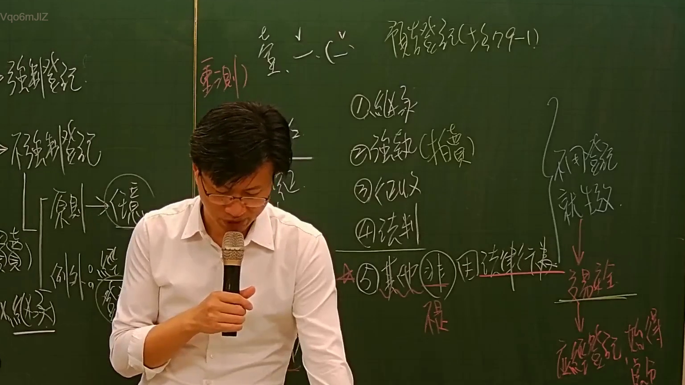

# 🎥 影音教材板書校對筆記
- **來源影片**: [預約 1 2024-11-29 17-26-30-544](file:///J:/土地登記/ch1/預約 1 2024-11-29 17-26-30-544.mp4)
- **課程分類**: `[土地登記`
- **課堂章節**: `ch1]`
- **影片時間戳記**: `01:13:45` (4425 秒)
- **板書類型**: `影音板書`
- **偵測時間**: 2026-07-09 12:53:42

## 🔍 擷取黑板板書對照圖


## 🧠 AI 智慧理解與知識庫演化註記
：
這張板書圖片詳細闡述了臺灣不動產物權變動的登記原則與其例外情況，並輔以相關概念與條文對照。核心內容圍繞在《民法》第758條的「登記生效主義」與第759條的「登記對抗主義」及其例外。

**板書文字辨識與解讀：**

1.  **Vqo6mJIZ**: 這是影片的編碼，與法律內容無關。

2.  **左側主線流程：**
    *   **→強制登記!**: 指的是法律規定不動產物權變動必須經過登記才能發生效力或對抗第三人的情形。在臺灣，不動產物權因「法律行為」而取得、設定、喪失、變更者，原則上採「登記生效主義」，即非經登記，不生效力（民法第758條本文），因此是「強制登記」。
    *   **→不強制登記**: 這句話在此語境下，並非指完全不需要登記，而是指在特定例外情況下，物權變動的「發生效力」不以登記為要件，但後續「處分」仍需登記。
        *   **原則 → 讓與**: 指不動產物權因法律行為（例如買賣、贈與等「讓與」行為）而發生變動時，必須遵循登記生效主義。
        *   **例外**: 這裡列舉的是《民法》第759條所規定的「非因法律行為」而取得不動產物權的情形。
            *   **繼承**: 物權因繼承而取得，在被繼承人死亡時即發生效力，無需登記。
            *   **公法行為**: 泛指因公法上的行為導致物權變動，例如徵收。
            *   **拍賣**: 指因強制執行而拍賣取得不動產物權，在拍定人領得權利移轉證書時即取得物權，無需登記。
            *   **不(經登記)**: 強調這些例外情況下，物權變動的效力發生不需經過登記的程序。

3.  **頂部相關概念：**
    *   **重測)**: 指土地重測，是地籍管理上對土地面積、界址進行重新測量。重測結果可能導致土地登記資料變更，屬於公法上的行政行為。
    *   **e**: 可能是筆誤、符號或未完成的文字，在此處意義不明。
    *   **意思主義**: 是一種物權變動原則，指物權的變動僅依當事人的意思表示即可生效，登記僅具對抗效力，而非生效要件。臺灣不動產物權原則上不採意思主義，而是登記生效主義。在此板書中出現，可能是在與臺灣法制進行對比或討論其在其他物權（如動產）或某些特殊情況下的適用。
    *   **預告登記(土§79-1)**: 指依《土地法》第79條之1規定辦理的預告登記。其目的在於保全一項請求權（例如買受人要求出賣人辦理移轉登記的請求權），一旦辦理預告登記，未經預告登記權利人同意，原登記名義人不得對該不動產為處分或設定負擔。這是一種保護「未來登記請求權」的制度，與「意思主義」在某種程度上都關乎意願的保護。

4.  **右側條列式例外與其效果：**
    *   這部分完整地列出了《民法》第759條所規定的不動產物權「非因法律行為」而取得的五種主要情形，以及其法律效果。
    *   **①繼承**: (同左側解釋)
    *   **②強制執行(拍賣)**: (同左側解釋)
    *   **③徵收**: 物權因國家徵收而取得，在徵收公告期滿或補償費發放時即發生效力，無需登記。
    *   **④判決**: 指法院的「形成判決」（例如分割共有物之判決），物權因判決確定而發生變動，無需登記。但「給付判決」（例如要求債務人履行移轉登記的判決）則不在此限。
    *   **☆⑤其他非因法律行為而取得**: 這是《民法》第759條的概括規定，涵蓋其他非基於當事人合意或單方意思表示而導致物權變動的情況（例如時效取得、公用徵收、因天然變更而取得等等）。

5.  **右側流程圖 (例外變動之效果)**: 這是《民法》第759條的具體操作與法律效果說明。
    *   **不用登記 就生效力**: 針對上述五種例外情況，不動產物權的取得、變更、喪失，不需經登記即可「生效力」。
    *   **↓ 變動發生**: 表示物權的權利歸屬已實質發生變更。
    *   **↓ 應經登記始得處分(權)**: 雖然物權變動已生效，但該新的物權權利人（例如繼承人、拍定人）在未辦理登記前，不得將其所取得的物權進行處分（例如買賣、設定抵押權等）。這旨在維護交易安全和公示原則。

**總結與法律條文對位：**
板書內容精確地詮釋了臺灣不動產物權變動的兩個核心條文：
*   **民法第758條本文**：「不動產物權，依法律行為而取得、設定、喪失及變更者，非經登記，不生效力。」這對應了板書中的「強制登記!」與「原則 → 讓與」以及「登記生效主義」。
*   **民法第759條**：「因繼承、強制執行、徵收、法院之判決或其他非因法律行為，於登記前已取得不動產物權者，應經登記，始得處分其物權。」這對應了板書中的「不強制登記」下的「例外」清單，以及右側流程圖「不用登記 就生效力」至「應經登記始得處分(權)」的完整邏輯。
*   **土地法第79條之1**：提供了「預告登記」的法源，作為一種保全登記請求權的特別制度。

整體而言，板書清晰地區分了因「法律行為」與「非因法律行為」導致的不動產物權變動在登記效力上的差異，強調了物權公示原則和交易安全的平衡。

## 📊 可編輯之 Mermaid 關係流程圖
```mermaid
：
graph TD
    A["不動產物權變動規則"]

    subgraph "登記分類與原則"
        A --> B["強制登記!"]
        A --> C["不強制登記"]
        C --> D["原則 法律行為 (讓與)"]
        D --> E["登記生效主義 (民法758條)"]
    end

    subgraph "例外 非因法律行為取得 (民法759條)"
        C --> F["例外"]
        F --> F1["① 繼承"]
        F --> F2["② 強制執行 (拍賣)"]
        F --> F3["③ 徵收"]
        F --> F4["④ 判決"]
        F --> F5["☆⑤ 其他非因法律行為而取得"]
        F --> F_CLARIFY["(不(經登記))"]
    end

    subgraph "例外變動之效果"
        F --> G{"不用登記 就生效力"}
        G --> H["變動發生"]
        H --> I["應經登記始得處分(權)"]
    end

    subgraph "相關概念"
        J["意思主義"]
        K["預告登記(土§79-1)"]
        L["重測)"]
        M["e"]
    end
```

## ✍️ 操作者手動校對修改區
<!-- 您可以直接修改上方的文字或調整 Mermaid 區塊中的節點，Obsidian 會即時重新渲染 -->
- [ ] 欄位結構與法律邏輯已校對無誤。
- **校對筆記**: 
