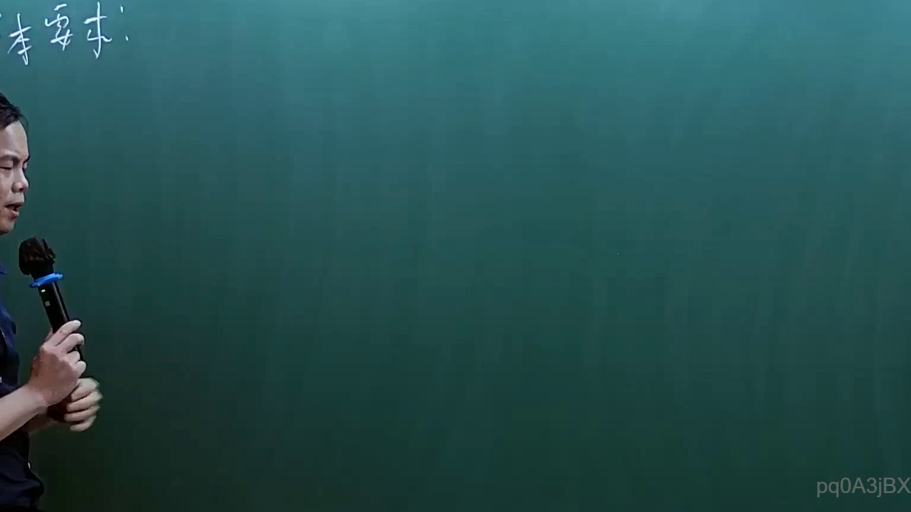
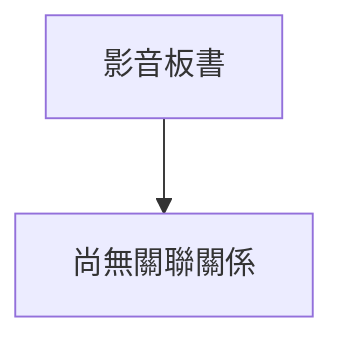

# 🎥 影音教材板書校對筆記
- **來源影片**: [預約 1 2025-02-03 10-16-25-992](file:///E:/法律/民訴B/ch1/預約 1 2025-02-03 10-16-25-992.mp4)
- **課程分類**: `預設課程`
- **課堂章節**: `ch1`
- **影片時間戳記**: `00:08:30` (510 秒)
- **板書類型**: `關係圖/邏輯圖板書`
- **偵測時間**: 2026-07-13 20:25:35

## 🔍 擷取黑板板書對照圖

## 🧠 AI 智慧理解與知識庫演化註記

您好，非常感謝您提供您的需求。然而，根據目前提供的 OCR辨识字元（"W" 和 "pd0A3jBX"），我們無法清楚理解板書的文字內容。OCR辨識結果不完整或不夠清晰，導致我們無法進一步進行語意整理、與法律條文比對，以及生成 Mermaid.js 流程圖。

建議您能提供更完整或更清晰的 OCR辨识字元，或者提供原始的板書文字或圖片，以便我們能更好地协助您完成 tasks。當您有更多資訊或更清楚的文字內容時，請重新提交，我們將會根據新的信息重新處理並提供幫助。謝謝！

## 📊 可編輯之 Mermaid 關係流程圖

## ✍️ 操作者手動校對修改區
<!-- 您可以直接修改上方的文字或調整 Mermaid 區塊中的節點，Obsidian 會即時重新渲染 -->
- [ ] 欄位結構與法律邏輯已校對無誤。
- **校對筆記**: 
