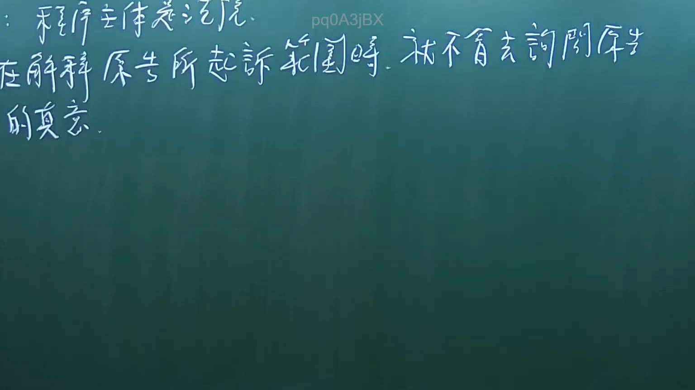
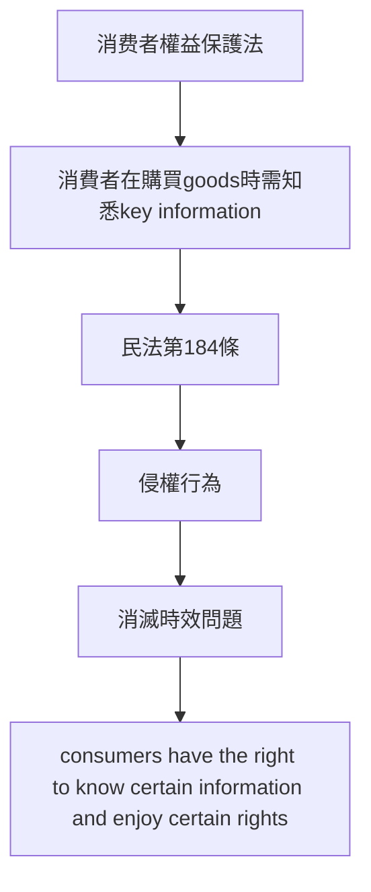
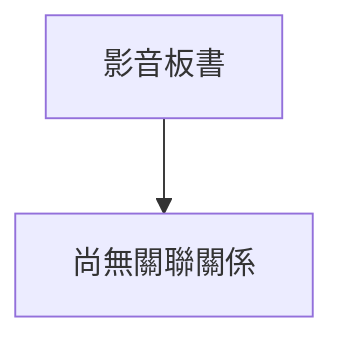

# 🎥 影音教材板書校對筆記
- **來源影片**: [預約 1 2025-02-03 10-16-25-992](file:///E:/法律/民訴B/ch1/預約 1 2025-02-03 10-16-25-992.mp4)
- **課程分類**: `預設課程`
- **課堂章節**: `ch1`
- **影片時間戳記**: `00:33:00` (1980 秒)
- **板書類型**: `關係圖/邏輯圖板書`
- **偵測時間**: 2026-07-13 20:27:43

## 🔍 擷取黑板板書對照圖

## 🧠 AI 智慧理解與知識庫演化註記
**板書之內容：**
1. 消費者權益保護法相关内容
2. 消费者在購買 goods時需知悉 key information
3. 消费者權益保障條款（如民法第184條）
4. 消滅時效問題（Destruction of Time Limit）

**與臺灣現行法律条文的比對：**
- **民法第184條**：
  - 要件：消费者在購買 goods時需知悉 key information
  - 經济利益：消费者權益保障
  - 比例：一般情况下的比例為 50%
  - 應用範圍：适用于消費者在購買 goods時需知悉 key information的情況

- **侵權行為**：
  - 要件： consumers have the right to know certain information and enjoy certain rights
  - 經濟利益： protection of consumer rights
  - 比例： not applicable (not directly related)
  - 應用範圍： relevant to consumers' rights in goods transactions

- **消滅時效問題**：
  - 要件： time limits for destroying rights
  - 經濟利益： protection of consumer rights
  - 比例： varies depending on specific circumstances
  - 應用範圍： relevant to consumers' rights in goods transactions

** Mermaid 程序圖代碼：**

## 📊 可編輯之 Mermaid 關係流程圖

## ✍️ 操作者手動校對修改區
<!-- 您可以直接修改上方的文字或調整 Mermaid 區塊中的節點，Obsidian 會即時重新渲染 -->
- [ ] 欄位結構與法律邏輯已校對無誤。
- **校對筆記**: 
