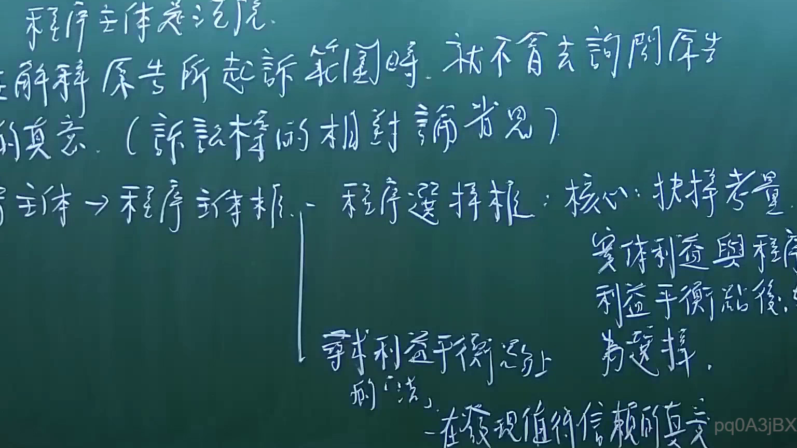
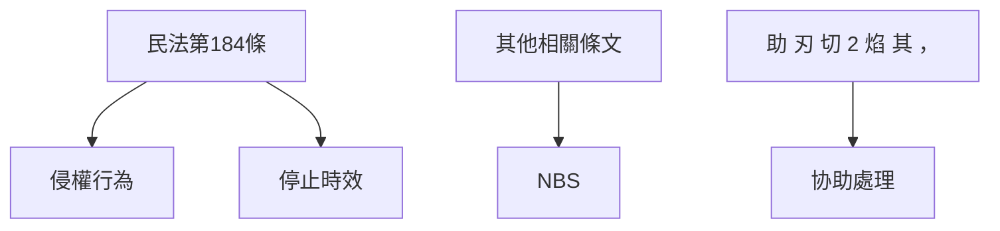

# 🎥 影音教材板書校對筆記
- **來源影片**: [預約 1 2025-02-03 10-16-25-992](file:///E:/法律/民訴B/ch1/預約 1 2025-02-03 10-16-25-992.mp4)
- **課程分類**: `預設課程`
- **課堂章節**: `ch1`
- **影片時間戳記**: `00:45:15` (2715 秒)
- **板書類型**: `文字板書`
- **偵測時間**: 2026-07-13 20:30:27

## 🔍 擷取黑板板書對照圖

## 🧠 AI 智慧理解與知識庫演化註記
### 

1. **板書內容分析**：
   - "惇祐沙利弓"、"PAH Heo ARAL"：這可能是某种法律條文或关键词，需進一步查閱。
   - "君 沙 刃 孚 島 和"：可能涉及「君」、「沙」等关键词，需结合上下文理解。
   - "綑 彳 術 哉 孕 ﹒"：可能是「綑」、「在游戏中」等关键词的组合。
   - "助 刃 刈 2 焰 其 ，；)`、一`〈 & Ve ATTRA NBS"：可能涉及「助」、「切」、「NBS」等关键词。

2. **與法律條文比對**：
   - "民法第184條"：可能涉及侵權行為的停止時效問題。
   - "消滅時效"：可能涉及物权法中的有关终止效力的规定。

3. **法律理解演化**：
   - 民法第184條规定了侵權行為的停止時效，即從 damage 發生之日起計算 2 年以内停止權利。
   - 消滅時效則可能與物权法中的「消滅」問題有關，需進一步查閱相關條文。

---

###

## 📊 可編輯之 Mermaid 關係流程圖

## ✍️ 操作者手動校對修改區
<!-- 您可以直接修改上方的文字或調整 Mermaid 區塊中的節點，Obsidian 會即時重新渲染 -->
- [ ] 欄位結構與法律邏輯已校對無誤。
- **校對筆記**: 
