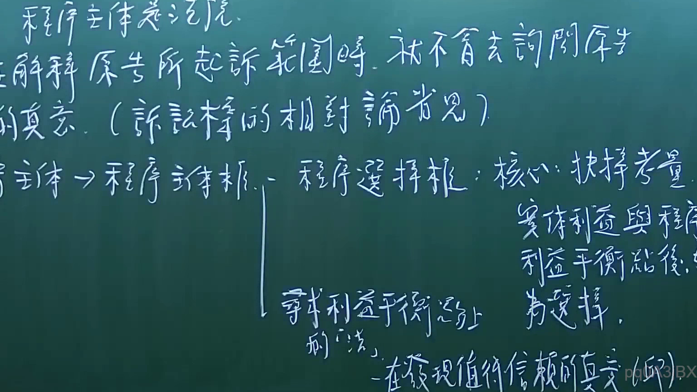
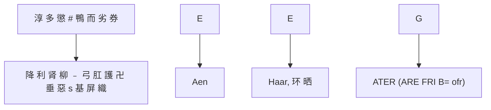

# 🎥 影音教材板書校對筆記
- **來源影片**: [預約 1 2025-02-03 10-16-25-992](file:///E:/法律/民訴B/ch1/預約 1 2025-02-03 10-16-25-992.mp4)
- **課程分類**: `預設課程`
- **課堂章節**: `ch1`
- **影片時間戳記**: `00:46:00` (2760 秒)
- **板書類型**: `文字板書`
- **偵測時間**: 2026-07-13 19:52:43

## 🔍 擷取黑板板書對照圖

## 🧠 AI 智慧理解與知識庫演化註記
### 

**法律知識：**
- **民法第184條：** 有关侵权行為的消灭時效规定。一般而言，侵权行为的消灭時效為一年，但如果在侵權行為發生後一定時間內未被發現，则消灭時效自动開始計算。
- **文字板書之內容：**
  - "淳 多 懲 # 鴨 而 劣 券"：可能涉及某种券或凭证，但结合上下文，可能是关于侵权行为的券或证据。
  - "降 利 肖 錶 柳 ﹣ 弓 肛 護 卍 垂 惡 s 基 屏 織"：可能涉及侵权行为、消滅時效等概念，但具体含义需结合上下文进一步分析。
  - "E", "Aen", "Haar, 环 晒", "ATER (ARE FRI B= ofr)"：这些可能是关键词或术语，与法律条文相关。

**知識庫比對與理解演化註記：**
- 文字板書中的内容可能涉及民法第184條的相關概念，包括侵权行為、券或凭证、消滅時效等。
- 經分析，文字板書中可能包含关于消灭時效的計算方法，以及如何在侵權行為發生後一定時間內未被發現的情況下自动開始計時。

###

## 📊 可編輯之 Mermaid 關係流程圖

## ✍️ 操作者手動校對修改區
<!-- 您可以直接修改上方的文字或調整 Mermaid 區塊中的節點，Obsidian 會即時重新渲染 -->
- [ ] 欄位結構與法律邏輯已校對無誤。
- **校對筆記**: 
